# Approvals

Chains, not graphs. An approval chain is an ordered list of steps; each step names an
eligible team by group and a completion rule. There is no BPM engine, no DAG, no parallel
branch — the shape that matches how a Marketing → Legal review actually runs.



## Chains

```
GET /api/v1/chains
PUT /api/v1/chains/:id        # policy.edit
```

```json
{
  "id": "brand-review",
  "name": "Brand review",
  "version": 1,
  "steps": [
    { "name": "Marketing", "approvers": { "groups": ["marketing-leads"] }, "rule": "any" },
    { "name": "Legal",     "approvers": { "groups": ["legal"] },           "rule": { "quorum": 2 } }
  ],
  "onReject": "return-to-submitter"
}
```

| Rule | Clears the step when |
|---|---|
| `any` | one eligible approver approves |
| `{ quorum: n }` | `n` **distinct** approvers approve |
| `all` | every eligible approver has approved |

A chain is bound to work by an overlay's `enforce.escalation` ([governance](governance.md)),
so "everything this tool produces goes through brand review" is a policy edit, not code.

## Raising and acting

```
POST /api/v1/approvals              # subjectType, subjectRef, title, chainId, nominees?
GET  /api/v1/approvals              # filtered to what the caller may see
GET  /api/v1/approvals/approvers    # who is eligible for a step, for nomination
POST /api/v1/approvals/:id/act      # { action: 'approve' | 'reject', comment? } — approval.act
POST /api/v1/approvals/:id/withdraw
```

Subjects are `asset`, `tool-change`, `config` or `guest-link` — one engine, several kinds of
thing to approve.

The chain is **snapshotted at submit**: an approval is judged by the rules it was raised
under, so editing a chain never rewrites decisions already in flight.

States: `submitted` → `in_review` → `approved` | `rejected` | `withdrawn`.

## Invariants the engine enforces

These are enforced in code and covered by property tests, not merely documented:

- **Separation of duties.** The submitter can *never* satisfy a step — checked before
  eligibility, so they always get the specific reason (`SEPARATION_OF_DUTIES`).
- **Eligibility by group.** An actor's groups must intersect the step's approver groups
  (`NOT_ELIGIBLE`). Nomination is routing and notification, not exclusivity: any eligible
  team member may act; nominees just get pinged.
- **No step is skippable.** A step completes per its rule, then the index advances; only past
  the last step is the whole approval `approved`.
- **A reject is terminal.** `onReject: 'return-to-submitter'` means the submitter opens a
  *new* approval — there is no resume.

## Notification

Acting on an approval writes to the per-user inbox, so the approver's next shell poll (and
the console's Approvals view) shows what needs them. The console's overview surfaces
"what needs me" from the same source, and messages/inbox targeting is described in
[api](api.md).

## Watermarking preview output

An overlay can set `enforce.watermark: 'until-approved'`, which is the intended pairing with
a chain: previews carry the diagonal PREVIEW brick pattern while the work is unapproved.
Today the compositor knows only "watermark now" vs "don't" — the per-render *until-approved*
linkage to approval state is deliberately not yet wired (`always` and `never` behave fully).
See [sharing](sharing.md) and [status](status.md).

## Related

- Who can approve: [permissions](permissions.md)
- Binding a chain to a tool: [governance](governance.md)
- Exporting chains as code: [governance](governance.md#policy-as-code)
