# Audit log

A tamper-evident, append-only record of every governed action on this deploy: sign-ins,
grant and policy edits, approvals, group and lockout changes, link mints and revocations,
provider changes, catalog changes, config applies.



Entries are never edited or deleted — only added.

## How the chain works

Each event's hash covers **the previous event's hash** plus the canonical JSON of the event
body. So an in-place edit or a truncation breaks the chain at a specific, detectable
sequence number. Verification walks the chain and reports either "intact" or the first bad
`seq`.

```
GET /api/v1/audit?limit=…        # entries + a chain verification result   (audit.export)
GET /api/v1/audit/head           # the current head: seq, hash, count, chainIntact
```

```bash
lw audit verify      # exits 2 if the chain is broken
lw audit head        # prints seq · hash · count · intact
```

The console's **Audit** view shows the same chain with its verification state, and the
`lw_audit_chain_intact` Prometheus gauge (1/0) is the thing to alert on.

Payloads must already be privacy-safe when they are written — digests and field names, never
raw input values. The chain module does not inspect them; the call sites are responsible, and
policy edits record before/after *shapes*.

## The one limitation, stated plainly

Hash-chaining detects edits **within** the log. It does not, by itself, stop someone with
direct database access from truncating the newest entries and re-chaining the remainder:
Postgres has no append-only constraint here.

The defence is to record the head hash somewhere **outside** this deploy. A later chain that
does not contain the head you saved is provably truncated.

**The server does this for you by default.** Every instance prints the head at boot and then
hourly:

```
[lolly-work] audit head seq=… hash=… count=… intact=…
```

Anything that keeps stdout — journald, `kubectl logs` shipped to Loki, CloudWatch, a plain
file — is therefore an external anchor with no setup. The timer is unref'd, so it never
holds the process open. The defaults are

```json
"audit": { "headLog": { "onBoot": true, "intervalMinutes": 60 } }
```

and `{ "onBoot": false, "intervalMinutes": 0 }` turns it off — do that only if you anchor
some other way, because an unanchored chain is exactly the gap this exists to close.

For a stronger anchor than log retention — one you can hand an auditor — snapshot the head
somewhere append-only on your own cadence (a cron committing it, a ticket per release):

```bash
lw audit head --json > audit-head-$(date +%F).json      # commit it, ticket it, ship it to a sink
```

## Reading the log

The console's Audit view and the Activity feed read the same rows for different jobs: Audit
is the authoritative record with chain verification; Activity is the humane merged timeline
(audit + attributed telemetry) with actor and category facets. `audit.export` gates the raw
API.

## Related

- What else is recorded, and what deliberately is not: [telemetry](telemetry.md)
- Monitoring and alerting: [operations](operations.md)
- Who may export: [permissions](permissions.md)
