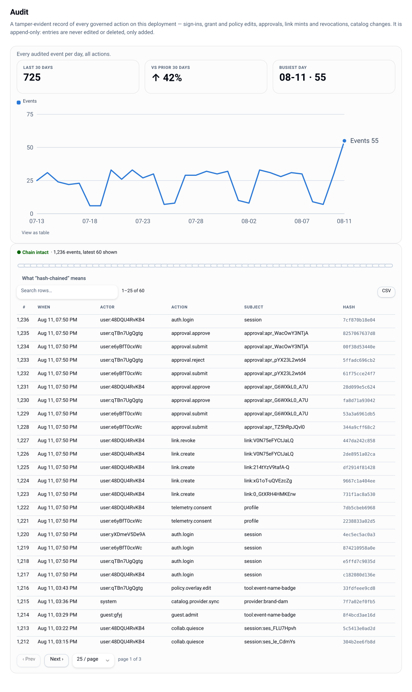

# Audit log

A tamper-evident, append-only record of every governed action on this deploy: sign-ins,
grant and policy edits, approvals, group and lockout changes, link mints and revocations,
provider changes, catalog changes, config applies.



Entries are never edited - only added, and only ever removed by stated retention:
`policy.retention.auditDays` trims rows older than the window behind an anchor (seq + hash)
that keeps the chain verifiable ([operations](operations.md#retention-and-erasure)).

## How the chain works

Each event's hash covers **the previous event's hash** plus the canonical JSON of the event
body. So an in-place edit or a truncation breaks the chain at a specific, detectable
sequence number. Verification walks the chain and reports either "intact" or the first bad
`seq`.

```
GET /api/v1/audit?limit=…        # entries + a chain verification result   (audit.export)
GET /api/v1/audit/head           # the current head: seq, hash, count, chainIntact
```

```bash
lw audit verify      # exits 2 if the chain is broken
lw audit head        # prints seq · hash · count · intact
```

The console's **Audit** view shows the same chain with its verification state, and the
`lw_audit_chain_intact` Prometheus gauge (1/0) is the thing to alert on.

Payloads must already be privacy-safe when they are written - digests and field names, never
raw input values. The chain module does not inspect them; the call sites are responsible, and
policy edits record before/after *shapes*.

## What holds the database itself to account

Two things beyond the chain. Every row also carries a **keyed MAC**: an HMAC of its hash
under a key derived at boot from `LW_SESSION_SECRET`, which the database never holds. A
database holder who edits a row and recomputes the public chain from there on still cannot
produce MACs that verify, and every verification path (`/api/v1/audit`, the head, the
Prometheus gauge, `lw audit verify`) checks them. Rows written before the key existed have
no MAC; verification counts them as `unkeyed` rather than failing them, but only at the start
of the log. Every host installs the key before it writes, so once a row has a MAC, every
later row must have one too: a row without one after that point is a stripped MAC and breaks
the chain. The console's badge shows the `unkeyed` count when there are any. Rows signed under
a session secret that has since been rotated are covered by a retired-key boundary
([below](#rotating-the-session-secret)). On Postgres,
migration `0034` adds a trigger that refuses `UPDATE` and `DELETE` on `audit_log`; the
retention trim is the one delete it admits, and it announces itself inside its own
transaction after writing the anchor.

## Rotating the session secret

The MAC key is derived from `LW_SESSION_SECRET`, so a new value means a new key. Every row
written before the rotation stops verifying, and the chain reads as broken at the first of
them. Which way out depends on whether you still have the old value:

- **The old value is known.** Deploy the new value with `LW_SESSION_SECRET_PREVIOUS` set to
  the old one ([operations](operations.md#secret-rotation)), so sign-ins carry over. The
  audit MAC uses the current key only, so also run `retire-key` (below) while PREVIOUS is
  still set: it first checks every row it is about to retire against the previous value, and
  refuses if a row verifies under neither.
- **The old value is gone**, for example because the platform stores secrets write-only.
  Nothing can check the old MACs again. Record the head first, while a server still runs the
  old value, and run `retire-key` once every host that writes to this database runs the new
  one.

### Before you rotate: record the head

While the server still runs the old value, record the seq and public hash of the last row,
and whether every row verifies under that value:

```bash
lw audit head --json                                              # through the API
docker compose exec -T server node scripts/audit-head.ts --json   # in the server container
```

`scripts/audit-head.ts` reads the database directly and never writes. Besides the head it
prints `linksIntact` (the hash links alone, no key). Keep the `seq` and `hash`: after the
rotation, `retire-key --expect-head <seq>:<hash>` refuses unless that row still has that
hash, and the hash links pin every row before it, so nothing up to the head can be rewritten
between the rotation and the boundary. `deploy/vm/rotate-secrets.sh` records the head itself
and prints the command with it filled in.

### Recording the boundary

Once every host runs the new value, sign in once: the server writes that sign-in under the
new key, and the command needs one such row (below). Then:

```bash
lw audit retire-key --reason "secret rotation 2026-10-04" --expect-head 412:9f2c… --dry-run
lw audit retire-key --reason "secret rotation 2026-10-04" --expect-head 412:9f2c…
# in the server container (the image carries scripts/, not cli/):
docker compose exec -T server node scripts/audit-retire-key.ts --reason "secret rotation 2026-10-04" --expect-head 412:9f2c…
```

It talks to the database directly and needs `DATABASE_URL` and `LW_SESSION_SECRET`, which
the server's environment has. It appends one row, action `audit.key.retire`, MAC'd under
the current key. Its payload records `retiredThroughSeq` and `retiredHeadHash` (the seq and
hash of the row directly before it), the reason, how many rows it retires, whether they
were checked against a previous value, and the head it was given (`expectedHead`). Keep the
reason to why ("secret rotation"), not who. The row is appended only while the log still ends
at the row it names, so two runs at once write one boundary, not two.

Before it writes, it checks that the rows since the last boundary look like a key change and
nothing else. Otherwise it refuses, writes nothing and exits `2`:

- `broken`: a hash link is broken. That is an edit or a deletion.
- `head-mismatch`: the row given with `--expect-head` is gone or has another hash.
- `stripped`: a row has no MAC although an earlier row has one.
- `interleaved`: a row that verifies under the current key comes before one that does not. A
  key change leaves the old-key rows first and the current-key rows after them, so this means
  an edit re-chained from there on, or a host still writing with the old value. If it is the
  second (a deployment that was switched last), switch it, then run again with
  `--allow-interleaved`.
- `no-witness`: no row after the old ones verifies under the key the command was given, so
  nothing shows the server runs that key. Sign in once and run again. This is what stops a
  run with the wrong `LW_SESSION_SECRET`, whose boundary the server would ignore.
  `--no-witness` skips it.
- `previous-mismatch`: with `LW_SESSION_SECRET_PREVIOUS` set, a row verifies under neither
  value. If PREVIOUS holds an older value that this rotation did not replace, run without it
  (in a container: `docker compose exec -e LW_SESSION_SECRET_PREVIOUS= server …`).

The two overrides are recorded on the boundary (`allowInterleaved`, `noWitness`). From then
on, verification:

- counts a row before the boundary whose MAC fails under the current key as a retired-key
  row instead of failing it;
- still checks every hash link through those rows. The boundary's MAC covers the hash it
  records, so an edit before the boundary breaks the chain exactly as before;
- ignores a boundary whose MAC does not verify or that does not name the row directly before
  it, so a database holder without the secret cannot write one;
- requires every row after the boundary to verify under the current key, and fails a row
  without a MAC after the first row that has one.

The chain then reads as intact, and says why. The head log line becomes
`intact=true (412 rows signed with a retired key before 2026-10-04T09:12:00.000Z)`;
`GET /api/v1/audit/head` and the `chain` of `GET /api/v1/audit` add `retiredKeyRows`,
`retiredThroughSeq` and `retiredBefore` (present only when there are such rows); the
console's badge and `lw audit head` show the same note. A later rotation works the same way:
the newest valid boundary covers every row before it, older boundaries included.

The command writes nothing when the chain already verifies under the current key. Exit
codes: `0` for a boundary written or nothing to retire, `1` for a usage or environment
problem, `2` for a refusal or a chain that still fails after the boundary.

What it cannot do: without the old value, nothing can tell a row written under the old
secret from one a database holder rewrote and re-chained, as long as the server writes again
after the rewrite and before the command runs. `--expect-head` closes that for every row up
to the recorded head. The rows after it (written by hosts still on the old value before they
were switched; the dry run counts them) rest on their hash links alone. So record the head,
switch every host promptly, run `retire-key` straight after, and never run it to clear a
broken chain that a rotation did not cause.

## The one limitation, stated plainly

Hash-chaining and the MAC detect edits **within** the log. They do not, by themselves,
stop someone with superuser access from dropping the trigger and truncating the newest
entries: rows that never existed leave nothing to verify.

The defence is to record the head hash somewhere **outside** this deploy. A later chain that
does not contain the head you saved is provably truncated.

**The server prints the head by default.** Every instance emits it at boot and then
hourly; external collection and retention are an operator responsibility:

```
[lolly-work] audit head seq=… hash=… count=… intact=…
```

Ship those lines to an independently retained log service with controlled deletion
access, and verify receipt and retention there. Local journald, a local file or
`kubectl logs` alone can disappear with the host or deployment and do not establish an
external anchor. The timer is unref'd, so it never holds the process open. The defaults are

```json
"audit": { "headLog": { "onBoot": true, "intervalMinutes": 60 } }
```

and `{ "onBoot": false, "intervalMinutes": 0 }` turns it off - do that only if you anchor
some other way, because an unanchored chain is exactly the gap this exists to close.

For a stronger anchor than log retention - one you can hand an auditor - snapshot the head
somewhere append-only on your own cadence (a cron committing it, a ticket per release):

```bash
lw audit head --json > audit-head-$(date +%F).json      # commit it, ticket it, ship it to a sink
```

## Reading the log

The console's Audit view and the Activity feed read the same rows for different jobs: Audit
is the authoritative record with chain verification; Activity is the humane merged timeline
(audit + attributed telemetry) with actor and category facets. `audit.export` gates the raw
API.

The console filters **the full retained history**, before pagination, by exact actor ID,
action and subject plus an inclusive UTC date range. The API accepts `actor`, `action`,
`subject`, `since`, `until`, `limit` (up to 1000), and `before` (sequence cursor):

```
GET /api/v1/audit?action=approval.submit&limit=50
```

Responses include `total` for the retained log, `matched` for the full filtered history,
and `nextBefore` for an older matching page. Keep the filters when following that cursor.
Rows within each page remain in ascending sequence order. Invalid or reversed date ranges
are rejected. The chain verdict covers the complete retained chain, not the filtered rows;
filtered rows alone cannot prove chain continuity. Actor filtering currently uses stored
IDs rather than a broader identity-directory lookup.

## Related

- What else is recorded, and what deliberately is not: [telemetry](telemetry.md)
- Monitoring and alerting: [operations](operations.md)
- Who may export: [permissions](permissions.md)
