# Catalog and content

The catalog is what members can actually use: tools, brand assets, tokens, fonts, logos. It
comes from two sources - the **pack** on disk, and **providers** that federate external
systems read-only - and both are filtered by the same governance.





## The pack

`instance.pack` points at a directory (a "brand pack"). Everything brand-shaped lives there:

```
catalog/tools/index.json      the tools this deploy offers
catalog/assets/index.json     assets, with a formats list per asset
catalog/fonts/webfonts/       self-hosted woff2
tools/<id>/tool.json          per-tool input definitions
```

Served at `/catalog/*` (blobs) and `/api/v1/catalog/assets/*`, filtered per caller. The
pack's design tokens double as the console's own theme: **This Deploy → Design system**
shows the live tokens the tools consume, and the sign-in screen inherits the pack's colours,
fonts and logo through a deliberately narrow unauthenticated `/api/brand` route - brand
chrome only, never the governed catalog.

A pack is immutable for a process: publish a new pack and restart (or roll) to pick it up.

## Access modes

`policy.defaultAccessMode` decides who may read the catalog at all:

| Mode | Behaviour |
|---|---|
| `open` | anonymous reads allowed |
| `gated` | sign-in required (`401 UNAUTHORIZED`, "this deployment is sign-in gated") |
| `per-tool` | per-resource decision through grants |

On top of that, overlay `visibility` removes individual tools from the feed for groups that
should not see them ([governance](governance.md)).

## Submitting an asset

The pack is immutable and providers are read-only, so for a long time the only way bytes
entered a deploy's catalog was a server-side pull from a source system. Submit is the other
direction: a member puts a file in.

```
POST /api/v1/catalog/submit?name=Campaign%20Hero&tags=campaign,hero&groups=design
                                                             # catalog.submit (author role)
```

The bytes ride the raw request body; the declared metadata rides query params (`name`,
`description`, `tags`, `type`, `groups`). The response names the new `inst/<id>` asset, its
checksum, and the state it arrived in.

**Open to authors is the default.** Anyone holding `catalog.submit` submits, and the asset is
live the moment it is stored. An org that wants review names an approval chain in
`policy.submit.chain`; then a submission waits in state `submitted`, invisible in the feed,
unservable at `/catalog/*` and not linkable, until an approver publishes it. Defaults set
direction; limits are something an org chooses.

Once chosen, the limit holds: if `policy.submit.chain` names a chain this instance does not
have - a rename, a deletion, a first boot in the wrong order - submissions are refused with
`503 SUBMIT_CHAIN_MISSING` naming the chain to fix. Review that a typo turns off would be
worse than an outage, because nothing would say it had stopped happening.

What happens to the bytes, in order:

| Step | What it does |
|---|---|
| Size cap | `policy.submit.maxBytes`, 64 MiB by default, the same cap publish-out uses |
| Quota | per-group counters (`policy.submit.quota`), both 0 (unlimited) by default |
| sha256 | an exact duplicate returns the asset that already holds those bytes, `200` with `duplicate: true` - reported, never an error. Only an asset the submitter can already see and fetch counts: a checksum hit on something invisible to them, or on one still under review or returned, stores a second copy instead, so the short-circuit can neither confirm a file they have no access to nor drop their contribution behind one |
| Scan hook | the operator's pre-store veto, if one is wired ([operations](operations.md#pre-store-scan-hook-for-submissions)) |
| Store | `BlobStore.put`, then an instance-asset record carrying the submitter, the declared metadata, and the sniffed type and pixel dimensions |
| Credentials | a C2PA **detection** pass, recorded and badged. Unlike publish-out no lolly export assertion is required: a submission is an arbitrary org file, and detection never refuses one |
| Decision | an approval with subject `asset` when a chain is configured, otherwise `live` immediately, with a lifecycle row minted so the expire/hold/revoke controls work from the first moment |

The type and dimensions come from the **bytes**, never from what the client claimed: a file
that says `image/png` and is not one is stored as what it is.

Exposure can be narrowed at submit with `groups`, and only ever to groups the submitter is
in - nobody publishes into a group they are not a member of. With no `groups`, the asset is
visible to every member, like a pack asset.

A quota scope is a group name, and a submission is charged to **every** group its submitter
belongs to, so extra memberships only ever tighten a member's budget rather than buying more
of it. The charge is made before the bytes are stored and is what enforces the cap - a check
read earlier is a window that concurrent submissions all pass through - and a submission that
is then refused gives its charge back. Counters are otherwise cumulative and are not credited
back when a submission is returned: the bytes were still stored.

Submitted bytes are served with a content-security policy that sandboxes them and allows no
script. An SVG is markup rather than a picture, and the console shares this origin, so a file
a member uploaded is never allowed to run as whoever opens it - through `/catalog/*`, through
a share link, or in the review preview.

### Reviewing what was submitted

```
GET   /api/v1/catalog/submissions[?state=submitted|live|returned]     # catalog.read
GET   /api/v1/catalog/submissions/<id>/bytes                          # preview, pre-publication
PATCH /api/v1/catalog/submissions/<id>         { "name": "…", "tags": ["…"], "type": "…", "description": "…", "fields": {…}, "extractedText": "…" }
POST  /api/v1/catalog/submissions/<id>/act     { "action": "approve" | "reject", "comment": "…" }
```

The queue answers with the caller's own submissions plus the ones open on a step their groups
may act on - the same two-sided rule the approvals inbox uses. Deciding delegates to the
approvals engine, so separation of duties and step eligibility are enforced in exactly one
place; the same decision made from the Approvals view settles the asset identically. Approve
publishes it, reject returns it with the comment, and the submitter is told either way through
the inbox. Audit records `catalog.submit`, `catalog.approve-submission` and
`catalog.return-submission`; a refused submission is audited too, because nothing was stored
to hang the event off otherwise.

**A reviewer can fix the metadata rather than return the asset over it.** `PATCH` corrects a
pending submission's declared `name`, `type`, `tags` and `description`, fills in the
org's own [custom fields](#org-defined-metadata) (`"fields": { "region": "EMEA" }`) on the same
overlay a published asset uses, and takes the submitter's on-device [`extractedText`](#org-defined-metadata)
so the words on the file are searchable the moment it publishes; the values are already there
when it reaches the feed. The submitter can do all of this to their own while it waits. It touches nothing else - not the bytes, not the exposure the
submitter chose - and it refuses once the submission has settled, because a published asset is
an ordinary catalog asset from then on. Every field that moves is audited with its before and
after, under `catalog.edit-submission`.

The console's Catalog view shows the queue above the served assets. Reviewing one opens a panel
below the table with the preview, the metadata as an editable form, and the decision with its
comment - the same place the served-asset inspect panel opens. Approving saves an unsaved
correction first, so a fixed name is never lost on the way to publishing it. From a terminal:

```bash
lw catalog submit ./hero.png --name "Campaign Hero" --tags campaign,hero --groups design
lw catalog queue                                  # --all to include settled ones
lw catalog edit    inst/ab12cd34 --name "Campaign Hero 2026" --tags campaign,hero
lw catalog approve inst/ab12cd34
lw catalog return  inst/ab12cd34 --body "wrong logo lockup"
```

## Org-defined metadata

Tags are a flat list, and for a long time they were the only taxonomy an org had. Custom
fields are the other half: an org names the fields it files assets under, and fills them in on
any asset this deploy serves.

The two halves have different owners on purpose.

**Definitions are policy.** They live in the [governance
document](governance.md#policy-as-code) beside grants, overlays, chains and flags, so
`lw export` and `lw apply` carry them, the boot seed brings a fresh deploy up with the org's
taxonomy already in place, and a change is reviewable in git:

```json
"catalogFields": [
  { "id": "region",   "label": "Region",   "kind": "select", "options": ["EMEA", "AMER"], "required": true },
  { "id": "campaign", "label": "Campaign", "kind": "text" },
  { "id": "shot-on",  "label": "Shot on",  "kind": "date" },
  { "id": "brief",    "label": "Brief",    "kind": "url" }
]
```

| Attribute | Meaning |
|---|---|
| `id` | a slug, and the key the value is stored and served under |
| `label` | what the editor and the details view show |
| `kind` | `text`, `select`, `date` (YYYY-MM-DD) or `url` (http/https) |
| `options` | the values a `select` allows - required for `select`, refused on every other kind |
| `required` | a save that leaves it empty is refused |

`required` gates the **editor**, never the feed: an asset that predates a definition keeps
serving exactly as it did, and the first edit is where it has to be filled in.

The same three routes the console uses are available directly, and a definition can also be
edited one at a time (`policy.edit`, the same gate the rest of governance uses):

```
GET    /api/v1/catalog/fields                 # catalog.read - the definitions, plus a canEdit bit
PUT    /api/v1/catalog/fields/<id>            # policy.edit
DELETE /api/v1/catalog/fields/<id>            # policy.edit
```

**Values are a local overlay keyed by asset id**, which is what makes them work the same for
all three kinds of asset this deploy serves: an instance-owned `inst/*` asset, a federated
`ext/*` asset whose record belongs to an upstream DAM, and a pack asset that is a file on
disk. None of those three could have grown a column; all three have an id.

```
PUT /api/v1/catalog/assets/<id>/meta          # catalog.edit
{ "fields": { "region": "EMEA", "campaign": "Autumn Launch" },
  "name": "Campaign Hero 2026", "tags": ["campaign"], "description": "Q4 hero" }
```

`fields` is a **sparse merge**: a field you do not send keeps its stored value, and one you
send empty (or `null`) is cleared. `name`, `description` and `tags` apply to an `inst/*` asset
only and write through to the record the submit pipeline already keeps them on - a federated
asset keeps the name its source gives it, because this deploy does not own that record and a
quietly shadowed title would make the two disagree with nothing to say which was authored
here. Every change is audited as `catalog.edit` with its before and after.

Values ride the feed as one additive `fields` bag on the entry that carries them:

```json
{ "id": "suse/tokens/brand", "name": "Brand tokens",
  "fields": { "campaign": "Autumn Launch", "region": "EMEA" } }
```

Additive is the point: the OSS asset schema is untouched, a shell that knows nothing about the
bag ignores it, one that renders unknown keys shows the values as ordinary rows, and no shell
version is ever required in lockstep. `GET /api/v1/catalog/search` matches the values too, so
an asset is findable by what an org filed it under.

**Find it by the words on it.** An asset's overlay can also carry `extractedText` - the OCR
text of the asset, produced **on the device** that submits or curates it (the same reader the
shell already ships). The server never runs a model: the client posts the text and it is
whitespace-collapsed, capped, and folded into the `GET /api/v1/catalog/search` haystack beside
the fields. So "find the slide by a phrase printed on it" works, while the OCR text stays
**off** the served feed - it is a search index, not weight every catalog card has to carry.
Like the fields, it works for `inst/*`, `ext/*` and pack ids alike, because the overlay is
keyed by asset id.

Two doors post it, the same two that post the fields: a curator uses the live-asset editor
(`PUT .../meta`, `catalog.edit`), and a **submitter** attaches their own reading of their own
file to a pending submission through the [review queue](#reviewing-what-was-submitted)'s PATCH
before it is published - no curation right needed for the words on a file you contributed.

Retiring a definition (`DELETE`, or a `--prune` apply that drops it) removes the **definition**
and takes its values off every served surface at once. The stored values survive: re-adding
the definition brings them back, which a cascading delete could never do.

The console's Catalog view puts the editor in the inspect panel, and the [submit review
queue](#reviewing-what-was-submitted) uses the same one - a reviewer files a submission under
the org's taxonomy before publishing it, so the values are already there the moment the asset
reaches the feed.

## Collections

A **collection** is a named, ordered set of catalog assets with its own group visibility - the
lookbook, the launch kit, the set you hand an agency. Managing them is
`catalog.collection.manage` (admin by default,
[grantable](permissions.md#curating-a-shareable-set-catalogcollectionmanage)); reading them
needs nothing extra.

```bash
curl -X PUT https://lolly.example/api/v1/catalog/collections/launch-kit \
  -H 'content-type: application/json' -b lw_session=... -d '{
    "name": "Launch kit",
    "description": "Everything for the spring launch.",
    "members": ["inst/hero", "ext/brandfolder/a1", "suse/logos/mark"],
    "groups": ["design", "sales"]
  }'
```

Three things follow from members being **ids**, not rows:

- one set mixes instance-owned (`inst/*`), federated (`ext/*`) and pack assets freely;
- **order is yours** and is kept exactly - a lookbook is a sequence, and a repeat keeps its
  first position rather than moving;
- nothing dereferences a member until it is served, so an asset that is later expired,
  revoked or deleted simply stops appearing. There is no repair step, and deleting a
  collection deletes the list and nothing else.

A `PUT` refuses any member the curator cannot see, and minting a link to the set refuses any
member the *minter* cannot see. Together those two keep a link from laundering exposure - see
[permissions](permissions.md#curating-a-shareable-set-catalogcollectionmanage).

The per-caller feed carries them as one additive `collections` key beside `assets`:

```json
{ "assets": [ ... ],
  "collections": [
    { "id": "launch-kit", "name": "Launch kit", "members": ["inst/hero", "suse/logos/mark"] }
  ] }
```

Two gates, kept separate: the **collection** is admitted by its own groups, and its **members**
are narrowed to the assets that caller is already being served. A collection whose members
have all expired still lists, empty - "why is this empty" is answerable and "where did my
collection go" is not. A deployment with no collections serves a byte-identical index.

### Collection links

A [signed link](sharing.md) can target a collection instead of a single asset:

```
POST /api/v1/links   { "kind": "share", "target": { "collectionId": "launch-kit" } }
```

- **`share`** serves a minimal listing page: the instance's own brand chrome (the same
  unauthenticated logo, fonts and colours the sign-in screen inherits), the collection's assets
  with previews, a per-asset download, and one **Download all** button.
- **`download`** serves the zip directly.
- **`embed`** is refused. A collection is a list, not a byte stream, so there is nothing for an
  `` to point at.

TTL, passwords, revocation and audit are the ordinary link rules. Lifecycle is re-resolved
**per member on every visit**, so an expired or revoked asset leaves both the page and the
archive at once, on a link that is otherwise still perfectly live; the page says how many were
left out and never which.

That limit is deliberate and complete: the page shows **that collection only**. No search, no
browsing past the set, no self-registration, no route into the rest of the catalog. Asking the
link for an asset the collection does not name is refused even though the signature is valid.
That is what keeps it a list somebody sent you rather than a brand portal.

The zip is built in-process from Node's own `zlib` - no archiver dependency, no temporary
files. Members stream out one at a time (each is buffered only long enough to compute its CRC
and length), entries are named for the asset and de-duplicated, and DEFLATE is kept only where
it actually wins, so a set of already-compressed photographs is stored rather than pointlessly
recompressed. Very large sets are refused before a byte is sent rather than truncated
silently - download those assets individually.

## Versions

New bytes for an asset that is **already in the catalog** do not make a second asset. They
become the next **version** of the one you have, and the id keeps meaning what it meant:

```bash
curl -X POST 'https://lolly.example/api/v1/catalog/submit?assetId=inst/hero&note=reshot%20in%20studio' \
  -H 'content-type: image/png' -b lw_session=... --data-binary @hero-2027.png
# → { "assetId": "inst/hero", "version": 2, "checksum": "…" }
```

It is the same pipeline a first submission runs - size cap, quota, sniff, the operator's
pre-store scan hook, content-credential detection - with a different ending. What changes:

- the served URL does **not**. `/catalog/inst/hero/png` is the id's address, not a version's,
  so every link, collection, session and already-rendered reference keeps resolving;
- the feed's **checksum and size** move, which is exactly what tells a shell holding an old
  copy to fetch again;
- **prior versions are kept**, and stay reachable at `?v=N` for a session that pinned specific
  bytes:

```
GET /catalog/inst/hero/png?v=1
```

That fetch answers to every gate the head answers to - your groups, submission state, expiry,
revocation. Version history is not a way around lifecycle.

A version snapshots the asset's **whole format set**, not one file of it, and a head move
replaces that set. Uploading a PNG to an asset that served PNG and SVG leaves it serving the
PNG alone - and rolling back restores both, because the prior version kept the pair. Nothing is
lost either way; what changes is what the id advertises today. A [pinned](#the-exit---materialize-a-source-into-your-own-store)
copy of a federated asset refuses versioning outright (`409 ASSET_IS_PINNED`): its identity is
still the provider's until the exit's cutover.

Replacing a published asset's bytes needs `catalog.edit`, the **curation** right, not the
`catalog.submit` contribution right that adds a new asset: an approver already decided this
asset belongs in the catalog, so `policy.submit.chain` gates contributions and not versions.
Exposure, name, tags and description keep their own door (`PUT …/meta`) and are refused here
rather than silently ignored.

### Rollback

```bash
lw catalog versions inst/hero          # the history, newest first, * marks what serves
lw catalog rollback inst/hero 1        # point the head at version 1
```

A rollback points the head at a version that already exists. Nothing is copied and nothing is
deleted, so it is itself reversible, and the version that *was* head stays in the history.
Because the bytes behind a stable id changed, cached renders that could have consumed the asset
are invalidated - the render cache key folds in a fingerprint of the instance's own assets, so
a head move ripples the same way a pack publish does.

### Deleting a version, and retention

```bash
lw catalog version-rm inst/hero 2
```

Two refusals: the **served** version is never deletable (roll back first, then delete), and a
**held** asset refuses entirely with `409 ASSET_HELD` - a [hold](#holds) only ever preserves
availability. Version numbers are never reused after a delete, because somebody may still hold
a `?v=N` URL and handing them different bytes under the same number would be worse than a 404.

Retention is policy, and the default keeps everything:

```json
{ "policy": { "catalog": { "versionKeep": 0 } } }
```

`0` keeps every version. A positive number keeps that many per asset, head included, trimming
oldest-first and deleting the trimmed versions' bytes. The head is never trimmed even when a
rollback has made an old version current, and a held asset is never trimmed at all. See
[operations](operations.md#blob-growth-and-version-retention) for sizing.

### Supersession

A version says *these bytes changed*. A supersession says *stop using this asset, use that one*:

```bash
lw catalog supersede inst/hero-2026 inst/hero-2027    # or: lw catalog supersede inst/… --rm
```

It writes `replacedBy` onto the asset, which rides the served feed additively (the key is
already in the open-source asset schema, so a shell that does not read it yet simply ignores
it). Any asset takes one - pack, federated or instance-owned - because it names a successor id
rather than editing a record this deployment owns. The successor has to be an asset you can
see, and an asset cannot replace itself.

Supersession is advice to consumers, never a takedown: the asset keeps serving until its
lifecycle says otherwise, and the two compose - retire in favour of the new one, then expire
the old one on a date the org agrees.

## Content lifecycle

Every asset can carry a lifecycle row - the "stop sharing" primitive, as one action:

```
GET /api/v1/catalog/lifecycle
PUT /api/v1/catalog/lifecycle/<assetId>     # catalog.expire / catalog.publish
```

| Field | Meaning |
|---|---|
| `validFrom` | not live before this instant |
| `validUntil` | expired at or after this instant |
| `revokedAt` | revoked forever, regardless of the dates |
| `onExpiry` | `hide` (default) or `warn` |

Resolved state is one of `live`, `scheduled`, `expired`, `revoked`; revoked always wins, and
an asset that was never live reads `scheduled` even if its end date has also passed. The
feed drops revoked, scheduled and expired-`hide` entries, and keeps expired-`warn` entries
annotated `expired: true` so a client can nag without a second fetch. The blob route applies
the same state to individual files, so hiding an asset from the feed also stops serving its
bytes.

The console's Catalog view lists every asset the deploy serves with a thumbnail, expiry and
revocation state; a revoked or hidden-on-expiry asset stays listed there - without its
catalog metadata - so it can still be managed.

### Holds

A **hold** is the one governance verb that only ever *preserves* availability - a
permissioned block on making an asset go away. It rides on the same lifecycle row and the
same PUT, but is its own operation:

```
PUT /api/v1/catalog/lifecycle/<assetId>   { "hold": { "note": "legal review" } }   # catalog.hold
PUT /api/v1/catalog/lifecycle/<assetId>   { "hold": null }                          # catalog.hold.release
```

While a hold is set, a revocation - or any edit that would make the asset unavailable *now*
(a `validUntil` in the past, a `validFrom` in the future) - is refused `409 ASSET_HELD`, and
the hold note rides the refusal. Release the hold first; that friction is the point.
Non-removing edits (scheduling a *future* expiry, extending a window) still go through, and a
hold never blocks *serving* - a held asset streams exactly as before. Setting/releasing needs
`catalog.hold` (admin, grant-narrowable per resource; owner not required because a hold can
only ever keep something available) and audits under `catalog.hold` / `catalog.hold.release`.

A hold on a **federated** `ext/*` asset implies a pin: its bytes are materialized into the
instance's own store (the [exit path](#the-exit---materialize-a-source-into-your-own-store))
while the identity stays `ext/*`, and the row reports `pinned: true`. The pin is best-effort:
if the provider is disabled or the fetch fails, the hold still applies and the row reads
`pinned: false` until a later materialize succeeds. A held pack asset is inherently
byte-durable.

### Imported availability windows

A federated asset can also carry an **upstream availability window** - the DAM's own
scheduling/expiry, imported where the provider exposes it (Brandfolder's
`availability_start`/`availability_end`; other kinds via a `mapping.availabilityFields`
custom-field map). The window rides on the feed entry as `availableFrom`/`availableUntil`
and is combined with the local lifecycle row **most-restrictive-wins**: the asset is
`scheduled` if either start is still in the future and `expired` if either end has passed.
So a local admin can *narrow* an upstream window (pull the end earlier, delay the start
later) but never widen it past what the DAM allows - the DAM stays the source of truth for
its own asset. One consequence: **upstream expiry always hides** (it stops the bytes too),
because `onExpiry: 'warn'` only ever softens a *local* expiry, never upstream
unavailability. Providers with no availability API set no window, and the manual
`catalog.expire` arm is the whole story for them.

`GET /api/v1/catalog/assets/<id>` reports the resolved `state` plus a `lifecycle` object
that separates **where each constraint came from** - local `validFrom`/`validUntil`/
`revokedAt` versus the imported `upstream.availableFrom`/`upstream.availableUntil` - so the
console can label a hidden asset "unavailable upstream" distinctly from a locally-expired
one.

## Catalog providers

A provider is an admin-configured, **read-only** connector to a system that stays the source
of truth. Assets federate into the feed namespaced `ext/<providerId>/<remoteId>`, so
lifecycle rows, grants and render-cache invalidation work on them unchanged. Lolly stores
references plus its own governance overlays - deleting a provider never touches remote
content.

Kinds, the open and self-hostable ones first: `webdav` (RFC 4918 - Nextcloud, ownCloud, Apache
`mod_dav`), `brandfolder`, `s3` (hand-rolled SigV4), `git` (raw-HTTP manifest), `dropbox`,
`gdrive`, `o365`/Graph, `penpot` (design-system source), `optimizely-cmp` (CMP DAM v3, OAuth2),
`imagerelay` (v2, OAuth2, off-boarding source), `canto` (REST v1, OAuth2, off-boarding source),
`acquia-dam` (Widen v2, bearer, native availability), `intelligencebank` (v3 Graph API, login
handshake), `mock`. No SDKs, publicly documented endpoints only.

A DAM with no native availability field (`imagerelay`, `canto`) imports expiry from a
custom-metadata field named in `mapping.availabilityFields` - the generic path for any DAM
that models expiry as custom metadata. Which of the two an Image Relay customer exits through
depends on where Canto's migration has put the tenant: the fork matrix is in
[off-boarding](offboarding.md).

`optimizely-cmp` federates Optimizely CMP's web DAM **read-only** - a source that stays
(the CMS owns those assets), never one that's exited. It maps CMP's native `expires_at` to
an [availability window](#imported-availability-windows) and uses `is_public` (and
not-`is_archived`) as the approved gate; a folder name or a label can scope an
`includeSections` slice. It is also the only kind that accepts published exports.

```bash
lw providers list
lw providers add acme-bf --kind brandfolder --label "Acme Brandfolder" \
  --options '{"brandfolderId":"…"}' \
  --exposure '{"groups":["marketing"],"requireApproved":true,"tier":"reference"}'
lw providers credential acme-bf     # prompts; never argv, never shell history
lw providers sync acme-bf
lw providers health acme-bf
lw providers enable acme-bf         # owner-only
```

`lw providers credential` is the credential step for **every** kind, Brandfolder's bearer key
included. `lw providers auth <id>` replaces that prompt with a PKCE loopback consent flow, and
only for the kinds that have one registered (`dropbox`, `gdrive`, `o365`) - the other OAuth
kinds capture the same sealed blob through `credential` until their authorize endpoint is
confirmed against a real tenant. One guide per kind, each with the `--options` that kind
needs and where its credential comes from: [the provider guides](providers/README.md).

Console equivalent: **This Deploy → Providers**.

### Exposure governance

| Field | Effect |
|---|---|
| `groups` | which member groups see these assets (`*`/absent = all members) |
| `requireApproved` | only assets the upstream marks approved |
| `includeSections` | provider-native folder/section scoping |
| `excludeTags` | drop assets carrying these tags |
| `tier` | catalog tier stamped on the entries |

Slice filters (`requireApproved`, `includeSections`, `excludeTags`) apply at
fragment-build time - excluded assets never enter the feed *or* the store. Group visibility
applies per caller at compose time.

### Credentials

Credentials are **write-only**. A stored credential is sealed with AES-256-GCM under
`LW_CREDENTIAL_SECRET`; APIs only ever return a display fingerprint (hash prefix +
last four). Storing one requires the owner-only `catalog.provider.credential`, and so does
the `enable` kill switch - an admin can shape a provider, but only an owner arms it.

Config-managed providers (declared in `instance.json`) are upserted at boot as
`managedBy: 'config'`, name their secret via `credentialRef` (an env var name), and are
read-only in the API: editing one returns `409 CONFIG_MANAGED` - change the file and
redeploy. That is the GitOps/air-gap path.

### Sync and resilience

Request-driven, not a cron: each provider keeps an in-process fragment with a TTL
(`sync.ttlSeconds`, default 300). An expired fragment is served as-is while a background
refresh runs, and the last successful fragment is persisted, so a cold boot or a provider
outage serves something marked stale rather than a 500. Fragment hashes fold into the
catalog version, so a refresh ripples through render-cache invalidation.

`GET /api/v1/catalog/search` fans out live to providers that support server-side search,
through the same exposure gates.

### The exit - materialize a source into your own store

Federation keeps the DAM as the source of truth. When you want to *leave* a DAM (contract
end, off-boarding), **materialize** its assets into the instance's own store and cut the
identity over - the same mechanism also powers a hold's implied pin:

```bash
lw providers materialize acme-bf                    # whole provider (or --remote-id / --section)
lw providers cutover acme-bf                         # identities ext/* → inst/*, provider disabled
```

- **Materialize** streams every format's bytes into the [BlobStore](#where-instance-bytes-live),
  checksums them, sniffs each for an embedded [Content Credential](c2pa.md), and mints an
  **instance asset** (`inst/<id>`) that carries a permanent `origin` (provider, providerKind,
  remoteId, filename, `sourceUpdatedAt`, `materializedAt`) so provenance stays honest after the DAM
  is gone. It is idempotent per asset and needs `catalog.provider.manage` (admin). The pinned
  asset keeps its `ext/*` identity and its federated entry; only the bytes change hands, served
  from the local copy.
- **Cutover** moves the identity to `inst/*` - the instance entry now substitutes for the
  federated one, so nothing appears twice - migrates the lifecycle row (including any hold),
  the credential detection and asset-specific grants, and writes **aliases** so every old
  `/catalog/ext/…` URL - baked into already-rendered SVGs and live sessions - keeps
  resolving. It disables a db-managed provider (owner-only, `catalog.provider.credential`); a
  config-managed one is turned off by removing it from `instance.json`. Deleting the provider
  afterwards deletes nothing, because the copies are instance-owned.
- Materialized `inst/*` entries carry a per-format **checksum + size**, so migrated assets
  gain the integrity-verification and offline-pin parity that federated `ext/*` entries
  cannot have while their bytes live upstream.

`lw providers drift <id>` reports which copies the upstream has changed since - the cadence
check during a staged exit. The whole motion, per vendor, is [off-boarding](offboarding.md).

### Publishing lolly exports out

The reverse motion, for a source you *keep* (Optimizely CMP): push **lolly-generated**
exports into the destination DAM so lolly-made media is usable there and stays attributable
on downstream sites.

```bash
lw providers publish web-cmp --in ./summit-badge.png --name "Summit Badge"
```

Deliberately narrow: the provider must declare the `publish` capability (`optimizely-cmp`
with `options.publish: true`), the action is owner-grantable (`catalog.provider.publish`),
and the bytes must carry lolly's **C2PA export assertion** - verified server-side, so a
federated or pack asset can never be pushed out. Each publish is audited with the export's
provenance chain. Exports arrive in the web DAM already carrying their signed Content
Credential (see [c2pa](c2pa.md)).

### Where instance bytes live

Instance-owned catalog bytes (materialized assets, and later collab staging) live in a
**BlobStore** chosen by `blobs.driver`:

| Driver | When |
|---|---|
| `pg` (default) | zero moving parts - PG works everywhere the plane runs, including a single node |
| `s3` | any S3-compatible store (AWS, MinIO, Ceph RGW) for media-sized estates and the air-gap story - a config flip, not an architecture change |

```jsonc
// instance.json
"blobs": { "driver": "s3", "s3": { "bucket": "lolly-assets", "endpoint": "https://minio.internal:9000", "prefix": "inst" } }
```

The S3 credential is env-only: `LW_BLOBS_S3_CREDENTIAL="<accessKeyId>:<secretAccessKey>"`.
S3 access is hand-rolled SigV4 (signed GET/PUT/DELETE) - no AWS SDK. `inst/*` bytes stream
from `/catalog/inst/<id>/<format>` with an ETag, gated by lifecycle like any asset.

### Third-party terms

Providers are integrations, not replacements. Every deploy brings its own API tokens and
OAuth apps - none ship in this repo - and provider names appear descriptively only. This
project *includes an integration for* those services and is not affiliated with them.

## Related

- **Per-provider setup (admin/owner):** [the provider guides](providers/README.md) - one per
  platform ([WebDAV/Nextcloud](providers/webdav.md), [Brandfolder](providers/brandfolder.md),
  [S3/MinIO](providers/s3.md),
  [Optimizely CMP](providers/optimizely-cmp.md), [Image Relay](providers/imagerelay.md),
  [Canto](providers/canto.md), [Acquia/Widen](providers/acquia-dam.md),
  [IntelligenceBank](providers/intelligencebank.md), [Penpot](providers/penpot.md),
  [git](providers/git.md), [Dropbox](providers/dropbox.md), [Google Drive](providers/gdrive.md),
  [M365](providers/o365.md)).
- **Connecting your first one, end to end:** [install §9](install.md#9-connect-a-source).
- **Leaving a DAM:** [off-boarding](offboarding.md).
- Restricting tools and inputs: [governance](governance.md)
- Serving and sharing what the catalog holds: [sharing](sharing.md)
- Where provenance for federated assets comes from: [sharing](sharing.md#provenance) and
  [c2pa](c2pa.md)
