# Configuration reference

One JSON file plus environment secrets. The standalone server reads `./instance.json`, or
whatever path `LW_CONFIG` names. (`LW_CONFIG_JSON` is a different thing and not
interchangeable: it carries the whole config as a *string* and is read only by the Vercel
entrypoint.) Unset keys take the defaults below - `instance.example.json` is a working
starting point, and `server/src/config/instance.ts` is the authority.

**Secrets are never in the config file.** Config is safe to keep in git; secrets come from
the environment.

## `instance`

| Key | Default | What it does |
|---|---|---|
| `name` | `Lolly Work` | the deploy's display name (console rail, sign-in card, `/healthz`) |
| `baseUrl` | `http://localhost:8787` | the URL this deploy answers on. Drives OIDC redirect URIs and the `Secure` cookie flag - **must** match reality |
| `pack` | `./packs/demo` | the brand pack mount: catalog, tools, design tokens, fonts, logos. The default is the small demo pack committed at `packs/demo`; the server warns at boot if the path does not exist, and the catalog is empty until it does |
| `shellDir` | *unset* | path to a built Lolly `shells/web/dist`. Set ⇒ the shell is served at `/` on one origin (session cookies work, the shell's `org/` governance seam activates) |
| `appUrl` | *unset* | where the Lolly app lives when it is *not* same-origin (a Vite dev server, a split deploy). The console routes "Open Lolly" and deep links through it |

Under a non-`open` access mode, a `shellDir` that is missing or predates the `org/`
governance module **stops boot**. `LW_ALLOW_STALE_SHELL=1` downgrades it to a warning.

## `idp`

| Key | Default | What it does |
|---|---|---|
| `issuer` | `""` | OIDC issuer URL; discovery does the rest. Any compliant issuer works |
| `clientId` | `""` | the client this deploy authenticates as |
| `displayName` | `""` | human name on the sign-in button ("Keycloak", "SUSE ID", "ZITADEL"). Empty ⇒ "SSO" |
| `groupsClaim` | `groups` | the claim carrying group membership |
| `claimMap` | `given_name` / `family_name` / `email` / `title` | which claims fill firstname, lastname, email, title |

Gated access needs `idp.issuer` - or `dev.enabled` for local work. The server refuses to
start otherwise. See [identity](identity.md).

## `policy`

| Key | Default | What it does |
|---|---|---|
| `defaultAccessMode` | `gated` | `open` (anonymous catalog), `gated` (sign-in required), `per-tool` |
| `telemetry` | `standard` | `off`, `aggregate`, `standard` |
| `telemetryAttribution` | `opt-in` | `opt-in` strips the user id until the user consents; `default` attributes at `standard` |
| `guestLinks.enabled` | `true` | whether guest-edit links may be minted at all |
| `guestLinks.maxTtlHours` | `168` | hard cap on any guest link's lifetime |
| `guestLinks.defaultTtlHours` | `72` | the default offered when minting |
| `nearby.enabled` | `true` | instance-mediated "nearby" presence: the `collab.nearby` capability bit and both `/api/v1/collab/nearby` routes. `false` keeps the whole surface dark fleet-wide |
| `sessionTtlHours` | `12` | member session lifetime (token `exp` and cookie `Max-Age`); must be > 0 and ≤ 720 |
| `submit.maxBytes` | `67108864` | per-file cap on a catalog submission (64 MiB, matching publish-out). Over it: `413 PAYLOAD_TOO_LARGE` |
| `submit.chain` | *unset* | approval chain id gating submissions. Unset means no review: a submitted asset is live the moment it is stored. Set to a chain that does not exist, submissions are refused (`503 SUBMIT_CHAIN_MISSING`) rather than published unreviewed |
| `submit.quota.bytes` | `0` | cumulative byte ceiling per group; `0` is unlimited |
| `submit.quota.count` | `0` | cumulative submission-count ceiling per group; `0` is unlimited |
| `catalog.versionKeep` | `0` | how many versions of one instance asset to keep, head included. `0` keeps every version; a positive number trims oldest-first and deletes the trimmed bytes. The served version is never trimmed, and a held asset is never trimmed at all |
| `fleet.minEngine` | *unset* | the stated engine version floor (dotted, e.g. `"1.140.0"`). A statement, never a gate: below-floor engines are highlighted in the Fleet view and the console offers a pre-composed upgrade nudge through the ordinary message path. Nothing is blocked or force-upgraded |

Submit is **open to authors** by default: anyone holding `catalog.submit` submits and the
asset goes live immediately. Name a `submit.chain` when the org wants review. Quota scopes are
group names, and a submission is charged to every group its submitter belongs to, so extra
memberships only tighten a member's budget. See [catalog](catalog.md#submitting-an-asset).

`catalog.versionKeep` keeps everything by default, because an org that has just moved its brand
history off a DAM would not thank a product-chosen ceiling for deleting the originals it moved.
Bounding blob growth is a deliberate operator call - see
[operations](operations.md#blob-growth-and-version-retention) and
[catalog](catalog.md#versions).

Shorter `sessionTtlHours` is safer: it bounds how long an uncaught revocation (group change,
offboarding) can ride. Account *disable* is instant regardless - it is checked per request.

## `render`

| Key | Default | What it does |
|---|---|---|
| `allowHooksInFastPath` | `false` | whether the in-process jsdom path may run a tool's `hooks.js`. Default refuses hooked tools with `501 HOOKED_TOOL_NEEDS_CHROMIUM` instead of running untrusted code in-realm. Turn on only for a pack you curate end to end |
| `worker.url` | `""` | the Chromium render worker. Set (with `LW_RENDER_WORKER_SECRET`) ⇒ hooked/HTML-heavy tools dispatch there instead of `501`. **This pair is the render-topology switch** - the deployment's capability set is advertised to shells via org_config's `render` block either way ([deployment](deployment.md)) |
| `worker.timeoutMs` | `20000` | per-job timeout |
| `c2pa.certFile` | `""` | signing-cert chain PEM (leaf first), public |
| `c2pa.claimGenerator` | `""` | producer label in the signed manifest |

Every tool in the committed `packs/demo` ships hooks, so `instance.example.json` and
`values-eval.yaml` both set `allowHooksInFastPath: true` - that pack is curated in this
repo end to end. Repoint `instance.pack` at a pack you do not fully control and this goes
back to `false`, with a Chromium worker for the hooked tools.

The worker itself takes `LW_RENDER_MAX_CONCURRENT` (default `4`, Helm
`renderWorker.maxConcurrent`): its per-pod render/rasterise cap. At capacity it answers
`503 RENDER_BUSY` + `Retry-After` immediately - no internal queueing, so saturation stays
visible to the HPA - and drops out of readiness (`/readyz`) until a slot frees. Its own
timeouts are `LW_RENDER_NAV_TIMEOUT_MS`, `LW_RENDER_EXPORT_TIMEOUT_MS` and
`LW_RENDER_TS_SKEW_MS` (HMAC clock skew between plane and worker) - see
`workers/render/README.md`.

Worker HMAC key and C2PA private key are secrets - see below and [c2pa](c2pa.md).

## `audit`

| Key | Default | What it does |
|---|---|---|
| `headLog.onBoot` | `true` | print the audit-chain head hash at boot |
| `headLog.intervalMinutes` | `60` | print it periodically (0 = off). The timer is unref'd, so it never holds the process open |

Anchoring the head off-box is the truncation defence, and the defaults do it for you: any
log pipeline that keeps stdout is an external anchor - see [audit](audit.md).

## `dev`

| Key | Default | What it does |
|---|---|---|
| `enabled` | `false` | enables `/api/auth/dev?email=…`, a passwordless local provider |
| `users` | `[]` | `{ email, name?, groups? }` entries the dev provider will admit |

**Keep this off in production.** It bypasses OIDC entirely, and setting `idp.issuer` does
not turn it off - the two coexist happily and the passwordless route stays live. The server
warns at boot when it finds both.

## `rateLimit`

| Key | Default | What it does |
|---|---|---|
| `enabled` | `true` | per-IP token buckets on the auth, telemetry and link surfaces |
| `trustedProxyHops` | `0` | how many reverse proxies to trust in `X-Forwarded-For`. `0` reads only the socket peer. Behind one ingress, set `1` |
| `maxBuckets` | `50000` | bucket table cap |
| `auth` | `capacity 10, refillPerSec 0.2` | sign-in attempts |
| `telemetry` | `capacity 120, refillPerSec 4` | event ingest |
| `link` | `capacity 30, refillPerSec 1` | signed-link resolution |

## `blobs`

Where instance-owned catalog bytes live (materialized copies, published assets).

| Key | Default | What it does |
|---|---|---|
| `driver` | `pg` | `pg` (bytes in Postgres, zero extra moving parts) or `s3` (any S3-compatible store: AWS, MinIO, Ceph RGW). Any other value is a startup error |
| `s3.bucket` | - | **required** when `driver` is `s3` |
| `s3.region` | *unset* | AWS region, when the endpoint needs one |
| `s3.endpoint` | *unset* | for a non-AWS S3-compatible store |
| `s3.prefix` | *unset* | key prefix inside the bucket |

With no database at all, `pg` falls back to a memory blob store (evaluation only). The S3
credential is a secret, `LW_BLOBS_S3_CREDENTIAL`, formatted `<accessKeyId>:<secretAccessKey>`.
This is the exit route for media-sized estates and the air-gap story: see
[off-boarding](offboarding.md).

## `submit`

The instance-side half of catalog submit: a single optional pre-store scan hook. Everything an
*org* tunes about submit lives under `policy.submit` above; this block is operator-only and
never reaches the policy-as-code document or any shell.

| Key | Default | What it does |
|---|---|---|
| `scanHook` | *unset* | no hook, and no bundled antivirus - an unconfigured deploy stores what it is sent |
| `scanHook.kind` | - | `exec` (bytes on stdin, exit code is the verdict) or `http` (bytes POSTed, status is the verdict) |
| `scanHook.target` | - | executable path for `exec`; an `http(s)` URL for `http` |
| `scanHook.args` | `[]` | extra argv for `exec` |
| `scanHook.timeoutMs` | `10000` | wall-clock budget for one scan |
| `scanHook.onError` | `reject` | what an *unanswered* scan means; `allow` opts out of failing closed |

Wiring ClamAV or an ICAP gateway is written up in
[operations](operations.md#pre-store-scan-hook-for-submissions).

## `catalogProviders`

Deploy-time (GitOps / air-gap) provider entries, upserted at boot as `managedBy: 'config'`
and read-only in the API. Each entry: `id` (lowercase, dash-separated), `kind`, `label`,
optional `credentialRef` (the *name* of the env var holding the secret), `enabled`,
`options`, `mapping`, `exposure`, `sync`. Duplicate ids, unknown kinds and missing labels
are startup errors. See [catalog](catalog.md).

## Environment variables

### Secrets

| Var | When | What |
|---|---|---|
| `LW_SESSION_SECRET` | required in prod | member/guest/state token HMAC key |
| `LW_LINK_SECRET` | required in prod | link signature key |
| `LW_IDP_CLIENT_SECRET` | if your IdP issues one | OIDC confidential client secret |
| `LW_CREDENTIAL_SECRET` | once a provider credential is stored | master key sealing credentials at rest (AES-256-GCM) |
| `LW_METRICS_TOKEN` | to scrape remotely | bearer token for `/metrics`. Unset ⇒ loopback-only |
| `LW_RENDER_WORKER_SECRET` | with a render worker | shared HMAC key; must match the worker |
| `LW_C2PA_SIGNING_KEY` | to sign exports | PKCS#8 private-key PEM |
| `LW_BLOBS_S3_CREDENTIAL` | with `blobs.driver: s3` | `<accessKeyId>:<secretAccessKey>` for the blob bucket |
| `<credentialRef>` | per config-managed provider | resolved at boot, never persisted |

In development, `LW_SESSION_SECRET` and `LW_LINK_SECRET` fall back to ephemeral randoms, so
sessions die on restart. In production (`NODE_ENV=production`) their absence throws.

### Everything else

| Var | Default | What |
|---|---|---|
| `LW_CONFIG` | `./instance.json` | config file **path**. The one the standalone server, Compose and Helm read |
| `LW_CONFIG_JSON` | - | the whole config as a **string**. Read only by the Vercel entrypoint (`api/_lib/bootstrap.ts`); the standalone server ignores it |
| `DATABASE_URL` | - | Postgres. Unset ⇒ in-memory store (evaluation only) |
| `LW_AUTO_MIGRATE` | `true` when unset | boot-time DDL. `false`/`0`/`off`/`no`/empty ⇒ no DDL and refuse to start on a pending schema (the HA invariant) |
| `LW_SEED_CONFIG` | - | path to a governance document applied at boot; trusted and idempotent ([governance](governance.md)) |
| `LW_ALLOW_STALE_SHELL` | - | `1` downgrades the stale-shell boot refusal to a warning |
| `PORT` | `8787` | listen port |
| `NODE_ENV` | - | `production` makes secret checks fail-closed |
| `LW_TEST_DATABASE_URL` | - | enables the Postgres conformance leg in `npm test` |
| `LOLLY_OSS_DIR` | `../lolly` | where `npm run demo` finds the built OSS web shell |

## Changing configuration

Config is read at boot: edit and restart (Helm: update the ConfigMap and roll). Anything
you want to change *without* a restart belongs in governance - grants, overlays, chains,
feature flags, provider exposure - which is live-editable in the console and exportable as
code. See [governance](governance.md).
