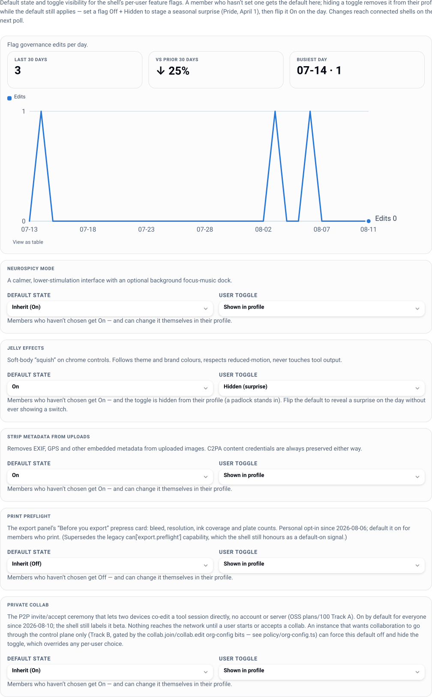

# Configuration reference

One JSON file plus environment secrets. The standalone server reads `./instance.json`, or
whatever path `LW_CONFIG` names. (`LW_CONFIG_JSON` is a different thing and not
interchangeable: it carries the whole config as a *string* and is read only by the Vercel
entrypoint.) Unset keys take the defaults below - `instance.example.json` is a working
starting point, and `server/src/config/instance.ts` is the authority.



**Secrets are never in the config file.** Config is safe to keep in git; secrets come from
the environment.

## `deployment`

| Key | Default | What it does |
|---|---|---|
| `mode` | `auto` | `production` enforces production checks regardless of NODE_ENV. `evaluation` deliberately permits memory storage and ephemeral secrets, including inside a production container. `auto` inherits production from NODE_ENV for existing installations. |
| `application` | `api` | `api` serves the console and API without requiring an employee shell. `web` requires a governed shellDir or external appUrl. A configured shellDir is checked in either profile. |
| `requireServerRendering` | `false` | Require every advertised tool to have at least one configured server format. Hooked tools need a worker URL and secret. This checks configuration, not a successful worker render. |

Production refuses memory storage, development login, open access, missing identity,
an unsafe public base URL, signing secrets shorter than 32 bytes, inconsistent worker
or signer configuration, and an incompatible active pack. Helm defaults to production;
the evaluation overlay and example JSON explicitly select evaluation. An old shell cannot
bypass production validation with `LW_ALLOW_STALE_SHELL`.

Run `pnpm run check:setup` with the deployment's config and environment to read the same
local checks as startup. It exits 1 for failed production checks and 0 otherwise; a zero
exit does not turn `not-tested` integrations into acceptance evidence. It neither connects
to the database nor calls identity, renderer or asset providers. The owner console's
**Customer setup** page additionally checks the running store and pending migrations.

## `instance`

| Key | Default | What it does |
|---|---|---|
| `name` | `Lolly Work` | the deploy's display name, also called the workspace name: console rail, sign-in card, `/healthz`, `instanceName` in `/api/auth/config`, and the invite, refusal and request pages, notices and copied invite messages ("Andy invited you to lolly.ing"). Put the name people know first: lolly.ing uses `lolly.ing` |
| `baseUrl` | `http://localhost:8787` | the URL this deploy answers on. Drives OIDC redirect URIs and the `Secure` cookie flag - **must** match reality |
| `pack` | `./packs/demo` | the brand pack mount: catalog, tools, design tokens, fonts, logos. The default is the small demo pack committed at `packs/demo`; the server warns at boot if the path does not exist, and the catalog is empty until it does |
| `shellDir` | *unset* | path to a built Lolly `shells/web/dist`. Set ⇒ the shell is served at `/` on one origin (session cookies work, the shell's `org/` governance seam activates) |
| `appUrl` | *unset* | where the Lolly app lives when it is *not* same-origin (a Vite dev server, a split deploy). The console routes "Open Lolly" and deep links through it |
| `brandTokens` | *unset* | map source IDs (`mounted` or `profile:<name>`) to explicit tokens asset IDs; required when a source has multiple independent heads |
| `connectPack` | *unset* | a `.lolly` instance pack to HOST from boot - a path relative to `pack` (or absolute). Seeded only before any durable branding decision, while no download is suppressed or hosted, so an ephemeral deploy offers `/connect/pack.lolly` without an owner ever uploading; an owner's own upload always wins, and a file naming a different instance base is refused loudly at seed time |
| `inviteNote` | *unset* | one plain-text line shown on the invite page and at the end of copied invite messages, such as which sign-in to use when an organisation blocks one. Trimmed, at most 240 characters, no line breaks; an empty line is the same as unset. See [invite links](identity.md#invite-links) |
| `homeView` | *unset* | the view a signed-in member's Lolly opens on when they arrive at the bare address: `tools` (the tools gallery) or `projects` (their Projects). Unset means tools. A link to a tool, a team project or a view still opens where it points, and choosing Tools later still shows the tools. Sent to members' shells in `GET /api/v1/org-config` as `home`; a shell that predates it ignores it |

`pack` supports materialized trees, modern `profiles.json` roots and legacy brand layouts. Selection lives in the Store; mounted files are never rewritten. See [Design-system administration](design-system-administration.md) for persistence requirements and explicit tokens selection.

Under a non-`open` access mode, a `shellDir` that is missing or predates the `org/`
governance module **stops boot**. In evaluation, `LW_ALLOW_STALE_SHELL=1` downgrades
the legacy shell guard to a warning; production validation still refuses it.

For generated deployment files and a staged owner cutover, use [Customer setup](customer-setup.md).

## `idp`

| Key | Default | What it does |
|---|---|---|
| `issuer` | `""` | OIDC issuer URL; discovery does the rest. Any compliant issuer works |
| `clientId` | `""` | the client this deploy authenticates as |
| `displayName` | `""` | human name on the sign-in button ("Keycloak", "SUSE ID", "ZITADEL"). Empty ⇒ "SSO" |
| `groupsClaim` | `groups` | the claim carrying group membership |
| `claimMap` | `given_name` / `family_name` / `email` / `title` | which claims fill firstname, lastname, email, title. `email_verified` vouches only for the `email` claim: a remapped email counts as verified only when it equals `email`, otherwise only under `emailVerification: trusted` |
| `roleGroups` | `{}` | exact groups for owner/admin/approver/author/member/viewer. Highest match wins; unmatched accounts are members. Omitted high roles retain literal legacy names; omitted member/viewer have no mapping. An explicit empty array disables that role mapping. Each group can appear once. Applies to IdP and local groups, including existing accounts after restart. |
| `additional` | `[]` | further IdPs beside the primary - each `{ id, kind?, issuer, clientId, displayName, groupsClaim?, claimMap?, clientSecretRef? }`. `kind` is `oidc` (default), `github` or `password`. A GitHub entry takes no `issuer`, needs `clientSecretRef`, refuses `scopes`, `authParams`, `hostedDomain` and `tenantId`, and accepts only `emailVerification: "claim"` (see the [GitHub recipe](identity.md#provider-recipes)). A `password` entry is described below. Unset claims inherit the primary's; the secret rides the env var `clientSecretRef` names; subs store namespaced `<id>:<sub>`. With several houses, plain `/api/auth/login` serves a chooser. Each entry may also set the per-IdP keys below (`hostedDomain`, `tenantId`, `emailVerification`, `scopes`, `authParams`); those are never inherited from the primary. See [identity](identity.md#more-than-one-idp) |
| `admission` | absent | who may sign in, checked on every OIDC, GitHub, password and proxy sign-in before a user row is written: `{ emails?: string[], domains?: string[], invitations?: boolean (default true) }`. Absent = every verified sign-in is admitted (production setup warns). `{}` admits invitations only. Admission by email, domain or invitation needs a verified email (see `emailVerification`). See [who may sign in](identity.md#who-may-sign-in) |
| `linkedStandingDays` | `30` | whole days, 1-365. How long one sign-in's IdP groups, and the account's own sign-in's standing under `admission`, carry over to the person's other linked sign-ins. See [one person, several sign-ins](identity.md#one-person-several-sign-ins) |
| `bootstrapOwners` | `[]` | emails that get the owner group (first `roleGroups.owner` name, else `owner`) at sign-in once admitted with a verified email. Audited as `auth.bootstrap-owner`. Each must be admitted by `admission.emails` or `admission.domains`; refused when `roleGroups.owner` is `[]` |
| `hostedDomain` | absent | per IdP. Google Workspace domain: the `hd` claim must equal it (a mismatch or missing claim refuses), and it is sent as the `hd` authorization parameter |
| `tenantId` | absent | per IdP. Microsoft Entra directory id (GUID): the `tid` claim must equal it |
| `emailVerification` | `claim` | per IdP. `claim`: email-based admission needs `email_verified: true`. `trusted`: every email this IdP sends counts as verified (tenant-pinned IdPs that omit the claim) |
| `linkByEmail` | `true` under `claim`, `false` under `trusted` | per IdP. Whether a sign-in from this IdP may join an existing person whose email matches. The default links only when the IdP itself says the address is verified; set `true` to link from a `trusted` IdP (refused unless that IdP has a `hostedDomain` or `tenantId` pin), or `false` to never link from this one |
| `scopes` | `["openid", "profile", "email"]` | per IdP. Requested scopes, a list or a space-separated string; must include `openid` |
| `authParams` | `{}` | per IdP. Extra authorization request parameters, allowlisted: `prompt`, `hd`, `domain_hint`, `login_hint`, `acr_values`. Any other key is refused; `hd` must equal `hostedDomain` when both are set |

Gated access needs `idp.issuer`, `proxyAuth.enabled` or a `password` entry - or
`dev.enabled` for local work. The server refuses to start otherwise. See [identity](identity.md).

### Email and password (`kind: "password"`)

For people who cannot use the instance's other sign-ins, for example because their own
organisation blocks unreviewed OAuth apps. Add one entry to `idp.additional`:

```json
{ "id": "email", "kind": "password", "label": "Email and password" }
```

| Key | Default | What it does |
|---|---|---|
| `id` | - | the slug in `/api/auth/login?idp=<id>`. `password` is reserved for this kind |
| `kind` | - | `password` |
| `label` | `Email and password` | the chooser button and the sign-in list in a profile; `displayName` is accepted instead |
| `linkByEmail` | `true` | whether a password sign-in joins the existing person who holds the same verified email. The other way round never happens: a password sign-in is stored unverified (an admin typed the address, no mailbox proved it), so no later sign-in through another provider joins an account by it |

- At most one `password` entry. It takes no `issuer`, `clientId`, `clientSecretRef`,
  `groupsClaim`, `claimMap`, `hostedDomain`, `tenantId`, `scopes` or `authParams`, and
  `emailVerification` can only be `claim`. It needs no secret, so setup counts it as
  complete.
- It can be the only sign-in: then no `issuer` is needed and `/api/auth/login` is the
  form itself. Such an instance has no admin to issue the first link, so the first
  owner gets theirs from the operator: list them in `bootstrapOwners` and run
  `node scripts/password-link.ts --email <their address>` where the server runs (it
  needs the server's `LW_CONFIG`, `DATABASE_URL` and `LW_SESSION_SECRET`, and prints the
  link). The same command lets a locked-out bootstrap owner back in. During restricted
  evaluation (`dev.enabled` on), a dev-login admin can issue links instead, and the
  console's sign-in screen offers the dev sign-in with the password form beside it.
- **No self sign-up, and nothing is emailed.** An admin or owner issues a one-time link
  from the console (Copy sign-in link on an invitation, or Copy password link on a
  person) and passes it on. The link sets the password and signs the person in. It
  works once, for 7 days, and issuing a new link for an address cancels its unused
  ones.
- Whoever holds a link can sign in as its address, so a link that leads to an owner,
  or that adds a password to an account that already signs in another way (unless it
  is the issuer's own), is owner-only. A link is also issued only for an address
  `admission` lets in now: an open invitation, a listed email or domain, or an account
  the lists still admit. All of this is asked again when the link is opened and used,
  on the issuer's standing at that moment, so a link stops working when its issuer is
  disabled or loses the admin role, or the address has since come to need an owner.
  "Disable access" cancels the person's unused links.
- An owner signs in with a password only when an owner (or the operator command)
  issued the link that set it. A password set from an admin's link stops working for
  an account that is later made an owner, until an owner issues a new link.
- Every password sign-in runs the same admission, linking, invitation and "Disable
  access" checks as any other sign-in. Setting a new password from a link ends every
  session the account had. Removing the email and password sign-in from a person
  (their profile, or the console) deletes the password.
- Passwords are 12 to 256 characters and not the email address. They are stored as
  scrypt hashes (N 2^15, r 8, p 1). At most two hashes are computed at once and 32
  wait; past that a sign-in gets `503` with `Retry-After` at once.
- Ten sign-in attempts in a row without a success lock that address for 15 minutes; a
  successful sign-in resets the count. Each attempt is counted before its password is
  checked, so parallel guesses get no more than ten checks, and attempts during a lock
  are not counted, so guessing does not extend it. An admin can lift a lock from the
  person (Unlock), without a new password. An unknown address, a wrong password and a
  locked address all get the same answer.
- The sign-in and link routes use the `auth` rate-limit bucket below, per client IP, on
  top of the lockout. A browser that runs out gets a page saying to wait a minute.
- The forms are served with `Referrer-Policy: strict-origin`, not `no-referrer`: a form
  post from a `no-referrer` page carries `Origin: null`, which the CSRF check refuses.
  A proxy in front must not replace that header on `/api/auth/` (the YunoHost package's
  nginx sets `no-referrer` on `/api/`, so email and password sign-in does not work
  there as shipped).

See [email and password](identity.md#email-and-password) for the flow.

## `policy`

| Key | Default | What it does |
|---|---|---|
| `defaultAccessMode` | `gated` | `open` (anonymous catalog), `gated` (sign-in required), `per-tool` |
| `ai.enabled` | `false` | approval ceiling for managed AI; the audited `ai` flag must also be explicitly On. See [managed AI](ai-policy.md). |
| `ai.capabilities` | `[]` | explicit capability list; required and nonempty when enabling AI. Unknown or duplicate capabilities are rejected. |
| `telemetry` | `standard` | `off`, `aggregate`, `standard` |
| `telemetryAttribution` | `opt-in` | `opt-in` strips the user id until the user consents; `default` attributes at `standard` |
| `guestLinks.enabled` | `true` | whether guest-edit links may be minted at all |
| `guestLinks.maxTtlHours` | `168` | hard cap on any guest link's lifetime |
| `guestLinks.defaultTtlHours` | `72` | the default offered when minting |
| `invites.allow` | `admins` | who may invite **new** people by email, from inside Lolly or from the console and `lw invite add`: `owners` (instance owners), `admins` (holders of `user.invite`: admins and owners by default) or `members` (any member not denied `user.invite`). Inviting through a project also needs manager on that project |
| `invites.domains` | `[]` | when not empty, a new address must be at one of these domains (a leading `@` is dropped, matching is case-insensitive) |
| `invites.maxTtlHours` | `720` | how long an invitation made from a project stays open; at most 8784 (366 days) |
| `invites.projectRoles` | all three | which project roles may be given by invitation or role change: any of `viewer`, `editor`, `manager` |
| `invites.passwordDomains` | `[]` | domains whose people usually sign in with email and password, the same rule as `domains`. When every address on a console or project invite is at one of them, "Can set a password" starts ticked, so the invite link also sets the password. It only suggests: the tick stays an admin's choice. See [setting a password from the link](identity.md#setting-a-password-from-the-link) |
| `requests.project` | `true` | members may ask for access to a project or session link they cannot open, and viewers may ask to edit. See [asking for access](sharing.md#asking-for-access) |
| `requests.join` | `false` | a person who signed in but is not admitted may ask the admins to let them in, from the refusal page. Off by default, because it lets anyone who can sign in somewhere reach the admins. See [asking to join](identity.md#asking-to-join) |
| `requests.ttlDays` | `14` | whole days, 1 to 60. How long a request stays open before it expires, with its notice |
| `requests.joinOpenMax` | `50` | whole number, 1 to 1000. The most requests to join and to use another account for an invitation that may be open at once across the instance; past it, new ones are held (the person sees the same page, nothing is stored) |
| `nearby.enabled` | `true` | instance-mediated "nearby" presence: the `collab.nearby` capability bit and both `/api/v1/collab/nearby` routes. `false` keeps the whole surface dark fleet-wide |
| `sessionTtlHours` | `12` | member session lifetime (token `exp` and cookie `Max-Age`); must be > 0 and ≤ 720 |
| `submit.maxBytes` | `67108864` | per-file cap on a catalog submission (64 MiB, matching publish-out). Over it: `413 PAYLOAD_TOO_LARGE` |
| `submit.chain` | *unset* | approval chain id gating submissions. Unset means no review: a submitted asset is live the moment it is stored. Set to a chain that does not exist, submissions are refused (`503 SUBMIT_CHAIN_MISSING`) rather than published unreviewed |
| `submit.quota.bytes` | `0` | cumulative byte ceiling per group; `0` is unlimited |
| `submit.quota.count` | `0` | cumulative submission-count ceiling per group; `0` is unlimited |
| `catalog.versionKeep` | `0` | how many versions of one instance asset to keep, head included. `0` keeps every version; a positive number trims oldest-first and deletes the trimmed bytes. The served version is never trimmed, and a held asset is never trimmed at all |
| `fleet.minEngine` | *unset* | advisory engine version floor (dotted, e.g. `"1.140.0"`): below-floor engines are highlighted in the Fleet view with an upgrade nudge; nothing is blocked or force-upgraded |
| `retention.telemetryDays` | `0` | delete telemetry events older than this; `0` keeps everything |
| `retention.auditDays` | `0` | trim audit rows older than this. The chain stays verifiable (the boundary's seq + hash are anchored before anything is deleted, and the head row is never trimmed), and a trim never passes the SIEM delivery cursor - an unreachable receiver pauses audit retention rather than losing events. See [operations](operations.md#retention-and-erasure) |
| `projectFiles.enabled` | `true` | shared files inside team projects. They also need a durable store: on the memory store they are off whatever this says. See [sharing](sharing.md#shared-files) |
| `projectFiles.maxFileBytes` | `26214400` | largest single file (25 MiB); at most `268435456` (256 MiB). Over it: `413 PROJECT_FILE_TOO_LARGE` |
| `projectFiles.projectBudgetBytes` | `134217728` | bytes of files one project may hold (128 MiB). Over it: `413 PROJECT_FILE_BUDGET` |
| `projectFiles.instanceBudgetBytes` | `268435456` | bytes of files all projects together may hold (256 MiB). Over it: `413 INSTANCE_FILE_BUDGET` |
| `projectFiles.uploadTtlHours` | `24` | the longest an unfinished upload stays open; at most 720. It expires sooner, 15 minutes after its begin or its last accepted part. An expired upload counts toward no budget; once it is an hour past expiry it is removed at the next upload or retention run |

`policy.invites` is optional; leaving it out keeps the defaults above. Unknown keys and
values outside the lists are refused at startup. The tier and the domain list govern
invitations, which let someone new sign in; sharing a project with someone who already has
an account needs manager on the project and an allowed role only. The console does not edit
this block (its configuration document covers grants, overlays, chains, providers, flags and
catalog fields), so change it in the configuration and redeploy. Lolly reads the limits from
org-config. See [sharing](sharing.md#invite-policy).

```json
"policy": {
  "invites": { "allow": "members", "domains": ["example.com"], "maxTtlHours": 168, "projectRoles": ["viewer", "editor"] }
}
```

`policy.requests` is optional too, and unknown keys in it are refused at startup. Requests
answer to the same rules as inviting: an approver may only grant what they could grant
directly. lolly.ing runs with join requests on, the invitation lifetime at its 30-day
default, and the password tick suggested for SUSE addresses:

```json
"instance": {
  "name": "lolly.ing",
  "inviteNote": "If your organisation blocks Google sign-in (for example @suse.com), use GitHub or email and password."
},
"policy": {
  "invites": { "passwordDomains": ["suse.com"] },
  "requests": { "join": true, "project": true, "ttlDays": 14, "joinOpenMax": 50 }
}
```

`policy.projectFiles` values are whole numbers above zero, with `maxFileBytes` no larger than
`projectBudgetBytes` and `projectBudgetBytes` no larger than `instanceBudgetBytes`; anything
else is refused at startup. Budgets count finished files and unfinished uploads that have not
expired, each at its size plus 4096 bytes for its database rows, so many tiny files fill a budget
too. One person's unfinished uploads may declare twice `maxFileBytes` in all, and one person may
download twice `instanceBudgetBytes` a day (counted per server process). The defaults are sized for a small hosted Postgres that also holds the file bytes (the
`pg` blob driver); Neon's free plan, for example, has 1 GB of storage in all and stops writes
past it. Raise them only with the storage to match.

```json
"policy": {
  "projectFiles": { "maxFileBytes": 10485760, "projectBudgetBytes": 67108864, "instanceBudgetBytes": 268435456 }
}
```

Submit is **open to authors** by default: anyone holding `catalog.submit` submits and the
asset goes live immediately. Name a `submit.chain` when the org wants review. Quota scopes are
group names, and a submission is charged to every group its submitter belongs to, so extra
memberships only tighten a member's budget. See [catalog](catalog.md#submitting-an-asset).

`catalog.versionKeep` keeps everything by default; set a ceiling only when you deliberately
want to bound blob growth - see
[operations](operations.md#blob-growth-and-version-retention) and
[catalog](catalog.md#versions).

Shorter `sessionTtlHours` bounds token lifetime if a directory change has not yet reached
Work. Once Work receives a group/role change, authorization uses the live record on each
request. Account disable and a session-epoch bump revoke existing member tokens on their
next authenticated request. Token expiry does not replace the offboarding integration.

## `render`

| Key | Default | What it does |
|---|---|---|
| `allowHooksInFastPath` | `false` | whether the in-process jsdom path may run a tool's `hooks.js`. Default refuses hooked tools with `501 HOOKED_TOOL_NEEDS_CHROMIUM`. When on, a tool whose manifest `requires` names a `host.*` API the in-process host lacks is refused with `501 TOOL_REQUIRES_UNMET` before any hook runs. Hooks run in a `node:vm` context with the DOM and host bridge but no `process`, `require` or `fetch` - contained, not isolated. Turn on only for a pack you curate end to end; the server warns at boot when it is on for any pack other than the bundled `packs/demo` |
| `worker.url` | `""` | the Chromium render worker. Set (with `LW_RENDER_WORKER_SECRET`) ⇒ hooked/HTML-heavy tools dispatch there instead of `501`. **This pair is the render-topology switch** - the deployment's capability set is advertised to shells via org_config's `render` block either way ([deployment](deployment.md)) |
| `worker.timeoutMs` | `20000` | per-job timeout |
| `c2pa.certFile` | `""` | signing-cert chain PEM (leaf first), public |
| `c2pa.claimGenerator` | `""` | producer label in the signed manifest |

Every tool in the committed `packs/demo` ships hooks, so `instance.example.json` and
`values-eval.yaml` both set `allowHooksInFastPath: true` - that pack is curated in this
repo end to end. Repoint `instance.pack` at a pack you do not fully control and this goes
back to `false`, with a Chromium worker for the hooked tools.

The worker itself takes `LW_RENDER_MAX_CONCURRENT` (default `4`, Helm
`renderWorker.maxConcurrent`): its per-pod render/rasterise cap. At capacity it answers
`503 RENDER_BUSY` + `Retry-After` immediately - no internal queueing, so saturation stays
visible to the HPA - and drops out of readiness (`/readyz`) until a slot frees. Its own
timeouts are `LW_RENDER_NAV_TIMEOUT_MS`, `LW_RENDER_EXPORT_TIMEOUT_MS` and
`LW_RENDER_TS_SKEW_MS` (HMAC clock skew between plane and worker) - see
`workers/render/README.md`.

Worker HMAC key and C2PA private key are secrets - see below and [c2pa](c2pa.md).

## `audit`

| Key | Default | What it does |
|---|---|---|
| `headLog.onBoot` | `true` | print the audit-chain head hash at boot |
| `headLog.intervalMinutes` | `60` | print it periodically (0 = off). The timer is unref'd, so it never holds the process open |

The defaults print the head; operators must forward and retain it outside this
deployment's control to establish an external anchor. Verify collection, retention and
restricted deletion access in the receiving system - see [audit](audit.md).

## `dev`

| Key | Default | What it does |
|---|---|---|
| `enabled` | `false` | enables `/api/auth/dev?email=…`, a passwordless local provider |
| `users` | `[]` | `{ email, name?, groups? }` entries the dev provider will admit |

**Keep this off in production.** It bypasses OIDC entirely, and setting `idp.issuer` does
not turn it off - the two coexist happily and the passwordless route stays live. The server
warns at boot when it finds both.

## `proxyAuth`

Reverse-proxy sign-in: an authenticating proxy in front of the instance (YunoHost's SSOwat,
Authelia, oauth2-proxy) states who the person is in request headers. See
[identity](identity.md#reverse-proxy-sign-in) for the contract and the security posture.

| Key | Default | What it does |
|---|---|---|
| `enabled` | `false` | enables `GET /api/auth/proxy?returnTo=…`. Satisfies the gated-access requirement on its own (no `idp.issuer` needed) |
| `displayName` | `""` | the sign-in button copy ("YunoHost"). Required when enabled |
| `secretRef` | `LW_PROXY_AUTH_SECRET` | env var NAME holding the shared secret; the header `x-lw-proxy-auth` must equal its value or the sign-in is `403` |
| `headers.user` | `ynh_user` | header carrying the stable login (required). Names are matched case-insensitively |
| `headers.email` | `ynh_user_email` | header carrying the mail address |
| `headers.name` | `ynh_user_fullname` | header carrying the display name; split into first and last name when the directory gives neither |
| `headers.groups` | `""` | header carrying a comma-separated group list; empty = the proxy sends none |
| `groups` | `{}` | static grants unioned in at sign-in: `{ "<login>": ["owner"] }` |
| `directory` | `null` | optional LDAP read of the person's own entry, once per sign-in. Fail-closed: configured but unreachable means `502` and no session |
| `directory.url` | `ldap://127.0.0.1:389` | plain `ldap://` over TCP; `ldaps` is refused |
| `directory.bindDn` | `""` | simple-bind DN; empty = anonymous |
| `directory.bindPasswordRef` | `""` | env var NAME holding the bind password |
| `directory.userDn` | `uid={user},ou=users,dc=yunohost,dc=org` | DN template; `{user}` is the RFC 4514-escaped login |
| `directory.attributes` | `mail` / `givenName` / `sn` / `cn` | which attributes fill email, firstname, lastname, name when the headers left them blank (empty string skips one) |
| `directory.groupMap` | `[]` | `{ attribute, pattern }` rules: every value of `attribute` matching `pattern` contributes its first capture group as a group name |
| `directory.timeoutMs` | `5000` | the whole bind + search must finish inside this |

## `rateLimit`

| Key | Default | What it does |
|---|---|---|
| `enabled` | `true` | per-IP token buckets on the auth, telemetry and link surfaces |
| `trustedProxyHops` | `0` | how many reverse proxies to trust in `X-Forwarded-For`. `0` reads only the socket peer. Behind one ingress, set `1` |
| `maxBuckets` | `50000` | bucket table cap |
| `auth` | `capacity 10, refillPerSec 0.2` | sign-in attempts, including each email and password guess and each use of a password link, and the invite page's and refusal page's forms (`/api/auth/invite`, `/api/auth/request`) |
| `telemetry` | `capacity 120, refillPerSec 4` | event ingest |
| `link` | `capacity 30, refillPerSec 1` | signed-link resolution, including invite pages (`/l/invite/`) |

## `blobs`

Where instance-owned catalog bytes live (materialized copies, published assets).

| Key | Default | What it does |
|---|---|---|
| `driver` | `pg` | `pg` (bytes in Postgres, zero extra moving parts) or `s3` (any S3-compatible store: AWS, MinIO, Ceph RGW). Any other value is a startup error |
| `s3.bucket` | - | **required** when `driver` is `s3` |
| `s3.region` | *unset* | AWS region, when the endpoint needs one |
| `s3.endpoint` | *unset* | for a non-AWS S3-compatible store |
| `s3.prefix` | *unset* | key prefix inside the bucket |

With no database at all, `pg` falls back to a memory blob store (evaluation only). The S3
credential is a secret, `LW_BLOBS_S3_CREDENTIAL`, formatted `<accessKeyId>:<secretAccessKey>`.
This is the exit route for media-sized estates and the air-gap story: see
[off-boarding](offboarding.md).

## `delivery`

Fixed organization-owned destinations for intentional outbound delivery. This is separate
from `catalogProviders` (assets coming in) and from a person's device-owned send targets.
No destination exists by default, so an unconfigured instance sends nothing anywhere.

| Key | Default | What it does |
|---|---|---|
| `maxBytes` | `67108864` | instance-wide per-delivery cap (64 MiB) |
| `destinations` | `[]` | fixed, config-managed outbound targets |
| `destinations[].id` | - | stable lowercase/dash id; also the `destination:<id>` RBAC resource |
| `destinations[].kind` | - | `s3`, `webdav`, or `https` |
| `destinations[].label` | - | member-visible name |
| `destinations[].credentialRef` | - | environment variable containing the write credential; never sent to a shell |
| `destinations[].enabled` | `false` | kill switch; only explicitly enabled targets are visible or writable |
| `destinations[].groups` | `*` | `*`/absent for all members, or an array of groups |
| `destinations[].formats` | - | required non-empty format allowlist |
| `destinations[].maxBytes` | global cap | narrower target-specific byte ceiling |
| `destinations[].approvalChain` | *unset* | optional existing approval-chain id; stages bytes and withholds provider egress until approved |
| `destinations[].options` | - | provider-specific fixed-target options below; never sent to a shell |

Provider options and credential forms:

| Kind | Options | Credential in `credentialRef` |
|---|---|---|
| `s3` | `bucket` (required), `region`, `endpoint`, `prefix`, `publicBaseUrl` | `<accessKeyId>:<secretAccessKey>` |
| `webdav` | `url` (required existing writable collection), `prefix` (existing subdirectory), `publicBaseUrl` | `<username>:<password>` or `bearer:<token>` |
| `https` | `url` (required exact HTTPS receiver; query allowed, redirects refused) | non-empty HMAC secret |

For S3, `endpoint` selects MinIO, Ceph, Garage, UpCloud or another compatible store;
omitting it uses AWS. For S3 and WebDAV, `publicBaseUrl` means the resulting object has a
public URL; omit it for private storage. WebDAV permits HTTP for an explicitly private/air-gap
deployment, but credentials then depend entirely on that network boundary - use HTTPS anywhere
else. The signed-HTTPS adapter always requires TLS.

Give every destination its own write-limited credential even when the same service is already
configured as a read-only catalog provider or as `blobs.driver`. Restrict it to the configured
bucket, collection or receiver. A destination credential is not a person's connected-service
credential and must not be reused as one.

See [outbound delivery](delivery.md) for the lifecycle, API and freedom boundaries.

## `submit`

The instance-side half of catalog submit: a single optional pre-store scan hook. Everything an
*org* tunes about submit lives under `policy.submit` above; this block is operator-only and
never reaches the policy-as-code document or any shell.

| Key | Default | What it does |
|---|---|---|
| `scanHook` | *unset* | no hook, and no bundled antivirus - an unconfigured deploy stores what it is sent |
| `scanHook.kind` | - | `exec` (bytes on stdin, exit code is the verdict) or `http` (bytes POSTed, status is the verdict) |
| `scanHook.target` | - | executable path for `exec`; an `http(s)` URL for `http` |
| `scanHook.args` | `[]` | extra argv for `exec` |
| `scanHook.timeoutMs` | `10000` | wall-clock budget for one scan |
| `scanHook.onError` | `reject` | what an *unanswered* scan means; `allow` opts out of failing closed |

Wiring ClamAV or an ICAP gateway is written up in
[operations](operations.md#pre-store-scan-hook-for-submissions).

## `notify`

Notification egress. Absent (the default) means dormant: zero egress. Sends only to
endpoints you configure, never phone-home; delivery is fire-and-forget, so an unreachable
relay never fails or slows a request. What gets sent, and to whom, is written up in
[operations](operations.md#notifications).

| Key | Default | What it does |
|---|---|---|
| `smtp.host` | - | the org's SMTP relay |
| `smtp.port` | `587` | submission port; `465`-style implicit TLS wants `secure: true` |
| `smtp.secure` | `false` | implicit TLS from the first byte. Off, STARTTLS is taken whenever the relay offers it |
| `smtp.from` | - | the From address on every notification |
| `smtp.user` | *unset* | AUTH PLAIN user; the password rides `LW_SMTP_PASSWORD`, never this file |
| `webhook.url` | *unset* | one JSON POST per event, signed with `LW_WEBHOOK_SECRET` (required - an unsigned webhook is refused at boot) |
| `people.email` | `false` | also email people notices: access requests and their answers and accepted invitations, which always reach the inbox of anyone with an account, and invitations and approved requests to join, for addresses with no account yet. Needs `smtp`. See below |
| `people.fromName` | `instance.name` | the sender's display name on those emails, 1 to 60 characters on one line. An invitation is sent as "Andy via lolly.ing" |

### Emailing people notices

People notices go through one function (`server/src/notify/people.ts`), which writes the
inbox message and, once email is on, also mails each recipient's verified address, or the
address of an invitee or a person asking to join who has no account yet. Email is off by
default, and every page and answer says so: the request page says the instance does not
send email yet, and the console never shows "Emailed" for a mail that did not go.

Email is on only when all three hold: `people.email` is `true`, `smtp` is set, and the
server's mail sender can confirm that the relay accepted each message. The sender in this
release sends and forgets, so it cannot confirm, and people notices stay inbox-only even
with the first two set. Still to be built: that confirming sender; plain-text mails sent as
"Andy via lolly.ing" from the `smtp.from` address, which never carry text a person wrote
(such as a request note) and end with "Not expecting this? You can ignore this email." and
a link to stop emails from the instance; and caps of 50 invitation emails a day per
inviter, one email per address a day, and one per request to each approver. Once a release
carries them, switching email on takes these steps:

1. **Pick a provider** that gives you an SMTP relay on port 587 with STARTTLS and its own
   DNS records, such as Postmark, or Amazon SES. The sender address needs no mailbox.
2. **Configure** the relay in `instance.json` and redeploy (`deploy/vm/push.sh` for
   lolly.ing):

   ```json
   "notify": {
     "smtp": { "host": "<relay host>", "port": 587, "secure": false, "from": "no-reply@lolly.ing", "user": "<relay user or API token name>" },
     "people": { "email": true, "fromName": "lolly.ing" }
   }
   ```

   Put the relay password or token in `LW_SMTP_PASSWORD` in the server's environment
   (`/opt/lolly-ing/.env` on the lolly.ing VM), never in the file. `secure: false`
   with port 587 takes STARTTLS when the relay offers it; use `secure: true` only for
   port 465.
3. **Publish the DNS records** the provider shows, in the domain's DNS. For lolly.ing that
   is Namecheap, Domain List > Manage > Advanced DNS, zone `lolly.ing`:

   | Record | Host | Value |
   |---|---|---|
   | SPF (TXT) | `@` | `v=spf1 include:<provider SPF host> ~all`. A domain has one SPF record: if a `v=spf1` record exists already (Namecheap's mail forwarding adds `include:spf.efwd.registrar-servers.com`), add the provider's `include:` to that record, never publish a second |
   | DKIM (TXT or CNAME) | `<selector>._domainkey` | exactly what the provider shows |
   | Bounce domain | the provider's return-path host, for example `pm-bounces` (Postmark, a CNAME) or `mail` (SES custom MAIL FROM, an MX and a TXT) | what the provider shows; it lets SPF align with the From domain |
   | DMARC (TXT) | `_dmarc` | `v=DMARC1; p=none; rua=mailto:andyfitz@gmail.com; adkim=s; aspf=r`. Move to `p=quarantine` after a clean week of reports |

   No MX record is needed to send from `no-reply@`.
4. **Check.** Wait until the provider shows the domain as verified. Then approve a request
   to join from a spare address, or invite one, and read the delivered mail's headers:
   they should show `spf=pass`, `dkim=pass` and `dmarc=pass`.

Keep using **Copy invite message** after email is on: a message sent from your own account
is the one a new person is most likely to trust.

## `siem`

Audit events pushed to the org's own receiver in signed batches (plans/35). `url` absent
(the default) means off. Loss-free by construction: the audit log is the outbox, a durable
cursor records the highest seq the receiver confirmed, and a refused batch replays whole.
Long-lived server only - on a serverless deploy, poll `GET /api/v1/audit` with a service
token instead. Delivery lag is the `lw_siem_lag` gauge on `/metrics`.

| Key | Default | What it does |
|---|---|---|
| `url` | *unset* | the receiver; batches POST as JSON signed with `LW_SIEM_SECRET` (same header scheme as notify webhooks) |
| `batchSize` | `200` | events per POST (1-1000) |
| `intervalSeconds` | `30` | forwarding cadence (>= 5) |

## `catalogProviders`

Deploy-time (GitOps / air-gap) provider entries, upserted at boot as `managedBy: 'config'`
and read-only in the API. Each entry: `id` (lowercase, dash-separated), `kind`, `label`,
optional `credentialRef` (the *name* of the env var holding the secret), `enabled`,
`options`, `mapping`, `exposure`, `sync`. Duplicate ids, unknown kinds and missing labels
are startup errors. See [catalog](catalog.md).

## Environment variables

### Secrets

| Var | When | What |
|---|---|---|
| `LW_SESSION_SECRET` | required in prod | member/guest/state token HMAC key; the audit log's MAC key is derived from it |
| `LW_SESSION_SECRET_PREVIOUS` | during a rotation | verification accepts it beside the current key; minting never uses it. Drop after the longest session TTL. The audit MAC does not use it: run `lw audit retire-key` after a rotation, with or without the old value ([audit](audit.md#rotating-the-session-secret)) |
| `LW_LINK_SECRET` | required in prod | link signature key |
| `LW_LINK_SECRET_PREVIOUS` | during a rotation | same window contract for outstanding signed links |
| `LW_IDP_CLIENT_SECRET` | if your IdP issues one | OIDC confidential client secret |
| `LW_LOG_FORMAT` | `text` | `json` writes one JSON object per log line (and turns the http access line on) for a log pipeline |
| `LW_LOG_HTTP` | off | `1` writes an access line per request in text mode: request id, method, route label, status, ms |
| `LW_PROXY_AUTH_SECRET` | with `proxyAuth.enabled` | the shared secret the reverse proxy injects as `x-lw-proxy-auth`. The name is `proxyAuth.secretRef`; `proxyAuth.directory.bindPasswordRef` names the LDAP bind password the same way |
| `LW_CREDENTIAL_SECRET` | once a provider credential is stored | master key sealing credentials at rest (AES-256-GCM) |
| `LW_METRICS_TOKEN` | to scrape remotely | bearer token for `/metrics`. Unset ⇒ loopback-only |
| `LW_SMTP_PASSWORD` | with `notify.smtp.user` | the relay password (AUTH PLAIN) |
| `LW_WEBHOOK_SECRET` | with `notify.webhook` | HMAC key signing every outbound webhook event |
| `LW_SIEM_SECRET` | with `siem.url` | HMAC key signing every forwarded audit batch |
| `LW_RENDER_WORKER_SECRET` | with a render worker | shared HMAC key; must match the worker |
| `LW_C2PA_SIGNING_KEY` | to sign exports | PKCS#8 private-key PEM |
| `LW_CATALOG_SIGNING_KEY` | when the shell pins a catalog key | ECDSA P-256 private key (PKCS#8 PEM or private JWK JSON) that signs each caller's tool index and tool file digests at `/catalog/tools/index.sig.json`. Unset: the catalog is served unsigned and that path answers 404, even when the pack carries a build-time signature, because that envelope can never match the index served per caller |
| `LW_BLOBS_S3_CREDENTIAL` | with `blobs.driver: s3` | `<accessKeyId>:<secretAccessKey>` for the blob bucket |
| `<credentialRef>` | per config-managed provider or delivery destination | resolved at boot, never persisted |

In development, `LW_SESSION_SECRET` and `LW_LINK_SECRET` fall back to ephemeral randoms, so
sessions die on restart. In production (`NODE_ENV=production`) their absence throws.

### Everything else

| Var | Default | What |
|---|---|---|
| `LW_CONFIG` | `./instance.json` | config file **path**. The one the standalone server, Compose and Helm read |
| `LW_CONFIG_JSON` | - | the whole config as a **string**. Read only by the Vercel entrypoint (`api/_lib/bootstrap.ts`); the standalone server ignores it |
| `DATABASE_URL` | - | Postgres. Unset ⇒ in-memory store (evaluation only) |
| `LW_AUTO_MIGRATE` | `true` when unset | boot-time DDL. `false`/`0`/`off`/`no`/empty ⇒ no DDL and refuse to start on a pending schema (the HA invariant) |
| `LW_SEED_CONFIG` | - | path to a governance document applied at boot; trusted and idempotent ([governance](governance.md)) |
| `LW_ALLOW_STALE_SHELL` | - | `1` downgrades the stale-shell boot refusal to a warning |
| `PORT` | `8787` | listen port |
| `NODE_ENV` | - | `production` makes secret checks fail-closed |
| `LW_TEST_DATABASE_URL` | - | enables the Postgres conformance leg in `pnpm test` |
| `LOLLY_OSS_DIR` | `../lolly` | where `pnpm run demo` finds the built OSS web shell |

## Changing configuration

Config is read at boot: edit and restart (Helm: update the ConfigMap and roll). Anything
you want to change *without* a restart belongs in governance - grants, overlays, chains,
feature flags, provider exposure - which is live-editable in the console and exportable as
code. See [governance](governance.md).
