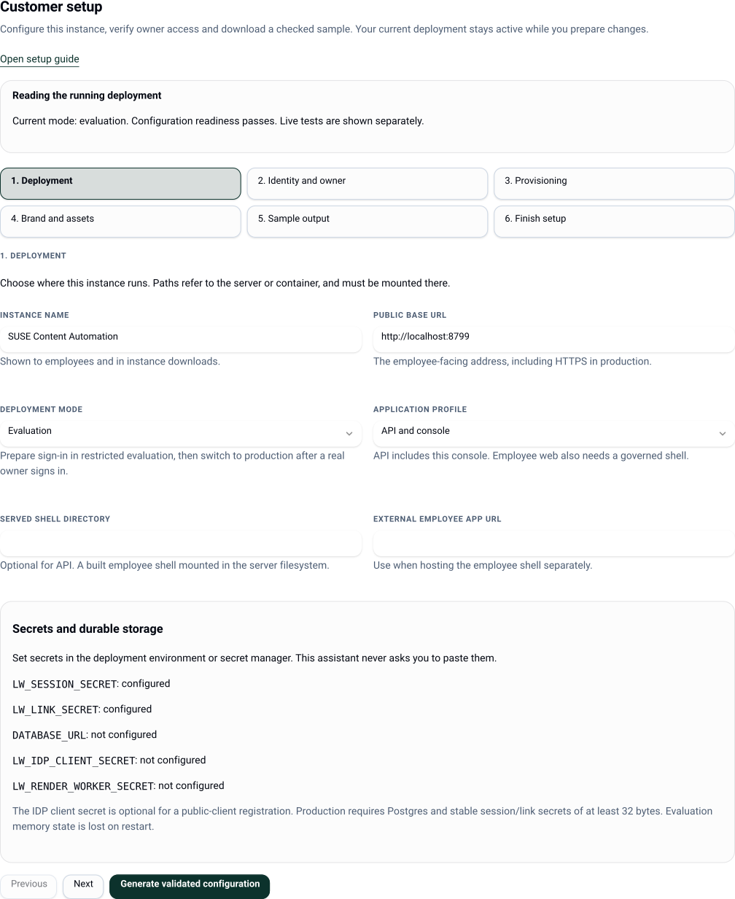
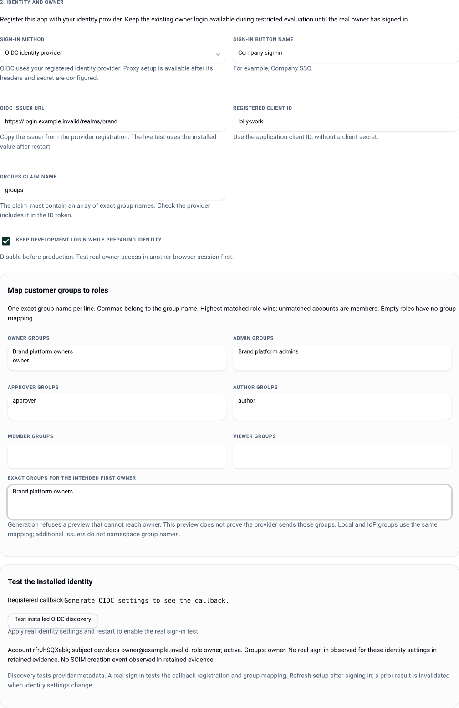
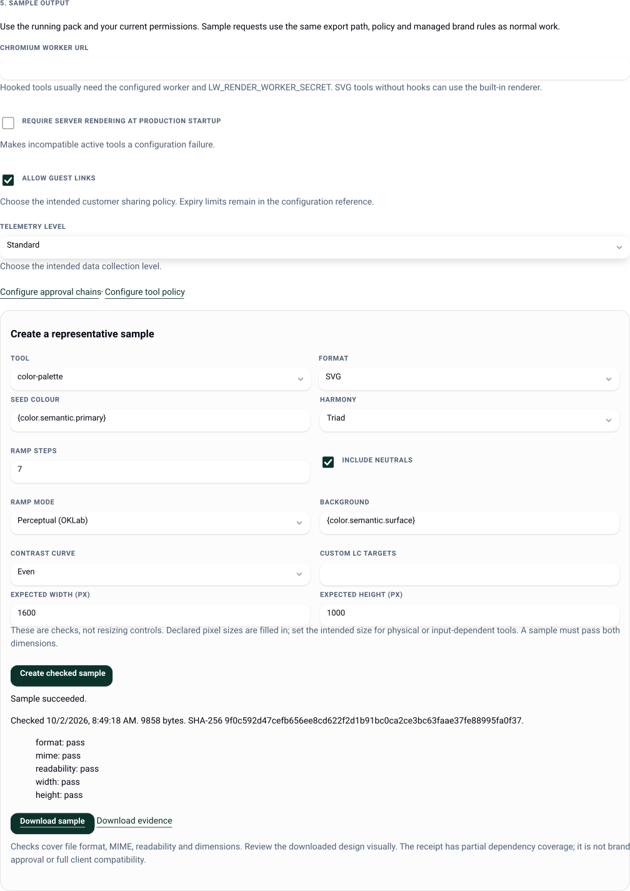

# Customer setup

Use **Customer setup** at `/admin#/setup` to configure an instance, establish a real owner and produce a downloadable sample. The six steps read the running deployment and guide you through the settings that need an application restart. Tokens, tool policy, brand sources and approval chains link to their existing console screens.

A generated file is a proposal. The app does not overwrite a mounted configuration file. After you apply it and restart, the screen compares the generated settings with the running instance. Discovery, sign-in and sample results remain separate from configuration readiness.



Screenshots show a local evaluation instance with example data. Copy URLs and settings from your own running app; the images do not record customer acceptance.

## Start with a reachable owner

Follow [Installing](install.md) for your deployment shape. For first setup, use restricted **evaluation** with a development owner, or configure OIDC and the owner mapping before the first production boot. Keep evaluation on a private host or behind an access boundary: development sign-in has no password.

For an evaluation bootstrap, the relevant settings are:

```json
{
  "deployment": { "mode": "evaluation", "application": "api" },
  "instance": { "baseUrl": "http://localhost:8787", "pack": "./packs/demo" },
  "dev": {
    "enabled": true,
    "users": [{ "email": "setup@example.invalid", "groups": ["owner"] }]
  }
}
```

Merge these into your deployment source when needed; retain its storage, pack and other settings. Set stable `LW_SESSION_SECRET` and `LW_LINK_SECRET` in the environment from the start. A generated evaluation fallback secret changes on restart and invalidates sessions. Use Postgres while testing identity if you need accounts, audit evidence and output to survive restarts; evaluation memory storage loses them.

Sign in through the configured development route, open the console and choose **Customer setup**. The page requires `instance.config`, normally an owner action. Production deliberately refuses development login and memory storage, so use the evaluation stage before production cutover.

## 1. Deployment

Set the instance name and public base URL. That URL drives cookies and the OIDC callback; use the address employees will actually visit. Production requires HTTPS without embedded credentials, query parameters or a fragment.

Choose **API and console** if you do not host an employee shell. Choose **Employee web app** and set a mounted built shell directory or an external employee app URL otherwise. The setup page cannot establish exact employee-client compatibility; use a matched client release and exercise its governed journey separately.

The environment panel reports whether required settings are present. Put secrets in your deployment environment or secret manager. There are no secret entry fields or secret values in the generated setup file. Production needs durable Postgres, current migrations and stable session/link secrets of at least 32 bytes. A worker URL also needs `LW_RENDER_WORKER_SECRET` on both application and worker.

## 2. Identity and owner

Select OIDC, enter the provider issuer, registered client ID, sign-in button name and groups claim. Additional issuers, custom profile claims and proxy headers remain available in the [identity reference](identity.md); the assistant preserves those advanced settings.

Map your customer groups to roles. Enter **one exact group name per line**; a comma is part of the name. The role order is owner, admin, approver, author, member, viewer. The highest matching role wins. Unmatched accounts remain members. An empty role mapping disables that role's literal legacy group; omitted roles in hand-written configuration retain the documented legacy defaults.

Local groups and provider groups share the mapping. Additional issuers namespace subjects, but **do not namespace group names**. Choose distinct provider group names if two issuers should carry different authority. Explicit deny grants continue to override a mapped role.



This example prepares OIDC settings while retaining development login and its bootstrap `owner` group. The installed sign-in evidence below the form stays separate from the draft.

Enter the exact groups expected for the first real owner. Generation refuses a preview that does not produce owner, duplicate group assignments or removal of every existing development owner while development login is retained. A preview tests entered strings; it cannot prove the provider will send them.

Keep development login during restricted evaluation. Generate and apply the OIDC settings and role mapping, restart, then register the exact callback shown on the page:

```text
https://your-work-host/api/auth/callback
```

Run **Test installed OIDC discovery**. It reads only the installed issuer, limits the request to ten seconds and bounds the response size. A pass proves matching discovery endpoints, not a successful registration or login. No raw provider error, token or secret is retained. Its audited result becomes stale when identity settings change.

Use **Sign in with installed identity** in a separate browser session. Confirm the page reports a real sign-in and owner role with the expected groups. The callback verifies the ID token; the setup page displays the derived account rather than raw claims or JWTs. Generate the production cutover from that real owner session. If development login is currently enabled, the preview API refuses to remove it until this sign-in has been observed for the same installed identity settings.

## 3. Provisioning

SCIM is optional for the first sample. When using it:

1. Open **Provisioning and service tokens**, create a SCIM token and store it in the directory connector before dismissing its one-time display.
2. Use the provisioning base URL shown by setup, ending in `/scim/v2`.
3. Set the test account's `externalId` to its exact primary OIDC `sub`. For an additional issuer, use `<issuer-id>:<sub>`. Proxy subjects use `proxy:<user>`.
4. Provision the account, then sign in as that person.
5. In setup, enter the exact durable subject and choose **Find provisioned account**. Confirm one account ID with both SCIM creation and real sign-in evidence, its role and effective groups.
6. Change groups through SCIM and confirm the effective role and permissions change. Disable the account and verify its current session loses access.

Email is never used to merge identities. If lookup finds no account, compare `externalId` with the verified provider subject. Audit retention can remove old events: absence of an event does not prove the action never occurred. Current group changes are resolved on authenticated requests; SCIM disable also advances the session epoch.

Token role selection, last use and revocation are implemented. Service-token scopes and expiry remain deferred; [identity](identity.md) describes the current credential contract.

## 4. Brand and assets

Set the pack path as it appears **inside the running server or container**. Mount or deploy the files there. Use an extracted `tools/` and `catalog/` tree or a supported profile source, then apply and restart before inspecting the new path.

The installed pack card uses the installed engine to load manifests and required files without running hooks. It separates compatible tools from the server formats this deployment can produce. Missing files, incompatible engine requirements and absent worker support have concrete diagnostics.

Use **Manage brand sources** for reviewed source changes and **Configure asset providers** for external originals. WebDAV / Nextcloud has a [guided connection](providers/webdav.md#guided-connection-in-the-app): configure the folder and groups, test a paged listing and an original, then save disabled and enable after a full sync. [Google Drive](providers/gdrive.md#guided-connection-in-the-app) adds typed folder settings and browser consent, then tests the saved source before activation. Its guide explains web-client registration, exact redirect URI, consent audience and testing-token expiry. Other providers retain their advanced forms and documented consent flows. Pack inspection does not test remote credentials or originals. Other typed provider forms/browser consent, trusted central pack publication and exact release handshakes remain separate work.

## 5. Sample output

Configure a Chromium worker for hooked tools. Built-in rendering supports suitable SVG tools without a worker. Evaluation can explicitly allow hooks in process for a curated pack; generated production settings disable that opt-in. Configure the isolated worker before production.

Choose the intended guest-link and telemetry settings. Configure tool policy and an approval chain through their linked screens when required. Stored overlay defaults are not applied consistently across clients and server yet; use a manifest default or governed locked preset as described in [governance](governance.md).

Choose an inspected tool with a governed SVG, PNG or JPG format. Simple input controls use the engine's initial values, current overlay restrictions and managed brand choices for the selected format. Only edited values are sent as overrides. Locked values are left to the renderer; complex inputs use tool defaults and can be edited in the employee app. The server rechecks tool access, export permission, managed rules and input validity when executing.

Confirm **Expected width (px)** and **Expected height (px)**. Declared pixel sizes are prefilled; enter the intended size for physical or input-dependent tools. These fields check the output and do not resize it. Both dimensions are required for a completed guided sample.

Choose **Create checked sample**. It submits an ordinary durable render with `output-v1` verification. Successful output includes format, MIME, readability and dimension checks, a SHA-256 receipt, **Download sample** and **Download evidence**. A failed render remains a failure with its remedy. PDF is excluded from this checked setup sample because its current inspection cannot establish full readability.

Download and visually inspect the design. The checks do not establish visual brand approval, complete dependency attestation, every employee-client path or every worker format. A successful worker sample proves that request through the current renderer; the exact-release worker canary remains separately marked not tested.



The example uses the bundled colour-palette tool and the real local renderer. **Download sample** retrieves the output; **Download evidence** retrieves its checks and receipt.

The screen resumes the last step and sample request in this browser. It stores only step, configuration/context hashes and a render ID, never draft settings, endpoints or tokens. Results are reread from the authorized server. Changed deployment, inspected pack files or governance requires a fresh sample; changing accounts also changes the setup context. Polling stops after two minutes; refresh to resume a long-running retained request.

## Apply

Choose **Generate validated configuration** after editing the settings. Review the patch and exact callback, then download `lolly-setup.json` for an instance-file deployment or `lolly-setup.helm.json` for Helm. The files contain non-secret customer configuration; handle them as deployment files.

For an instance JSON file, run from the Work checkout:

```sh
pnpm setup:apply ./instance.json ./lolly-setup.json
pnpm setup:apply ./instance.json ./lolly-setup.json --write
```

The first command validates without changing a file. The second revalidates the settings, preserves unrelated source configuration, creates a restricted backup and updates the regular source file atomically. Use the source file before deploying its read-only mounted copy. If the source changes during validation, the update refuses. An altered or stale expected-settings hash also refuses; regenerate the proposal in setup.

For Helm with `config` as an **inline YAML object** in your values file, add the overlay **after** your existing values and retain their secret/storage settings:

```sh
helm upgrade --install lw ./deploy/helm \
  -f ./customer-values.yaml -f ./lolly-setup.helm.json
```

JSON is valid YAML input to Helm. Supply the intended application/worker images and secrets through the existing chart contract; the assistant does not select or publish releases. Apply the chart to your authorized environment and wait for its rollout. For an instance file, deploy the updated source and restart the application.

If you use `config` as a raw JSON string or `--set-file config=...`, an object overlay would replace that string and lose its unrelated settings. Download the setup file instead, apply it to your source `instance.json` with the two commands above, then supply the complete updated source:

```sh
helm upgrade --install lw ./deploy/helm \
  -f ./customer-values.yaml --set-file config=./instance.json
```

Refresh Customer setup. **Generated settings are applied** means the running editable settings match the generated configuration. It does not mean all integration tests pass. Re-run identity and sample checks after relevant changes. If the browser has an unexported draft, navigation asks whether to retain or discard it.

For production cutover, use the real owner session, choose production and disable development login. Generate, apply and restart with Postgres and stable secrets configured. Run `pnpm check:setup` against the deployed configuration and check `/readyz`. Keep the backup until the new deployment passes; restore the source backup and redeploy if needed. A change from memory to Postgres does not migrate evaluation state.

## 6. Finish setup

The final page shows configuration readiness for the declared mode, observed real owner sign-in, installed discovery and the checked sample separately. It lists remaining checks and sends you to the relevant step. A configured URL stays distinct from a tested integration.

The guided milestone is complete when the applied deployment is configured, a real mapped owner can use it and the representative sample passes file checks and downloads. Customer acceptance also needs the selected provider's originals, the matched employee clients and any product features the customer requires. Full approval-bound ordinary exports, central publication, HA and unattended delivery recovery remain deferred when those requirements apply.

## Troubleshooting

| Symptom | Action |
|---|---|
| Generated settings remain pending | Deploy the updated source, restart the correct instance, then refresh. Compare pack paths and public base URL with the generated patch. |
| No owner preview | Enter exact group names, including the intended owner's groups. Keep the bootstrap `owner` group mapped while development login is retained. |
| Cutover refuses | Apply identity and mapping in restricted evaluation first. Complete a real owner sign-in for those installed settings, then generate from that session. |
| Discovery fails | Check installed issuer, server network access and HTTPS endpoints. Discovery does not accept a draft URL or follow redirects. |
| Login returns to an error | Compare the registered callback with the exact generated URL. Confirm client ID, groups claim and ID token group array. |
| SCIM and sign-in show different accounts | Correct the exact externalId/subject contract. Do not merge using email. |
| No available sample format | Fix pack compatibility, worker credentials or tool format policy. Refresh after deployment. SVG without hooks can use the built-in renderer. |
| Provider consent or credential setup is unavailable | Set stable `LW_CREDENTIAL_SECRET`, restart and sign in as an owner. For Google Drive, use HTTPS and register the provider callback shown in its guided form. |
| Google connection returns without an offline credential | Check the registered web client, consent audience, Drive read-only permission and folder access, then reconnect from the saved disabled source. See the [Google Drive guide](providers/gdrive.md). |
| Sample cannot be queued | Use the long-lived server; function-only hosts cannot own durable background renders. |
| Sample fails or output cannot be downloaded | Read its error, confirm current access and inspect worker/asset availability. Retained output downloads recheck permissions and integrity. |
| A previous sample no longer appears | Configuration, pack, governance or account changed; create a new sample. Retention may also remove its bytes. |
| Database or schema fails | Restore database connectivity and run migrations. Liveness is separate from readiness. |
