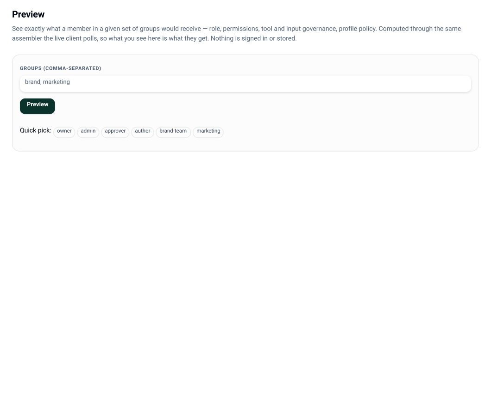

# Policy and governance

Governance is *data*, held server-side, edited live, and exportable as one document. It is
never a fork of the pack's `tool.json` - the open-source tool definition stays untouched and
the control plane overlays its opinion on top.





Everything on this page is live-editable in the console (**This Deploy → Tools / Feature
flags**, **Grants**) and reaches connected shells on their next poll.

## Tool overlays

One overlay per tool, versioned. `PUT /api/v1/policy/overlays/:toolId` under `policy.edit`
(admin by default, grantable to a brand group so a brand team can govern inputs without
holding the admin role). Saving audits before/after and busts the render cache for exactly
the affected renders.

### Visibility

```json
"visibility": { "groups": ["brand-team", "marketing"] }
```

A tool with a `visibility` block is **absent** from the catalog feed for anyone outside
those groups - not greyed out, not hidden client-side. `*` means everyone.

### Per-input access

`inputAccess` maps an input id (or `*` as the default) to an ordered rule list; the first
group-match wins, and no match means `editable`.

| Level | Effect |
|---|---|
| `editable` | normal input |
| `choice` | restricted to `allow: [...]` |
| `locked` | replaced by `value` - the user never supplies it |
| `hidden` | removed from the schema entirely |

```json
"inputAccess": {
  "logo": [
    { "groups": ["brand-team"], "level": "editable" },
    { "groups": ["*"], "level": "locked", "value": "acme/logo" }
  ],
  "discount": [
    { "groups": ["sales-managers"], "level": "editable" },
    { "groups": ["*"], "level": "hidden" }
  ]
}
```

Enforcement is server-side and pre-render: a locked input supplied by a caller is a
`422 INPUT_LOCKED`, and the locked value is baked into the render regardless of what the
request said. The same pure functions filter the schema the shell sees, so the UI and the
enforcement can't disagree.

### The enforce block

| Key | Values | Meaning |
|---|---|---|
| `formats` | e.g. `["svg","png"]` | restrict output formats |
| `c2pa` | `org-identity` \| `off` | sign exports with the deploy identity ([c2pa](c2pa.md)) |
| `watermark` | `always` \| `until-approved` \| `never` | preview watermarking ([sharing](sharing.md)) |
| `escalation` | a chain id | bind this tool's outputs to an approval chain ([approvals](approvals.md)) |

`defaults` seeds initial input values without locking them.

## Profile governance

Identity fields the IdP owns are managed, not editable. `claimMap` decides which claim fills
`firstname`, `lastname`, `email` and `title`; those fields come back to the shell as
`mode: locked, source: idp`, which is what renders the padlocks in the shell's profile view.
The user keeps everything the org has no opinion about.

## Feature flags

The control plane governs the shell's per-user toggles it knows about, instance-wide. Two
knobs per flag:

| Knob | Values | Meaning |
|---|---|---|
| `default` | `on` \| `off` \| unset | what a user who hasn't chosen gets; unset inherits the shell's built-in default |
| `visibility` | `show` \| `hide` | whether the user sees the toggle at all - hiding removes the control while the default still applies |

Governable today (ids are the shell's own):

| Flag | Built-in default | What it is |
|---|---|---|
| `neurospicy` | on | calmer, lower-stimulation interface with an optional focus-music dock |
| `jelly-effects` | on | soft-body squish on chrome controls; respects reduced-motion, never touches output |
| `strip-upload-metadata` | off | strips EXIF/GPS from uploaded images (C2PA credentials are preserved either way) |

`GET /api/v1/policy/flags`, `PUT /api/v1/policy/flags/:flagId`, same `policy.edit` gate.
The `off` + `hide` combination is how a seasonal surprise ships dark: stage it now, flip the
default on the day and it lights up without ever having shown a switch.

## Policy-as-code

One canonical document holds the whole governance state, serialized deterministically so
logically-equal states hash identically:

- grants
- tool overlays
- approval chains
- catalog-provider **config + exposure** (never credentials, never runtime state, never the
  enable kill-switch)
- feature-flag governance

```bash
lw export --out governance.json                # GET /api/v1/config/export
lw apply governance.json --dry-run             # POST /api/v1/config/apply?dryRun=1 - shows the diff
lw apply governance.json                       # apply
lw apply governance.json --prune               # also delete store-only entries
```

The diff reports create/update/delete/unchanged per category, and the response carries the
document hash. Two guards:

- Applying a document that creates or removes an owner-only grant
  (`instance.config` / `catalog.provider.credential`) requires the **owner** role
  (`403 OWNER_ONLY_ACTION`).
- Entries that a config-managed catalog provider owns are conflicts, not overwrites
  (`409 CONFIG_MANAGED`) - edit `instance.json` and redeploy instead.

### Seeding at boot

```bash
LW_SEED_CONFIG=./governance.json npm start
```

Idempotent, so it is safe to leave set. It is *trusted* (filesystem access), so it bypasses
the owner-only HTTP guard and may seed owner-only grants - it still never enables a provider
or stores a credential, because neither is in the document. This is what makes a fresh deploy
come up already governed, and governance reviewable and promotable staging → prod from git.

## Related

- Who may edit any of this: [permissions](permissions.md)
- What the shell does with it: [identity](identity.md#what-a-shell-sees)
- Provider exposure rules: [catalog](catalog.md)
