# Identity and sessions

Two principals, two cookies, two token domains. Everything is a signed, stateless token - 
there is no session table.



| Principal | Cookie | Comes from | Lives |
|---|---|---|---|
| Member | `lw_session` | OIDC sign-in, or the dev provider | `policy.sessionTtlHours` (default 12h) |
| Guest | `lw_guest` | admission through a guest-edit link | the remaining lifetime of that link |

Cookies are `HttpOnly`, `SameSite=Lax`, `Path=/`, and `Secure` whenever `instance.baseUrl`
is https. A member session wins when both cookies are present. Every token carries a `typ`
domain in its signed payload, so a session token can never be replayed as a guest token, a
link signature or an OAuth state.

## OIDC SSO

Provider-agnostic by construction - nothing in the code knows your IdP. Set:

```json
"idp": {
  "issuer": "https://id.example.com/realms/main",
  "clientId": "lolly-work",
  "displayName": "Keycloak",
  "groupsClaim": "groups",
  "claimMap": { "firstname": "given_name", "lastname": "family_name", "email": "email", "title": "title" }
}
```

The flow is discovery → Authorization Code + PKCE (S256) → `id_token` verified against the
provider JWKS (RS256 via WebCrypto) **before any claim is believed**. Verified claims fill
the org user record through `claimMap`.

- Redirect URI: `<instance.baseUrl>/api/auth/callback`. `baseUrl` must match the URL the
  deploy actually answers on.
- `LW_IDP_CLIENT_SECRET` only if your IdP issues a confidential client.
- `displayName` is what the sign-in button and "managed by …" copy say. Any compliant
  issuer works; open and sovereign providers are first-class.

Routes: `GET /api/auth/config` (what the sign-in screen needs), `GET /api/auth/login`,
`GET /api/auth/callback`, `GET /api/auth/session`, `POST /api/auth/logout`.

## The dev provider

`dev.enabled: true` plus a `dev.users` list enables `GET /api/auth/dev?email=…`: a
passwordless local sign-in for development, demos and tests. It bypasses OIDC entirely - 
keep it off in production. The Helm values ship it disabled.

## Device-code sign-in

A device that cannot run the browser flow - the CLI, a native shell against a gated
instance - signs in by code (plans/34): it asks `POST /api/v1/auth/device` for a short
code, the person opens `/activate` in any browser where they are already signed in and
confirms it, and the device's next poll collects an ordinary session cookie minted for
that person. The approving browser session is the whole authority - the flow never
touches IdP credentials, works identically over OIDC and the dev provider, and the
mint re-checks disable/revocation so an account closed mid-flow gets nothing. Codes
live ten minutes, are single-use, and pending ones are listable (and deniable, never
approvable) in the console's Fleet view. Needs the long-lived server; a serverless
deploy answers `501`.

## Groups → role

Groups arrive from the IdP claim named by `groupsClaim`. The console can add **local
groups** on top, for organizational structure your IdP does not model:

```
GET/POST /api/v1/groups              # list / create a local group
DELETE   /api/v1/groups/:name
PUT      /api/v1/users/:id/local-groups
```

The effective group set is the union (IdP ∪ local), and role is derived from it: the
highest of `owner`, `admin`, `approver`, `author` present, otherwise `member`. A local
group named after a role escalates exactly like an IdP one - which is deliberate, and why
group editing is an admin action and audited.

Group membership is also how governance targets people: overlay visibility, approval-chain
eligibility, provider exposure, and grant principals (`group:<name>`) all read groups.
See [permissions](permissions.md).

## SCIM provisioning

An IdP can push user lifecycle over SCIM 2.0 at `/scim/v2`, so joiners, movers and leavers
are provisioned without a console visit. The subset is deliberate - Users (create, patch,
`active=false`) and Group membership - because that is what earns the wave; passwords, bulk,
sort and ETags are declared unsupported in `GET /scim/v2/ServiceProviderConfig`.

SCIM is **another writer of the one identity model**, never a second one:

- a SCIM **User** is a `UserRecord`. Its `externalId` is the `sub` OIDC login also keys on,
  so a person the IdP provisions and the same person signing in resolve to **one row** - and
  the groups SCIM set survive that sign-in, because they land in `localGroups` (durable),
  not the IdP-authoritative `idpGroups` (re-synced on login).
- a SCIM **Group** is a local group. Membership is stored per-user (`localGroups`), so a
  Group `PATCH` becomes a set of per-user edits - the same `localGroups` the console writes.
- `active=false` is the deprovision: it flips the disabled flag **and** bumps the session
  epoch, exactly as the console disable does (below), so every live session dies at once.

The connector authenticates with a bearer token, one per IdP, minted by an **owner**
(`scim.manage`) and shown once:

```
POST   /api/v1/scim/tokens     { "idp": "keycloak" }   # returns the secret ONCE
GET    /api/v1/scim/tokens                              # metadata only - never the secret or its hash
DELETE /api/v1/scim/tokens/:id                          # revoke
```

The secret is stored only as its sha256, so a leaked database yields hashes, not usable
tokens. **SAML is not implemented**, and does not need to be: Keycloak (which id.suse.com
runs) bridges a SAML-only IdP to the OIDC this already speaks.

## Offboarding, disable and revocation

```
POST /api/v1/users/:id/disabled     # { disabled: true }   (or SCIM active=false)
```

Disable is **instant and it revokes**: `resolveMember` rejects a disabled account on every
request, and disabling also bumps the user's **session epoch** - a counter each session
token embeds at mint, so a token minted before the bump is refused from that moment. Every
live session of the disabled person therefore dies on its next request; there is no window
to ride out. SCIM `active=false` (above) composes exactly this. Two further notes:

- Revocation is **per user, not per session**: the epoch kills all of a person's sessions at
  once (there is no list of individual sessions to revoke one of). `bumpSessionEpoch` is the
  same lever for a "sign everyone-of-this-person out" without disabling them.
- A group or role change is **immediate for API authorization**: `requireAction` resolves
  the live user record on every request and ignores the role baked into the cookie. What
  waits for the next token mint is only the role the shell's own token *claims*; lowering
  `policy.sessionTtlHours` shortens that window.

## Guest sessions

A guest-edit link admits someone with no account: `GET /l/:id?s=…` mints an `lw_guest`
cookie scoped to that link's tool (and session, if the link names one), for whatever
remains of the link's lifetime. Guests carry the `guest` role, which grants **nothing** by
default - their access is entirely link-scoped. Links can carry a password (scrypt-hashed),
and `policy.guestLinks.maxTtlHours` caps the lifetime regardless of what the minting UI
asks for. `guestLinks.enabled: false` refuses minting outright.

See [sharing](sharing.md) for the link lifecycle and [permissions](permissions.md) for
what a guest can be granted.

## What a shell sees

Once signed in, a connected shell polls one document - `GET /api/v1/org-config` - carrying
identity, role, permissions, tool and input governance, managed profile fields and feature
flags, pre-filtered for that caller's groups and ETag'd on a policy version. Profile fields
sourced from the IdP come back `mode: locked, source: idp`, which is what renders the
padlocks in the shell's profile view. To check what any group combination would receive,
without impersonating anyone: `GET /api/v1/org-config/preview?groups=…`, the console's
Preview view, or `lw preview --groups a,b`.
