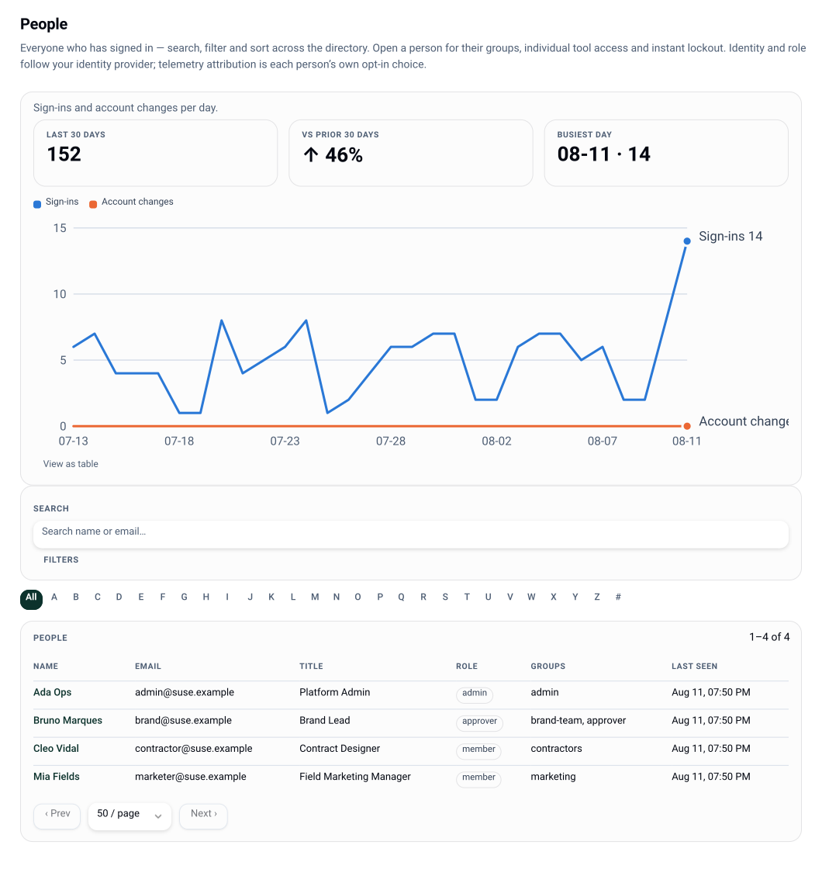

# Identity and sessions

Two principals, two cookies, two token domains. Everything is a signed, stateless token - 
there is no session table.



| Principal | Cookie | Comes from | Lives |
|---|---|---|---|
| Member | `lw_session` | OIDC sign-in, reverse-proxy sign-in, or the dev provider | `policy.sessionTtlHours` (default 12h) |
| Guest | `lw_guest` | admission through a guest-edit link | the remaining lifetime of that link |

Cookies are `HttpOnly`, `SameSite=Lax`, `Path=/`, and `Secure` whenever `instance.baseUrl`
is https. A member session wins when both cookies are present. Every token carries a `typ`
domain in its signed payload, so a session token can never be replayed as a guest token, a
link signature or an OAuth state.

## OIDC SSO

Provider-agnostic by construction - nothing in the code knows your IdP. Set:

```json
"idp": {
  "issuer": "https://id.example.com/realms/main",
  "clientId": "lolly-work",
  "displayName": "Keycloak",
  "groupsClaim": "groups",
  "claimMap": { "firstname": "given_name", "lastname": "family_name", "email": "email", "title": "title" }
}
```

The flow is discovery → Authorization Code + PKCE (S256) → `id_token` verified against the
provider JWKS (RS256 via WebCrypto) **before any claim is believed**. Verified claims fill
the org user record through `claimMap`.

- Redirect URI: `<instance.baseUrl>/api/auth/callback`. `baseUrl` must match the URL the
  deploy actually answers on.
- `LW_IDP_CLIENT_SECRET` only if your IdP issues a confidential client.
- `displayName` is what the sign-in button and "managed by …" copy say. Any compliant
  issuer works; open and sovereign providers are first-class.

Routes: `GET /api/auth/config` (what the sign-in screen needs), `GET /api/auth/login`,
`GET /api/auth/callback`, `GET /api/auth/session`, `POST /api/auth/logout`, and for
[email and password](#email-and-password) `POST /api/auth/password/login` and
`GET`/`POST /api/auth/password/set`.

### More than one IdP

A migration in flight, or a subsidiary on its own house: `idp.additional` lists further
issuers beside the primary (plans/36) -

```json
"idp": {
  "issuer": "https://id.example.com/realms/main", "clientId": "lolly-work", "displayName": "Example ID",
  "additional": [{
    "id": "subsidiary", "issuer": "https://login.subsidiary.example", "clientId": "lolly",
    "displayName": "Subsidiary SSO", "groupsClaim": "roles", "clientSecretRef": "LW_IDP_SECRET_SUBSIDIARY"
  }]
}
```

Each entry carries its own client, display name, and (optionally) its own `groupsClaim`
and `claimMap` - unset ones inherit the primary's. A confidential secret rides the env
var `clientSecretRef` names; omit it for a public/PKCE client. With several houses
configured, plain `/api/auth/login` serves a script-free **chooser page**, so every
existing sign-in link (the console gate, the OSS shell's gate) grows the buttons with no
client change; `?idp=<id>` picks one directly, and `/api/auth/config` +
`GET /api/v1/instance` list `providers` for clients that render their own. The IdP that
STARTS a flow finishes it - the id rides the signed state token - and an additional
house's subs are stored namespaced (`<id>:<sub>`), so two issuers handing out the same
bare sub can never collide into one row. The primary's subs stay raw: existing rows and
the SCIM `externalId` linkage are untouched.

### Email and password

Some people cannot use the instance's IdPs: their organisation's Google Workspace, for
example, refuses OAuth apps it has not reviewed. For them, add one `kind: "password"`
entry to `idp.additional` (see [configuration](configuration.md#email-and-password-kind-password)):

```json
"additional": [{ "id": "email", "kind": "password", "label": "Email and password" }]
```

The chooser then offers "Sign in with email and password", which opens a server-rendered
form. With no other sign-in configured, `/api/auth/login` is that form.

There is no sign-up and no email is sent. A person gets a password like this:

1. An admin or owner invites the address (or it is already admitted by the lists, or
   it belongs to an account).
2. In the console, they press **Copy sign-in link** on the invitation, or **Copy
   password link** on the person. The console copies a one-time link and shows it with
   its expiry.
3. They send the link themselves, by chat or email. It works once, for 7 days. A new
   link for the same address cancels any unused one.
4. The person opens it, sees their address, chooses a password (12 to 256 characters,
   not the address), and is signed in. The same page asks for "Your name" (optional,
   1 to 80 characters, trimmed); a name given there becomes the account's display name,
   so People lists, presence and notices show it instead of the address.

An invitation can also do this in one link: when the admin ticks "Can set a password",
the invite link itself offers **Set a password** (see
[setting a password from the link](#setting-a-password-from-the-link)), so the person gets
one link, not two.

A forgotten password is the same: ask the person who invited you for a new link. The
old password keeps working until the new one is set, and setting it ends every session
the account had, so a password that got out stops working everywhere at once.

Whoever holds a link can sign in as its address, so some links are owner-only: one
that leads to an owner (an owner's account, a `bootstrapOwners` address, an invitation
into an owner group), and one that adds a password to an account that already signs
in another way, unless it is the issuer's own account. Each link is judged again when
it is opened and when it is used, on its issuer's standing at that moment: if the
issuer has been disabled or is no longer an admin, or the address has since come to
need an owner, the link no longer works (an `auth.password.link.refused` audit row says
why). An owner signs in with a password only when an owner issued the link that set
it, so a password an admin's link set stops working for an account that is later made
an owner.

A password sign-in finishes exactly like an OIDC or GitHub one. Admission runs on every
sign-in, so revoking the invitation or taking the address off the lists stops it;
"Disable access" stops it (and cancels the person's unused links); an open invitation
is accepted and its groups join; and the sign-in joins the existing person who holds
the same verified email (see [one person, several sign-ins](#one-person-several-sign-ins)),
unless that person's only verified sign-ins are pinned to a directory. A password
brings no IdP groups. The password sign-in itself is stored as unverified: an admin
typed the address, no mailbox proved it. So a later sign-in through another provider
never joins an account by a password's address; a person who wants both adds the other
one from their profile while signed in with the password.

Removing the email and password sign-in from a person, from their profile or in the
console, deletes the password. A new one needs a new link. The sign-in an account was
created with cannot be removed (as for any provider); "Disable access" is the way to
stop that one.

Guessing is slowed twice over: every attempt uses the `auth` rate-limit bucket, and ten
attempts in a row without a success lock the address for 15 minutes (a success resets
the count). An attempt is counted before its password is checked, so a burst of
parallel guesses gets no more than ten checks, and attempts during a lock are not
counted. An admin or owner can unlock a person from the console (Unlock) without
making them choose a new password; anyone can lock an address by guessing at it. An
unknown address, a wrong password and a locked address all get the same answer: "That
email and password do not match." The form carries a signed double-submit token
against login CSRF. Passwords are stored as scrypt hashes; passwords, hashes and link
tokens never reach a log line or the audit chain. The audit actions are
`auth.password.link.issue`, `auth.password.link.refused`, `auth.password.set`,
`auth.password.fail`, `auth.password.locked`, `auth.password.unlock` and
`auth.password.remove`, beside the usual `auth.login` and `auth.denied`.

An instance whose only sign-in is email and password has no admin to issue the first
link. The operator prints one for an address listed in `bootstrapOwners`, where the
server runs:

```sh
docker compose exec server node scripts/password-link.ts --email ana@example.com
```

The link behaves like one an owner issued: once, for 7 days, still subject to
admission. The same command lets a locked-out bootstrap owner back in.

## Who may sign in

Completing a sign-in at the IdP proves who a person is. It does not say they belong here.
`idp.admission` decides that, on every OIDC, GitHub, password and reverse-proxy sign-in,
after the `id_token` (or password) is verified and **before** a user row is written. A refused person gets a
403 page and leaves only an `auth.denied` audit row.

```json
"idp": {
  "issuer": "https://accounts.google.com", "clientId": "…", "displayName": "Google",
  "hostedDomain": "example.com",
  "admission": { "domains": ["example.com"], "invitations": true },
  "bootstrapOwners": ["ana@example.com"]
}
```

With `hostedDomain` set, only accounts in that Google Workspace get past step 2 below,
invited people included. To let in people from outside it, use a second Google
registration without `hostedDomain` (an `idp.additional` entry) and admit those people
by exact `emails` or by invitation, never by `domains`.

The checks run in this order, and the first that applies decides:

1. A disabled account is refused. This reads every account with the same email, under
   every IdP, so a person disabled under one IdP cannot sign in through another, or as
   a fresh account the lists or their invitation would admit. Re-enable each of their
   accounts to let them back in.
2. Per-IdP pins: when `hostedDomain` is set, Google's `hd` claim must equal it; when
   `tenantId` is set, Entra's `tid` claim must equal it. A mismatch, or a missing claim,
   always refuses, whatever the lists say.
3. With no `idp.admission` block, every verified sign-in is admitted. This is the
   behaviour before admission existed, and production setup shows a warning for it.
4. Otherwise an email the IdP does not vouch for (see below) is refused before the lists
   are read, so the refusal never says whether an address is listed or invited.
5. Then one of these admits: an open invitation for the email (while `invitations`
   is not `false`), the email in `emails`, or its domain in `domains`. Emails compare
   case-insensitively; the domain is the part after the last `@`, matched exactly
   (`example.com` does not admit `sub.example.com`). An empty policy (`{}`) admits
   invitations only.

**Verified email.** Admission by email, domain or invitation needs an address the IdP
vouches for. Each IdP's `emailVerification` says how:

- `claim` (default): the `id_token` must carry `email_verified: true` (the boolean; the
  string `"true"` does not count). A missing claim is not verified.
- `trusted`: every email this IdP sends counts as verified. Use it only for an IdP pinned
  to your own directory that omits the claim, such as Entra single-tenant with
  `tenantId` set.

`email_verified` vouches for the `email` claim and nothing else. When `claimMap.email`
names another claim (`preferred_username`, `upn`), the mapped value counts as verified
only when it equals the `email` claim. Otherwise the address is unverified under `claim`,
and you must choose `trusted` on purpose for an IdP whose usernames you control.

A reverse proxy is the authority for the address it sends, so proxy sign-ins count as
verified. The refusal page starts with the workspace name ("lolly.ing is invite only"),
names the account the person used, says to sign in with the account the invitation went
to or to ask an admin, and links to `/api/auth/login?prompt=select_account` so a browser
holding several accounts can pick another (behind a proxy only the proxy can switch
accounts, so the link is left out). With `policy.requests.join` on, a person refused as
not invited can also [ask to join](#asking-to-join) from that page. It never shows which
emails or domains are listed. The rule is checked at every sign-in: removing someone from
the lists blocks their next sign-in, and the console's disable ends live sessions at once
(see [offboarding](#offboarding-disable-and-revocation)). A device sign-in (a code approved
at `/activate`) mints a session without the IdP, so before minting it the server asks
the lists, the invitation and the disabled state again, and answers `denied` when the
person is no longer admitted.

**Invitations.** Admins and owners (the `user.invite` permission) invite people by email
from **Invite people** on the console's People view, with `lw invite add`, or with
`POST /api/v1/invitations` (see [the API](api.md#invitations)). An invitation names one
address, stored lowercased, plus optional local groups and an optional expiry of at most
366 days. Nothing is emailed: every pending invitation has a personal
[invite link](#invite-links), which the console copies on its own or inside a
ready-to-send message. An address has at most one active invitation. Inviting the same
address again returns the existing invitation unchanged, so to change its groups or
expiry, revoke the invitation and invite again.

At each sign-in, while `invitations` is not `false`, the server looks up the active
invitation for the email:

- A pending invitation admits a verified email until its expiry. An expired or revoked
  invitation admits nobody: the reason is `not-invited` unless a list admits the person.
- On the first admitted sign-in the invitation is marked accepted. Once the user row
  exists, its groups are added to the person's local groups. An IdP group or role group
  that an owner named and that is not in the local registry yet is created there. This
  happens once: if an admin later removes the person from a group, the next sign-in does
  not add the group back. Local groups survive IdP re-syncs.
- Groups go only to an account the invitation preceded. An account that already existed
  when the invitation was written keeps its groups; the acceptance is recorded with
  `groupsNotApplied: "existing-account"`.
- An accepted invitation keeps admitting that email until someone revokes the
  invitation. Revoking blocks the person's next sign-in unless `emails` or `domains`
  admit them. A session that is already open stays open; disable the person to end
  their sessions.
- An unverified email never takes an invitation.
- With no `idp.admission` block everyone is admitted anyway, and a verified invited email
  still gets its invitation's groups at the first sign-in.
- Attaching groups to an invitation assigns groups, so it carries the same controls as
  editing a person's local groups. The inviter needs `grant.edit` as well as
  `user.invite`. Each group must be in the local registry. No group may map to a role
  above the inviter's own, so an owner group is owner-only. A group holding a grant for
  an owner-only action is owner-only too. An address that already belongs to an account
  joins the groups at once instead (`status: "applied"`), under the same controls; it is
  refused for your own account, a disabled one, and an owner's unless an owner is
  inviting. Only an account that has shown it holds the address counts (a verified or
  trusted sign-in, or an accepted invitation for it); one whose sign-in only claimed the
  address gets an invitation, which a verified sign-in has to accept.
- `policy.invites` ([configuration](configuration.md#policy)) applies here too: its
  `allow` tier and `domains` list decide which new addresses may be invited.
- Only an owner may also name an IdP group or a role group that is not in the registry.
  That is how a second owner joins an instance whose IdP sends no groups: an owner
  invites them into the owner group, which the console offers to owners.
- Only an owner may revoke an accepted invitation that belongs to an owner.
- Erasing an account deletes the invitation it accepted, and any other invitation for
  that address when no other account carries it, so nothing keeps admitting the erased
  address.

**Bootstrap owners.** An IdP such as Google sends no groups, so nobody could reach the
owner role. `idp.bootstrapOwners` lists the emails that get the owner group at sign-in:
the first name in `roleGroups.owner`, else the literal `owner`. It applies only to an
admitted person with a verified email, it is re-applied at each sign-in (removing the
address removes the group at the next one), and each grant writes an
`auth.bootstrap-owner` audit row. Every bootstrap owner must be admitted by `emails` or
`domains`, and the server refuses a config where one is not. That check reads the lists
only: a `hostedDomain` or `tenantId` pin can still refuse the owner's account, so check
the owner's account passes every pin on the IdP they will use. Once real owner groups
exist, empty the list.

**Requested scopes and extra parameters.** Per IdP, `scopes` replaces the default
`openid profile email` (it must include `openid`), and `authParams` adds authorization
request parameters from a fixed allowlist: `prompt`, `hd`, `domain_hint`, `login_hint`,
`acr_values`. Nothing else is accepted. `hostedDomain` is also sent as `hd`, so Google's
account picker offers the right account first. A sign-in link may add
`prompt=select_account` or `prompt=login`; no other query parameter reaches the IdP.

Audit rows: `auth.denied` (actor `anonymous`; payload `provider`, `idp`, `reason`, the
lowercased `email`) with reasons `not-invited`, `email-unverified`, `hosted-domain`,
`tenant` and `disabled`, and provider `device` with reason `not-admitted` when a device
sign-in is refused; `auth.bootstrap-owner` (payload `idp`, `group`); and
`auth.login` carries `admittedVia` (`email`, `domain` or `invitation`) whenever a policy
admitted the person; and `auth.failed` when a GitHub sign-in could not finish (see the
GitHub recipe below). `provider` is `oidc` for an OpenID Connect IdP, `github` for
GitHub and `proxy` for the reverse proxy. A refusal that came from an invite link adds
`invitationId`. Invitations write `invite.create` (payload `email`, `groups`,
`expiresAt`, `via`: `console`, `project`, `request` or `reinvite`, `from` for an invitation
made again, and `passwordSetup`), `invite.link` (a new link; payload `email`, `version`),
`invite.open` (actor `anonymous`, the first sign-in started from a link; payload
`provider`, `idp`), `invite.wrong-account` (payload the signed-in `email`, `provider`, `idp`
and `admitted`), `invite.revoke` (payload `email`, `was`: the status before revoking) and
`invite.accept` (actor the new member; payload `provider`, `idp`, `email`, `groups`, `via`:
`sign-in`, `join` or `link`, and `createdGroups` when the sign-in created local groups, or
`groupsNotApplied` when the account predates the invitation and already carried the
invited address, or is the inviter's own), each with subject `invitation:<id>`. Requests
to join and to use another account write the `access.*` rows listed in
[the API](api.md#invite-links-and-access-requests).

### Provider recipes

Every recipe uses one redirect URI: `<instance.baseUrl>/api/auth/callback`. Secrets go in
env vars, never in the config file: `LW_IDP_CLIENT_SECRET` for the primary, the variable
`clientSecretRef` names for an additional IdP.

**Google.** Google Cloud Console, OAuth consent screen ("Internal" keeps it to one
Workspace; "External" in "Testing" adds Google's own test-user list), then Credentials,
OAuth client ID, type Web application, with the redirect URI above.

```json
{ "issuer": "https://accounts.google.com", "clientId": "….apps.googleusercontent.com",
  "displayName": "Google", "emailVerification": "claim", "hostedDomain": "example.com" }
```

Omit `hostedDomain` to accept personal Google accounts as well, and then admit people
by exact `emails` or by invitation only. Domain admission on Google needs
`hostedDomain`: Google reports `email_verified: true` for a personal Google account
registered with a non-Gmail address, and that account outlives the mailbox, so a
departed employee's personal account for `alex@example.com` would still match
`domains: ["example.com"]`.
Google sends no groups, so use `bootstrapOwners` for the first owner and local groups
after that.

**Microsoft Entra ID (single tenant).** App registrations, New registration, "Accounts in
this organizational directory only", Web redirect URI as above, then a client secret.
Add the optional `email` claim, or map the sign-in name as below. For roles, define app
roles on the registration, assign people or groups to them, and read the `roles` claim.

```json
{ "id": "microsoft", "displayName": "Microsoft",
  "issuer": "https://login.microsoftonline.com/<tenant-id>/v2.0",
  "clientId": "<application id>", "clientSecretRef": "LW_IDP_MICROSOFT_SECRET",
  "tenantId": "<tenant-id>", "emailVerification": "trusted",
  "groupsClaim": "roles", "claimMap": { "email": "preferred_username" } }
```

`trusted` is right here because `tenantId` pins the directory and Entra does not send
`email_verified`. Personal Microsoft accounts use a separate consumers-only registration
whose tenant id is `9188040d-6c67-4c5b-b112-36a304b66dad` (issuer
`https://login.microsoftonline.com/9188040d-6c67-4c5b-b112-36a304b66dad/v2.0`). Anyone can
create such an account, so keep `emailVerification` at `claim` there and admit by
`emails`. Multi-tenant issuers (`{tenantid}` templating) and the groups overage claim are
not supported yet.

**Okta.** Applications, Create App Integration, OIDC, Web Application, client
authentication "Client secret post" (this server sends the secret in the token request
body, not in a Basic header), sign-in redirect URI as above. On the authorization
server, add a `groups` claim to the ID token (filter, for example, "Starts with
lolly-").

```json
{ "issuer": "https://<org>.okta.com/oauth2/default", "clientId": "…",
  "displayName": "Okta", "groupsClaim": "groups" }
```

**Keycloak.** A confidential OpenID Connect client in your realm with the redirect URI
above, plus a "Group Membership" mapper (token claim name `groups`, "Full group path"
off) added to the ID token.

```json
{ "issuer": "https://id.example.com/realms/<realm>", "clientId": "lolly-work",
  "displayName": "Keycloak", "groupsClaim": "groups" }
```

**Auth0.** A Regular Web Application with the callback URL above, and the signing
algorithm left at RS256 (Advanced settings, OAuth). Auth0 sends no groups by default; add
them with an Action that sets a namespaced claim, and name that claim in `groupsClaim`.

```json
{ "issuer": "https://<tenant>.eu.auth0.com/", "clientId": "…", "displayName": "Auth0",
  "groupsClaim": "https://lolly.example/groups" }
```

The Auth0 issuer ends in a slash; copy it exactly from the discovery document.

**GitHub.** GitHub sign-in is OAuth 2.0, not OIDC, so it has its own adapter: an
additional IdP with `kind: "github"`. In GitHub, open Settings, Developer settings, OAuth
Apps, New OAuth App (for an organisation, the organisation's own Developer settings).
Set the Homepage URL to `instance.baseUrl` and the Authorization callback URL to
`<instance.baseUrl>/api/auth/callback`, the same callback every IdP uses. Generate a
client secret and put it in the env var `clientSecretRef` names. Leave device flow off.

```json
{ "id": "github", "kind": "github", "displayName": "GitHub",
  "clientId": "<client id>", "clientSecretRef": "LW_IDP_GITHUB_SECRET" }
```

A GitHub entry takes no `issuer`, `scopes`, `authParams`, `hostedDomain` or `tenantId`,
and the server refuses a config that sets one. It always asks for two scopes:
`read:user` for the profile and `user:email` for the email list. The sign-in uses PKCE
(S256) and the person may create a GitHub account on the way (`allow_signup`).

The subject is the numeric GitHub user id, stored as `github:<id>` (with the entry's
`id` as the prefix). The login name is never the identity, because people rename
accounts and a freed login can be claimed by someone else. The email is the primary
address when GitHub has verified it, else the first verified address; the
`@users.noreply.github.com` commit address is used only when nothing else is verified.
GitHub lets anyone add any address to an account without proving it, so an account
with no verified address is refused on every instance, open or not, with a page asking
the person to add and confirm one (`auth.failed`, reason `no-email`). For the same
reason a GitHub entry accepts only `emailVerification: "claim"` (the default); the
server refuses `trusted` on it. "Keep my email addresses private" in GitHub does not
hide the list from this app: `user:email` reads private addresses too, so the address
shown in Lolly Work may differ from the public profile. For invitations only, every
other verified address on the account counts too (see
[GitHub addresses](#github-addresses)). GitHub sends no groups: use `bootstrapOwners` for
the first owner and local groups after that.

A failed exchange (a stale code, GitHub unreachable, a missing or wrong client secret)
shows the same phone-friendly page with a "Try again" link and writes an `auth.failed`
audit row (actor `anonymous`; payload `provider: "github"`, `idp`, `reason`: `token`,
`profile` or `no-email`). GitHub's own error text and the access token never reach the
page or the audit log; the token is used for two API reads and then dropped.

**SAML.** SAML is a different protocol and does not connect directly. Put a broker in
front: an Auth0 SAML enterprise connection or a Keycloak SAML identity provider in the
realm. This instance then talks OIDC to the broker as in the recipes above.

## Invite links

Every pending invitation has a personal link, `<baseUrl>/l/invite/<token>`, and each
project on the invitation has a link of its own. Admins copy the workspace link from the
console's Invitations table (**Copy link**, or **Copy message** for a ready-to-send
message). Managers copy a project's link from that project's People panel in Lolly. The
link identifies the invitation and never admits anyone by itself: the person still signs
in, and the address they sign in with must be the invited one. The token is signed, not
stored (see [the API](api.md#invite-links-and-access-requests)), so every inviter who added
a project to an invitation can copy a working link at any time.

**The invite page.** Opening a link shows a page with no script on it. It says who invited
the person, to which project and with which role, which address to use, and when the
invitation ends:

- the heading names the inviter and the project ("Andy invited you to Brand refresh"), or
  the workspace for a workspace link ("Andy invited you to lolly.ing"). Each link shows
  its own project only, never the others the invitation carries. An archived project is
  shown as a workspace invite;
- a line explains the role ("On lolly.ing, as an Editor. Editors can open and save work in
  Brand refresh.");
- the address is masked: "Sign in with the address this invitation was sent to:
  an•••@suse.com". A screen reader hears "an address at suse.com that starts with an";
- the end date, as a relative time and a UTC date ("Ends in 30 days (2 Nov, UTC).");
- one button per sign-in: **Set a password** first when the link may set one, then one
  button per OIDC or GitHub IdP, then **Sign in with email and password** when the
  address already has a password;
- when GitHub is configured, a line saying that every verified address on the GitHub
  account counts;
- `instance.inviteNote`, when set (on lolly.ing, which sign-ins to use when an
  organisation blocks Google);
- inside an in-app browser (a mail, chat or social app's own web view, where Google
  sign-in can fail), a hint to open the link in Safari or Chrome, with the link to copy.

The page never contains the full invited address, the inviter's email, the project name in
the `<title>` (always "Invitation to" and the instance name) or `og:` and `twitter:`
preview tags, so a link pasted into a chat previews as nothing in particular. Reading the page changes
nothing: a link preview or a mail scanner that fetches it does not mark the invitation
opened. It is marked opened when someone presses a sign-in button.

| State | Status | The page |
|---|---|---|
| Pending, signed out | 200 | the invite page above |
| Pending, signed in with the invited address | 200 | "You are signed in as …" and **Join Brand refresh** (**Accept invitation** for a workspace link), which accepts and opens the project |
| Pending, signed in as another account | 200 | "You are signed in as another account", sign-in buttons that ask for an account, and [Use this account instead?](#using-another-account) |
| Accepted by the reader | 200 | "You are already in" and **Open Brand refresh** |
| Accepted by someone else, or signed out | 200 | "This invitation was already used", with **Sign in** |
| Ended (pending past its end date) | 410 | "This invitation has ended. … Ask Andy for a new link." |
| Unknown, malformed, revoked or replaced | 410 | "This link no longer works", the same page for every cause |

**Signing in from the page.** A sign-in button posts to `POST /api/auth/invite`. The server
records the first opening (`invite.open`), then starts that sign-in with the invitation
carried in the signed `state` the IdP hands back; the token itself never goes to the IdP.
An OIDC IdP also gets `login_hint` with the invited address, so its account picker offers
the right account first. GitHub takes no hint, and the email and password form says which
address to use without filling it in. When the sign-in comes back:

- **The address matches.** The sign-in finishes as usual, the invitation is accepted, and
  Lolly opens on the project (`/#/team/project/<id>`), or on `/` for a workspace link.
- **Another address, not admitted.** The page "This is not the invited account" (403)
  names both addresses (the invited one masked) and offers **Use a different account**
  and [Ask to use this account](#using-another-account). No user row is written. The
  audit log gets `auth.denied` (reason `not-invited`, with `invitationId`) and
  `invite.wrong-account` with `admitted: false`.
- **Another address that is admitted anyway** (already a member). The person is signed in
  and sees the signed-in wrong-account page (200) instead of the app, with
  `invite.wrong-account` and `admitted: true`.

If the invitation was revoked, replaced or accepted by someone else while the person was
at the IdP, the sign-in finishes as a plain one and opens `/`.

### Setting a password from the link

For people who will sign in with [email and password](#email-and-password), an admin or
owner can let the invite link set the password, so they send one link, not an invitation
and a password link. The tick is "Can set a password" on **Invite people** in the console
and on Lolly's invite form, and it is only offered to an admin or owner while a `password`
entry is configured. It starts ticked when every address on the invite is at a domain in
`policy.invites.passwordDomains` (on lolly.ing, `suse.com`, whose Google Workspace blocks
apps it has not reviewed).

The invite page then shows **Set a password** first. Pressing it works only when all of
these hold, and they are checked at that moment:

- a `password` entry is still configured;
- the invitation is pending and has not ended;
- the address has no password yet;
- the person who invited them (the project entry's inviter, else the invitation's) could
  still issue a password link for the address, under the same rules as **Copy sign-in
  link** (owner-only addresses, a disabled or demoted inviter).

The server then mints a one-time password link valid for an hour (audited as
`auth.password.link.issue` with `via: "invitation"`) and shows the set-password form,
including the optional name. Setting the password signs the person in and opens the
project. If any check fails, the invite page shows "This invitation can no longer set a
password. Sign in another way, or ask Andy for a sign-in link."

Whoever holds such a link can set the password for the address until one is set, so the
link is a credential: send it privately, not in a shared channel. Once a password exists,
the link only offers the ordinary sign-ins.

### New link and Invite again

**New link** (console, or a pending row in a project's People panel) raises the
invitation's link version. Every link copied before, from any project and from the
console, then shows "This link no longer works", and the invitation's "Opened" mark is
cleared. Use it when a link went to the wrong place. Each invitation gets at most 10 new
links a day.

**Invite again** is for an expired or revoked invitation. It writes a new invitation for
the same address, with the same projects, and in the console the same groups, and a new
link. The console needs `user.invite` and the usual group controls; a project needs a
manager who may invite new people.

### GitHub addresses

GitHub accounts often carry several verified addresses: a personal one as primary and a
work one beside it. For invitations, and only for invitations, a GitHub sign-in counts
every verified address on the account (up to 10; never the
`users.noreply.github.com` commit address). So a person invited at their work address can
sign in with a personal GitHub account that has the work address verified on it, and the
console shows "Accepted as" the primary address.

Everything else still uses the primary address alone: the `emails` and `domains` lists, the
address stored on the account, and joining an existing person by email. A secondary
address at a listed domain does not admit anyone. An account admitted through a secondary
address stays admitted, device sign-ins included, while the invitation it accepted is not
revoked.

### Asking to join

A person who signed in but is not invited sees the refusal page ("lolly.ing is invite
only"). With `policy.requests.join` on (off by default; on for lolly.ing), the page also
offers **Ask to join**: "Ask the admins of lolly.ing to let sam.k@gmail.com in.", with an
optional note of up to 280 characters. The request carries the address the sign-in just
verified, never a typed one. With it off, the page says to ask the person who invited them
to invite this address. Other refusals (a disabled account, an unverified email, a
`hostedDomain` or `tenantId` mismatch) never offer it.

- **Who answers.** Every enabled account that may invite new people (`policy.invites.allow`;
  on lolly.ing, admins and owners). They see the request in the console's Requests card on
  People and in their inbox.
- **Approve.** Needs an approver who may invite new people and an address at a domain
  `policy.invites.domains` allows. It writes an invitation for the address
  (`createdVia: "request"`), so the person is admitted at their next sign-in. The approver gets a message to send ("You can
  now sign in to lolly.ing. Open https://lolly.ing and sign in as … with GitHub."). An
  address that already has an account needs nothing more.
- **While it is open,** signing in again shows "You asked to join 3 hours ago. An admin of
  lolly.ing has not answered yet." with **Withdraw request**.
- **Declined,** the page says so for 7 days with the date, and hides the form until then.
- **Limits.** One open request per address, 3 per address in 30 days, and at most
  `policy.requests.joinOpenMax` open requests to join and to use another account across
  the instance. Past a limit the same "Request sent" page shows and nothing is stored
  (`access.request.held`). A request expires after `policy.requests.ttlDays` (14 days).
- **Closed by an invitation.** Inviting the address, or the person accepting an
  invitation, closes the open request.

While people email is off (see [configuration](configuration.md#notify)), the "Request
sent" page says "lolly.ing does not send email yet. Sign in again later: once an admin
approves, you are in."

### Using another account

An invitation is for the invited address only. When someone opens an invite link and
signs in with another account, the wrong-account page lets them ask the inviter: "Andy
decides whether sam.k@gmail.com can use this invitation." (The signed-in page asks
"Use this account instead?", shown when the reader is not the inviter and has less than
the invitation gives.) This files a request of kind `switch`. It goes to the admins who
may invite new people and, when the person already has an account here, also to the
managers of the link's project. Their notice carries a warning: "Someone with the
invitation for an•••@… signed in as … Approve only if you know the address belongs to
them."

- **For an existing account** (the signed-in case), approving adds that account to each
  project on the invitation that the approver manages, and gives it the invitation's
  groups only when the approver holds `grant.edit`. Those entries come off the invitation,
  and a project-made invitation left with nothing is revoked.
- **For an address with no account** (the refused case), approving revokes the old
  invitation, so its links stop working, and writes a new one for the signed-in address
  with the same projects, end date and, when the approver may grant them, groups. The
  person is admitted at their next sign-in. One invitation never admits two people.
- Approving needs the invitation to be still pending; otherwise the request closes as
  expired. Each invitation takes at most 3 such requests a day.

## One person, several sign-ins

A person may sign in with Google one day and GitHub the next. Both sign-ins belong to
one user: the same projects, groups, inbox and role. Each sign-in is an identity (one
IdP subject, such as `github:4242`), and `user_identities` (migration 0039) links each
identity to one user. The session cookie always names the user's own `users.sub`, the
subject the account was created with, whichever sign-in was used.

**How a sign-in finds its user.** After the IdP proves who the person is, and before
anything is written, the server looks in this order and stops at the first answer:

1. an identity row for this subject: that user;
2. a user created with this subject before identities were recorded: that user, and the
   identity row is written now;
3. when the IdP links by email and confirmed the address: exactly one user who already
   holds a confirmed identity with the same address (compared lowercased). The new
   identity joins that user and the audit log records `identity.link` with
   `via: "email"`. When two or more users hold that address, nothing is linked: the
   sign-in gets an account of its own and the log records `identity.link-ambiguous`
   with the number of candidates, so an owner can sort it out. When every confirmed
   identity that holds the address came through an IdP pinned to a directory
   (`hostedDomain` or `tenantId`), only an IdP with the same pin may join it: the pin
   is what ties the account to the organisation's directory, and GitHub never checks
   again an address it verified once, so a former holder of a reassigned mailbox could
   still present it there. Such a sign-in gets an account of its own and the log
   records `identity.link-held` with `reason: "pinned"`; the person can still add it
   by hand, as below;
4. otherwise a new user, created with this subject.

Admission (above) still runs before any write. A sign-in linked to a disabled person is
refused. When a linked sign-in's own address is not on the admission lists, the person
is admitted on their own standing: their account's email must pass the lists, the IdP's
`hostedDomain` and `tenantId` pins still apply, and `auth.login` records
`admittedVia: "linked"`. A personal GitHub address need not be listed for someone the
instance already admits. That standing lasts only while the account's own sign-in (the
one it was created with, which passes the pins and the lists by itself) has been used
within `idp.linkedStandingDays` (default 30). After that, a person deleted at their
work IdP can no longer get in through a linked personal sign-in.

A sign-in that is not the account's own leaves the account's name and email alone.
IdP groups are kept per sign-in: each sign-in records the groups its IdP sent (and any
bootstrap owner group it earned), and the account carries the groups of every sign-in
used within `idp.linkedStandingDays`. So a GitHub sign-in neither clears the groups a
work IdP sent nor keeps them alive: when the work IdP drops a group, the next sign-in
there removes it for every sign-in, and when the work sign-in has not been used for the
window, its groups lapse. A work IdP linked to an account that GitHub created grants
its groups the same way. A sign-in added by hand asserts no groups until its first
real sign-in.

**Which IdPs link by email.** Per IdP, `linkByEmail` decides. It defaults to `true` when
`emailVerification` is `claim` (the IdP must say `email_verified: true`) and to `false`
when it is `trusted`. An identity counts as confirmed, and so as a link target, only
when its IdP links by email and vouched for the address at that sign-in. An Entra
organization tenant that can assign any address should stay `trusted` (no link by
email) unless `tenantId` pins it; the server refuses `linkByEmail: true` on a `trusted`
IdP that has neither a `hostedDomain` nor a `tenantId` pin. Set `linkByEmail: false` on
any IdP that should never join an existing user by email; its sign-ins still link by
hand, as below.

```json
"additional": [
  { "id": "github", "kind": "github", "clientId": "Iv1.abc", "displayName": "GitHub",
    "clientSecretRef": "LW_IDP_GITHUB_SECRET" },
  { "id": "entra", "issuer": "https://login.microsoftonline.com/<tenant>/v2.0",
    "clientId": "...", "displayName": "Microsoft", "emailVerification": "trusted",
    "tenantId": "<tenant>", "linkByEmail": false }
]
```

**Adding a sign-in by hand.** A signed-in person opens
`GET /api/auth/link?idp=<id>&returnTo=<path>`. It runs that IdP (with the account picker,
since the browser is often still signed in to the account already linked) and links
the identity it returns to the current user, whatever its email. The session that
started the link must be the one that finishes; a link never mints a new session. An
identity that already belongs to someone else is refused with a 409 page and an
`identity.link-refused` audit row. A new link writes `identity.link` with
`via: "self"`.

**Seeing and removing sign-ins.** `GET /api/v1/me/identities` lists the person's own:
`idp`, `displayName`, `email`, `emailVerified`, `linkedAt`, `lastLoginAt`, `canUnlink`,
and a `subjectHash` (the first 16 hex characters of the SHA-256 of the subject, so a raw
IdP subject never leaves the server). It also lists the sign-ins the instance offers,
each with its `linkPath`. `DELETE /api/v1/me/identities/<idp>/<subjectHash>` removes
one and answers 204. Two are never removed: the sign-in the account was created with
(409 `ACCOUNT_SIGN_IN`) and the last one (409 `LAST_SIGN_IN`). Admins and owners see
anyone's sign-ins at `GET /api/v1/users/<id>/identities`, and the console's People view
shows them in each person's detail; removing one there
(`DELETE /api/v1/users/<id>/identities/<idp>/<subjectHash>`) needs `grant.edit`, and an
owner's sign-ins are owner-only. Each removal writes `identity.unlink` with `by: "self"`
or `"admin"` and `sessionsRevoked: true`. Every session carries the account's own
subject, so a session opened through the removed sign-in cannot be told apart from the
others: a removal ends every session of the account, as "sign out everywhere" does. A
person removing their own sign-in gets a fresh session on the device they used. A removed identity whose IdP links by email and confirms a matching
address joins the same person again at its next sign-in; to keep one out for good, set
`linkByEmail: false` on that IdP or disable the account.

**Invitations.** An invitation is accepted by whichever account signs in with the
invited address, including an existing account that reaches it through a newly linked
sign-in. Adding a sign-in from the profile accepts it at once when that sign-in's IdP
vouches for the invited address and links by email (`invite.accept` with `via: "link"`).
Its groups and projects then apply to that account. The inviter's own account never takes
groups from its own invitation.

**Upgrading.** Migration 0039 writes one identity row per existing user from
`users.sub` (the IdP is the prefix before the first `:`, or `primary` when there is
none) with the email marked unconfirmed. Nothing links by email to a backfilled row
until that person signs in again through the same identity and the IdP confirms the
address.

## The dev provider

`dev.enabled: true` plus a `dev.users` list enables `GET /api/auth/dev?email=…`: a
passwordless local sign-in for development, demos and tests. It bypasses OIDC entirely - 
keep it off in production. The Helm values ship it disabled.

## Reverse-proxy sign-in

Some hosts already authenticate every request before it reaches the instance: YunoHost's
SSOwat, Authelia, oauth2-proxy, an enterprise gateway. `proxyAuth` lets that proxy be the
identity provider. It states who the person is in request headers, and
`GET /api/auth/proxy?returnTo=…` turns those headers into an ordinary member session - the
same cookie, the same role derivation, the same audit row (`auth.login` with
`provider: "proxy"`) as OIDC. Members get the sub `proxy:<login>`.

```json
"proxyAuth": {
  "enabled": true,
  "displayName": "YunoHost",
  "secretRef": "LW_PROXY_AUTH_SECRET",
  "headers": { "user": "ynh_user", "email": "ynh_user_email", "name": "ynh_user_fullname", "groups": "" },
  "groups": { "andy": ["owner"] },
  "directory": {
    "url": "ldap://127.0.0.1:389",
    "userDn": "uid={user},ou=users,dc=yunohost,dc=org",
    "groupMap": [
      { "attribute": "memberOf",   "pattern": "^cn=([^,]+),ou=groups,dc=yunohost,dc=org$" },
      { "attribute": "permission", "pattern": "^cn=lolly-work\\.(owner|admin|approver|author),ou=permission,dc=yunohost,dc=org$" }
    ]
  }
}
```

**The header contract.** `headers.user` is the only required header: the stable login the
proxy asserts. `email` and `name` fill the member record when present, `groups` is a
comma-separated list when the proxy sends one (Authelia's `Remote-Groups`). Names are
matched case-insensitively, so `YNH_USER` and `Remote-User` both work as written. The
defaults are the three headers SSOwat sets: `YNH_USER`, `YNH_USER_EMAIL`,
`YNH_USER_FULLNAME`. For Authelia set `remote-user` / `remote-email` / `remote-name` /
`remote-groups`; for oauth2-proxy `x-forwarded-user` / `x-forwarded-email`.

**The shared secret.** The proxy must add one more header, `x-lw-proxy-auth`, carrying the
value of the environment variable `secretRef` names (`LW_PROXY_AUTH_SECRET` by default).
A request without it, or with the wrong value, is refused with `403 PROXY_SECRET_MISMATCH`
and an `auth.proxy.rejected` audit row; the presented value is never recorded. This is what
stops a process on the same host from reaching the instance port directly and naming
itself an owner: only the proxy knows the secret, and it injects the header on every request
it forwards. In production the variable is required whenever the provider is enabled; the
server refuses to boot without it.

**Static grants.** `groups` maps a login to groups that are unioned in at every sign-in -
the way a deployment gives its first owner the `owner` group before any directory or group
header exists. It follows the same rule as everything else here: role is derived from
groups, never assigned.

**The directory.** An optional LDAP read, once per sign-in, of the person's own entry.
`userDn` is a template; `{user}` is replaced with the login, escaped per RFC 4514 so a login
can never break out of its own RDN. `attributes` (defaults `mail`, `givenName`, `sn`, `cn`)
fill whatever the headers left blank, and `groupMap` turns attribute values into groups:
every value of `attribute` that matches `pattern` contributes its first capture group. The
bind is anonymous unless `bindDn` is set; the bind password rides the env var
`bindPasswordRef` names. Groups from the headers, the directory and the static grants are
unioned, and a group named after the login itself is dropped (YunoHost gives every account a
primary group of its own name). The directory is fail-closed: configured but not answering
means `502 DIRECTORY_UNAVAILABLE` and no session, never a session with fewer groups than the
person holds. The client is `server/src/iam/ldap.ts`, plain `ldap://` over TCP, meant for
the loopback of the host that owns the directory.

**YunoHost, worked through.** SSOwat authenticates against the portal, strips any `ynh_*`
header and any `Authorization: Basic` a client sent, then sets `YNH_USER`, `YNH_USER_EMAIL`
and `YNH_USER_FULLNAME` for a signed-in user. Each user's LDAP entry carries `memberOf`
(YunoHost groups) and `permission` (the app permissions the user holds), which the two
`groupMap` rules above turn into groups: a YunoHost group `marketing` becomes the
lolly-work group `marketing`, and the app permissions `lolly-work.owner` / `.admin` /
`.approver` / `.author` become the role groups. Roles are therefore managed in YunoHost's
own Users → Groups and permissions screen, and take effect at the next sign-in. The
YunoHost package sets all of this up, including the nginx line that injects the secret.

**Security posture.** Never enable `proxyAuth` unless both hold: the proxy strips every
client-supplied identity header before adding its own, and the proxy is the only thing
that knows the shared secret. With either missing, anyone who can reach the port can be
anyone. The route rides the auth rate-limit bucket, and `POST /api/auth/logout` clears the
instance session only - the proxy's own session is the proxy's to end.

## Device-code sign-in

A device that cannot run the browser flow - the CLI, a native shell against a gated
instance - signs in by code (plans/34): it asks `POST /api/v1/auth/device` for a short
code, the person opens `/activate` in any browser where they are already signed in and
confirms it, and the device's next poll collects an ordinary session cookie minted for
that person. The approving browser session is the whole authority - the flow never
touches IdP credentials, works identically over OIDC and the dev provider, and the
mint re-checks disable/revocation so an account closed mid-flow gets nothing. Codes
live ten minutes, are single-use, and pending ones are listable (and deniable, never
approvable) in the console's Fleet view. Codes are database rows (plans/35), so any
replica answers the poll - HA needs no sticky sessions, and serverless deploys have
the flow too.

## Groups → role

Groups arrive from the IdP claim named by `groupsClaim`. The console can add **local
groups** on top, for organizational structure your IdP does not model:

```
GET/POST /api/v1/groups              # list / create a local group
DELETE   /api/v1/groups/:name
PUT      /api/v1/users/:id/local-groups
```

The effective group set is the union (IdP ∪ local). With no explicit mapping, the
highest literal `owner`, `admin`, `approver` or `author` group wins, otherwise `member`.
Configure customer names without renaming directory groups:

```json
"idp": {
  "roleGroups": {
    "owner": ["Work Owners"],
    "admin": ["IT Administrators"],
    "approver": ["Legal, EMEA"],
    "author": [],
    "viewer": ["Read Only"]
  }
}
```

The order is owner, admin, approver, author, member, viewer; the highest match wins.
Unmatched accounts remain members. Omitted high roles keep their literal defaults;
explicit empty arrays disable that mapping. Names are exact, case sensitive and may
contain commas. Duplicate assignments and wildcard names are refused. Existing accounts
resolve roles from the current mapping on authenticated reads, including directory paging.
Local group editing can grant any mapped role and remains an audited administration action.
Additional issuers namespace subjects, not groups; choose distinct names when authority differs.

[Customer setup](customer-setup.md) validates mappings, previews the intended owner,
generates deployment files and requires a real owner sign-in before its preview API removes
an enabled development login. It also checks installed OIDC discovery and correlates retained
SCIM creation/sign-in events by durable subject and account ID, without displaying JWTs.

Group membership is also how governance targets people: overlay visibility, approval-chain
eligibility, provider exposure, and grant principals (`group:<name>`) all read groups.
See [permissions](permissions.md).

## SCIM provisioning

An IdP can push user lifecycle over SCIM 2.0 at `/scim/v2`, so joiners, movers and leavers
are provisioned without a console visit. Supported: Users (create, patch, `active=false`)
and Group membership; passwords, bulk, sort and ETags are declared unsupported in
`GET /scim/v2/ServiceProviderConfig`.

SCIM is **another writer of the one identity model**, never a second one:

- a SCIM **User** is a `UserRecord`. Its `externalId` is the `sub` OIDC login also keys on,
  so a person the IdP provisions and the same person signing in resolve to **one row** - and
  the groups SCIM set survive that sign-in, because they land in `localGroups` (durable),
  not the IdP-authoritative `idpGroups` (re-synced on login).
- a SCIM **Group** is a local group. Membership is stored per-user (`localGroups`), so a
  Group `PATCH` becomes a set of per-user edits - the same `localGroups` the console writes.
- `active=false` is the deprovision: it flips the disabled flag **and** bumps the session
  epoch, exactly as the console disable does (below), so every live session dies at once.

The connector authenticates with a bearer token, one per IdP, minted by an **owner**
(`scim.manage`) and shown once:

```
POST   /api/v1/scim/tokens     { "idp": "keycloak" }   # returns the secret ONCE
GET    /api/v1/scim/tokens                              # metadata only - never the secret or its hash
DELETE /api/v1/scim/tokens/:id                          # revoke
```

The secret is stored only as its sha256, so a leaked database yields hashes, not usable
tokens. **SAML is not implemented**, and does not need to be: Keycloak (which id.suse.com
runs) bridges a SAML-only IdP to the OIDC this already speaks.

## Service tokens

The console's **Provisioning and service tokens** page provides create, metadata list
and revoke actions through the existing APIs. SCIM requires `scim.manage`; service
tokens require `token.manage`. A new secret displays once and is cleared when acknowledged;
it is not placed in the URL, localStorage or token metadata. Record it before leaving.
Last-use metadata helps identify unused credentials. Scopes and expiry are not implemented;
service tokens currently carry the selected role and can be revoked.

Automation identity (plans/35): CI running `lw export`/`lw apply`, a
governance-drift check, an audit poller - no more session cookies in secret
stores. A token is minted by an owner (`lw tokens create --label ci --role
admin`), shown once, stored as a hash, and revoked with one command; presenting
it resolves to a synthetic principal with the token's role and no groups, so
the RBAC evaluator, grants and the audit trail treat it exactly like a person -
there is no second authorization model. Tokens work on the action-gated
API and are refused on the member-workflow routes (approvals, submissions,
collab): those flows mean "a person decided". Authenticate the CLI with
`LW_TOKEN=<token>` or `--token`.

## Offboarding, disable and revocation

```
POST /api/v1/users/:id/disabled     # { disabled: true }   (or SCIM active=false)
```

Disable is **instant and it revokes**: `resolveMember` rejects a disabled account on every
request, and disabling also bumps the user's **session epoch** - a counter each session
token embeds at mint, so a token minted before the bump is refused from that moment. Every
live session of the disabled person therefore dies on its next request; there is no window
to ride out. SCIM `active=false` (above) composes exactly this. Two further notes:

- Revocation is **per user, not per session**: the epoch kills all of a person's sessions at
  once (there is no list of individual sessions to revoke one of). `bumpSessionEpoch` is the
  same lever for a "sign everyone-of-this-person out" without disabling them.
- A group or role change is **immediate for API authorization**: `requireAction` resolves
  the live user record on every request and ignores the role baked into the cookie. What
  waits for the next token mint is only the role the shell's own token *claims*; lowering
  `policy.sessionTtlHours` shortens that window.

## Guest sessions

A guest-edit link admits someone with no account: `GET /l/:id?s=…` mints an `lw_guest`
cookie scoped to that link's tool (and session, if the link names one), for whatever
remains of the link's lifetime. Guests carry the `guest` role, which grants **nothing** by
default - their access is entirely link-scoped. Links can carry a password (scrypt-hashed),
and `policy.guestLinks.maxTtlHours` caps the lifetime regardless of what the minting UI
asks for. `guestLinks.enabled: false` refuses minting outright.

See [sharing](sharing.md) for the link lifecycle and [permissions](permissions.md) for
what a guest can be granted.

## What a shell sees

Once signed in, a connected shell polls one document - `GET /api/v1/org-config` - carrying
identity, role, permissions, tool and input governance, managed profile fields and feature
flags, pre-filtered for that caller's groups and ETag'd on a policy version. Profile fields
sourced from the IdP come back `mode: locked, source: idp`, which is what renders the
padlocks in the shell's profile view. To check what any group combination would receive,
without impersonating anyone: `GET /api/v1/org-config/preview?groups=…`, the console's
Preview view, or `lw preview --groups a,b`.
