# Operations runbook

Day-two work: schema, replicas, backup, limits, monitoring, upgrades.



## Store and schema

Two drivers behind one seam, both passing a single shared conformance suite:

| Driver | When | Notes |
|---|---|---|
| memory | no `DATABASE_URL` | evaluation only - state dies with the process and replicas do not share it |
| Postgres 16/17 | `DATABASE_URL` set | the production driver |

```bash
npm run migrate            # apply pending migrations
npm run migrate:status     # exit 1 if anything is pending
lw migrate [--check]       # same, run where the database is reachable (not via LW_BASE)
GET /api/v1/system/migrations      # pending list - owner-gated (instance.config)
```

Migrations are `migrations/*.sql`, applied in filename order, tracked in
`schema_migrations`, each file in its own transaction.

### Single node vs HA

- **Single node** (local, Compose): leave `LW_AUTO_MIGRATE` unset. The server applies pending
  migrations at boot - one command, no separate step.
- **HA / multiple replicas**: set `LW_AUTO_MIGRATE=false`. No replica runs DDL (concurrent
  auto-migrate races), and the server **refuses to start on a pending schema**. A single
  migrate Job owns the schema - the Helm chart wires this as a pre-install/pre-upgrade hook
  that must succeed before new pods roll, so a skipped migration fails loudly instead of
  serving a half-migrated database.

### Replicas

The app holds no local state: sessions, guests and state tokens are HMAC-signed and all
durable data is in Postgres, so replicas are interchangeable **provided every replica shares
the same `LW_SESSION_SECRET` and `LW_LINK_SECRET`**. That is why the chart refuses to
generate them: a per-replica secret would fail signature checks and log everyone out on
every rollout.

The render cache is per-process (an in-process LRU). Replicas simply warm independently.

## Secret rotation

| Secret | Rotation cost |
|---|---|
| `LW_SESSION_SECRET` | forced global logout - there is no dual-key window today |
| `LW_LINK_SECRET` | every outstanding signed link stops verifying |
| `LW_CREDENTIAL_SECRET` | stored provider credentials can no longer be unsealed; re-enter them |
| `LW_METRICS_TOKEN` | update the scraper |
| `LW_RENDER_WORKER_SECRET` | rotate app and worker together |
| `LW_C2PA_SIGNING_KEY` | new signatures use the new identity; old exports stay verifiable against the old chain |

Generate once (`openssl rand -hex 32`), store in your platform's secret manager, rotate
deliberately.

## Backup and restore

Postgres is the durable state - with one carve-out: under `blobs.driver: "s3"` the byte
content of instance assets (and the hosted instance pack) lives in the object store, so
that bucket's versioning/replication is part of the backup story too. Under the default
`pg` driver the blobs are in Postgres and one backup covers everything. Back Postgres up
with your normal practice (point-in-time recovery if you have it) and keep two things
beside it:

- the current `instance.json` (config, safe to keep in git - it holds no secrets), and
- an exported governance document (`lw export`), which is the reproducible half of the
  deploy.

The pack and the shell dist are build artefacts you can rebuild; recording *which* versions
were in service matters more than backing up the bytes. The audit head is already anchored
off-box by default - the server prints it to stdout at boot and hourly, so your log pipeline
holds it; keep a snapshot beside the backup too ([audit](audit.md)).

Restore drill: fresh database → run migrations → `LW_SEED_CONFIG=./governance.json` →
mount the same pack → point at the same IdP. Provider credentials must be re-entered (they
are sealed under `LW_CREDENTIAL_SECRET`, so keeping that key is what makes a restore
credential-complete).

## Rate limiting

Per-IP token buckets on three surfaces: auth, telemetry, link. Behind a reverse proxy set
`rateLimit.trustedProxyHops` to the number of proxies you actually terminate - `0` means
never trust `X-Forwarded-For`, and getting this wrong either rate-limits the whole world as
one client or lets a header spoof the limiter. Authenticated console and API paths are not
throttled.

## Pre-store scan hook for submissions

**There is no scan hook by default, and no bundled antivirus. State that plainly rather than
assuming otherwise:** an unconfigured deploy stores whatever a member with `catalog.submit`
sends, exactly as it stores whatever a federated source hands back. This project ships the
hook, never a scanner - no engine, no signature database, no updates. Scanning is yours, and
so is keeping it current.

Wire one in `instance.json` under `submit.scanHook`. It is **instance config, not org
policy**: it never appears in the policy-as-code document, in `org-config`, or in anything a
shell can read.

```json
{
  "submit": {
    "scanHook": {
      "kind": "exec",
      "target": "/usr/bin/clamdscan",
      "args": ["--no-summary", "-"],
      "timeoutMs": 10000,
      "onError": "reject"
    }
  }
}
```

| Field | Meaning |
|---|---|
| `kind` | `exec` (bytes on stdin, exit code is the verdict) or `http` (bytes POSTed, status is the verdict) |
| `target` | the executable path, or the gateway URL |
| `args` | extra argv for `exec`; the bytes always ride stdin |
| `timeoutMs` | wall-clock budget for one scan, default `10000` |
| `onError` | what an unanswered scan means: `reject` (default) or `allow` |

The hook runs **before anything is stored**, which is the whole reason it exists: a veto
means the bytes were never written to the BlobStore and no record was created. `exec` reads
exit `0` as clean and anything else as a veto, with whatever the command printed carried
back as the reason (the `clamdscan -` pattern). `http` reads any 2xx as clean and any other
status as a veto, with the response body as the reason; the request carries
`x-lolly-submit-sha256` so a gateway can cache its own verdicts.

`onError` covers the third case, which is neither clean nor infected: the scanner did not
answer at all - a timeout, a refused connection, a missing binary. The default is `reject`,
so an unreachable scanner refuses submissions rather than quietly turning the gate off. Set
`allow` only if you would rather take the bytes than block contributions during an outage.

Both transports ship because both deployment shapes are real here: `exec` keeps a single-node
install to one config block and no new service, while `http` is the only path that works
where there is no local process to spawn or where the scanner is an ICAP gateway your security
team already runs.

The verdict is audited either way, under `catalog.submit`: a refusal carries the code and the
scanner's reason, and there is nothing else for it to hang off, since no asset was created. An
accepted submission records what the hook did as `scan` - `clean` when it answered and passed
the bytes, `unavailable` when it could not answer and `allow` let the bytes through anyway,
and `absent` when no hook is configured at all. An outage you chose to ride out never reads as
a clean scan, so "which files went in unscanned last Tuesday" stays an answerable question.

## Notifications

Without a `notify` block the instance sends nothing, ever - approvals and reviews live in
the in-product inbox alone. With one, the same moments that write an inbox message also
reach people where they actually are:

| Moment | Mail goes to | Webhook event |
|---|---|---|
| Approval requested | the step's eligible approvers + nominees (never the requester) | `approval.requested` |
| Approval decided | the requester | `approval.decided` |
| Submission enters review | the review step's approvers | `submission.queued` |
| Submission decided | the submitter | `submission.decided` |
| Broadcast message sent | *(nobody - mail would double the inbox it is)* | `message.sent` |

Mail is plain text through the org's own relay (`notify.smtp` - see
[configuration](configuration.md#notify)); a user without an email address is skipped.
Webhook events POST to `notify.webhook.url` as JSON with `x-lolly-signature:
sha256=<hmac(timestamp.body)>` under `LW_WEBHOOK_SECRET` and an `x-lolly-timestamp` header -
verify both, refuse stale timestamps, and forgeries and replays are dead on arrival. One
retry, then the failure is counted (`lw_notify_total{outcome="failed"}`) and logged;
delivery never blocks or fails the request that triggered it. Neither channel is
phone-home: both targets are the org's own, named in its config, reached only when its
members act.

## Blob growth and version retention

Every version of an instance asset keeps its own bytes, and the default
(`policy.catalog.versionKeep: 0`) keeps every version forever. That is the right default - an
org that has just materialized its brand history out of a DAM should not find the product
deleting the originals it moved - but it does mean the blob store grows with contribution, not
with the number of assets.

The arithmetic is worth doing before it surprises you. A brand team replacing 200 hero images
four times a year at 8 MiB apiece adds roughly 6 GiB a year, on top of whatever the originals
weigh. Where the bytes live decides what that costs: with `blobs.driver: "pg"` the history
is stored in your database and in every database backup, which is the number that usually matters
first; with `"s3"` it goes to object storage, where it is cheap but is still yours to
lifecycle. See [configuration](configuration.md#blobs).

Two ways to bound it, and they compose:

- **Retention.** Set `policy.catalog.versionKeep` to the number of versions you want per asset,
  head included. Trimming happens when a new version arrives - oldest-first, deleting the trimmed
  versions' bytes. The served version is never trimmed even if a rollback made an old one
  current, and an asset [on hold](catalog.md#holds) is never trimmed at all, so a legal hold
  does not quietly lose the history it was set to preserve. Lowering the number does not
  retroactively sweep: it takes effect for each asset the next time that asset gains a version.
- **Deleting a version by hand.** `lw catalog version-rm <assetId> <n>`, refused for the served
  version and for a held asset.

Neither is a substitute for watching the store. `GET /metrics` carries the database and blob
counters; a size alert on the blob table (or the bucket) is the cheap version of this
paragraph.

## Monitoring

```
GET /healthz     unauthenticated, cheap - liveness and readiness both use it
GET /metrics     Prometheus; loopback-only unless LW_METRICS_TOKEN is set
```

Gauges worth alerting on:

| Gauge | Alert when |
|---|---|
| `lw_audit_chain_intact` | `0` - investigate immediately |
| `lw_provider_last_error` | `1` for a provider you depend on |
| `lw_provider_assets` | drops sharply (an exposure or upstream change) |
| `lw_rate_limit_buckets` | approaching `rateLimit.maxBuckets` |
| `lw_process_resident_memory_bytes` | trending up across a render-heavy day |

The Helm chart's ServiceMonitor needs `metricsToken`, because `/metrics` is loopback-only
without one.

## SIEM forwarding

`siem.url` streams the audit log to your Splunk/Sentinel/collector as signed JSON batches -
see [configuration](configuration.md#siem) for the block and the loss-free cursor design,
and verify `x-lolly-signature` + `x-lolly-timestamp` receiver-side exactly as with notify
webhooks. Alert on `lw_siem_lag` (events not yet confirmed): a healthy forwarder holds it
near zero, a dead receiver grows it without losing anything, and on a serverless deploy -
where the forwarding loop cannot run - a service token polling `GET /api/v1/audit` is the
supported path.

## Upgrades

1. Read the migration list in the release and run `npm run migrate:status` against production.
2. Roll the image. On the HA path the migrate Job runs first and must succeed.
3. Watch `/healthz` readiness - a pod refusing to start on a pending schema is the guard
   working, not a flake.
4. Check `lw audit head` and the chain gauge afterwards.

### The engine pin

The open-source engine is vendored, pinned and unmodified; `engine-pin.json` records the pin
and `npm run verify:engine-pin` (which runs automatically before `npm test`) fails if the
vendored tree and the pin disagree. Re-pinning is a deliberate act: bump the pin, run the
suite, check the bridge-contract version label, commit. Letting the pin drift far behind is a
known maintenance risk - see [status](status.md).

#### Re-pin cadence

`npm run repin-engine` reports drift against the sibling OSS checkout (`LOLLY_OSS_DIR`, or
`../lolly` next to this repo): commits behind OSS HEAD and pinned vs current engine/core
versions. It is read-only and cheap - run it in CI or before a release to see how stale the
pin is.

`npm run repin-engine -- --apply` performs the re-pin: it backs up `vendor/` and the pin to
a temp dir, runs the OSS repo's `scripts/pack-engine.ts`, extracts the fresh tarballs into
`vendor/`, adopts the new manifest as `engine-pin.json`, syncs the lockfile, then proves
coherence with `npm run verify:engine-pin` and `npm test`. Any failure restores the previous
vendor tree and pin, so the working copy is never left half-vendored. After a successful
apply, review the diff (including the bridge-contract version label) and commit.

### The shell dist

If you serve the web shell (`instance.shellDir`), its freshness is part of the upgrade. Under
a non-`open` access mode the server refuses to boot on a missing or pre-governance dist,
because a stale shell would serve employees without the session gate and locked-input UX
while the deploy looks governed. `LW_ALLOW_STALE_SHELL=1` downgrades it to a loud warning - 
use it knowingly, briefly.

## Connecting apps to this instance

A Lolly client arrives as a neutral download - the app-store shell, a desktop
build, or the public PWA - and everything organizational reaches it by
pointing that client at this deployment. Three routes exist, in friction
order:

1. **A signed `.lolly` instance pack.** The zero-typing path: importing the
   pack sets the client's instance base after the signature verdict and
   installs the brand alongside. The pack is cut by the OSS repo's
   `build-instance-pack.ts` (the tool that owns the signed format, with its
   own size and licence guards) with this deployment as its instance base -
   then hosted HERE: `lw instance pack <file.lolly>` (owner), or the Connect
   card on the console's Fleet view. The instance serves it at
   `/connect/pack.lolly` (public on an `open` instance, member-gated
   otherwise), advertises it in the manifest's `connect.packUrl`, and refuses
   at upload any pack whose instance base is not this deployment - hosting a
   pack that enrolls devices somewhere else is the one mistake an operator
   must not be able to make silently. A key-pinned build refuses an unsigned
   or wrongly-signed pack on import.
2. **The first-run instance sheet** (desktop and mobile shells): the person
   types this deployment's URL; the shell probes `GET /api/v1/instance` and
   `GET /api/auth/config` and takes it from there.
3. **Profile → Lolly instance → Change**, on an already-running shell.

Two realities shape the setup:

- **Native shells need no CORS from this server.** The desktop and mobile
  shells route instance traffic through their own HTTP client, so a
  cross-origin instance works out of the box. A **browser** pointed at a
  remote instance is a different story - the OSS shell refuses instance
  switching in browsers, so browser users are served same-origin (the shell
  at `/`, this API beside it), and no CORS opening is needed or offered.
- **`X-Lolly-Client` is the only signal a connected client sends.** Shell
  kind, shell version, engine version, platform - on requests the person's
  own use already makes. There is no heartbeat and no phone-home; a device
  that stops using the instance simply stops appearing. The OSS shells add
  an `install/<id>` token to that tag while - and only while - their person
  is signed in, so the install appears by name in the console's Fleet view
  (rename and forget there are bookkeeping on the row - the device is never
  touched). Leaving the instance deletes the client-side id, so a device
  that re-enrolls returns as a new install.

### Enrollment, and leaving

Connecting is a nomination: the individual chooses governance, and the
instance never reaches out to a device. While signed in, org policy applies
and work saved here is the organization's - projects, sessions, submissions
and audit live server-side continuously, which is the whole of the
"surrender". Leaving is unilateral on both sides: the person leaves from
their client (the OSS shells' Profile → Lolly instance → Leave removes the
org brand, tools, cached catalog and install id in one act; personal work is
untouched), and the organization ends enrollment by disabling the user
(every live session dies on its next request). Neither side can reach into
the other afterwards: no remote wipe, no export block, no exit toll - and
equally, a departed device keeps no org catalog. Exports made while enrolled
keep their Content Credentials; history is history.

## Checks and artefacts

```bash
npm test                     # node:test over tests/
LW_TEST_DATABASE_URL=… npm test   # adds the Postgres conformance leg
npm run typecheck
npm run sbom                 # regenerate sbom.cdx.json (CycloneDX)
```

CI workflows live in `.github/workflows/`. The Postgres leg only runs when
`LW_TEST_DATABASE_URL` is set - if your pipeline does not set it, that driver is effectively
untested.

## Related

- Install-time choices: [deployment](deployment.md)
- Every key and variable: [configuration](configuration.md)
- Chain anchoring: [audit](audit.md)
- Known gaps: [status](status.md)
