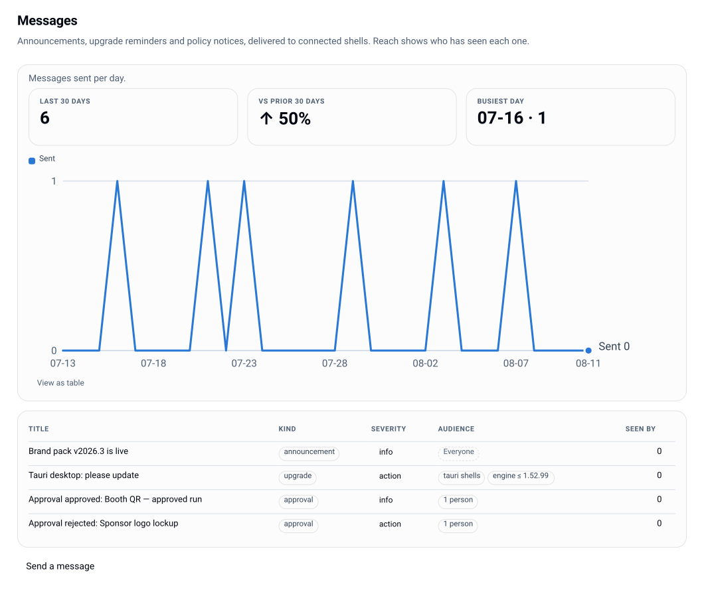

# Operations runbook

Day-two work: schema ownership, collaboration drain, backup, limits, monitoring
and upgrades. Keep application releases separate from infrastructure relocation.



## Store and schema

Two drivers behind one seam, both passing a single shared conformance suite:

| Driver | When | Notes |
|---|---|---|
| memory | no `DATABASE_URL` | evaluation only - state dies with the process and replicas do not share it |
| PostgreSQL | `DATABASE_URL` set | durable records and database-backed blobs; use the selected deployment profile's qualified version |

```bash
pnpm run migrate            # apply pending migrations
pnpm run migrate:status     # exit 1 if anything is pending
lw migrate [--check]       # same, run where the database is reachable (not via LW_BASE)
GET /api/v1/system/migrations      # pending list - owner-gated (instance.config)
```

Migrations are `migrations/*.sql`, applied in filename order, tracked in
`schema_migrations`, each file in its own transaction.

### Who applies migrations

- **Single node** (local, Compose): leave `LW_AUTO_MIGRATE` unset. The server applies pending
  migrations at boot - one command, no separate step.
- **Helm with its migration Job**: `migrate.enabled=true` sets
  `LW_AUTO_MIGRATE=false`. The application does not run DDL and **refuses to start
  on a pending schema**. A single
  migrate Job owns the schema - the Helm chart wires this as a pre-install/pre-upgrade hook
  that must succeed before new pods roll, so a skipped migration fails loudly instead of
  serving a half-migrated database.

### Collaboration ownership and replacement

The current combined HTTP/WebSocket application keeps one writable collaboration
owner. The chart refuses `replicaCount` other than one until room routing and
operation ordering are supported. PostgreSQL persistence, a multi-node cluster
or ingress affinity does not make writable replicas interchangeable or establish
application HA. Independent render workers can scale after workload testing.

The default `Recreate` strategy and 60-second termination grace period allow the
old owner to drain sockets and release room leases before replacement. Expect a
brief reconnect window and qualify reconnect with an existing client. Acknowledged
edits are durable; unacknowledged edits remain in client outboxes. Stable
`LW_SESSION_SECRET` and `LW_LINK_SECRET` values must be retained across restarts
and releases. They are not generated per Pod. The render cache is per-process
and warms again after replacement.

## Secret rotation

| Secret | Rotation cost |
|---|---|
| `LW_SESSION_SECRET` | sign-ins: none inside the window. Deploy the new value with `LW_SESSION_SECRET_PREVIOUS=<old>`, then drop PREVIOUS once the longest session TTL has passed. Verification accepts both; every new session signs with current. The audit log's MACs are keyed from it as well, so every older row stops verifying: run `lw audit retire-key` once after the rotation, while PREVIOUS is still set ([audit](audit.md#rotating-the-session-secret)) |
| `LW_LINK_SECRET` | none inside the window: same two-step recipe with `LW_LINK_SECRET_PREVIOUS`. Keep PREVIOUS as long as your longest-lived outstanding links (embed links default to 90 days), then drop it - links signed under the old key die at that moment, not before |
| `LW_CREDENTIAL_SECRET` | stored provider credentials can no longer be unsealed; re-enter them |
| `LW_METRICS_TOKEN` | update the scraper |
| `LW_RENDER_WORKER_SECRET` | rotate app and worker together |
| `LW_C2PA_SIGNING_KEY` | new signatures use the new identity; old exports stay verifiable against the old chain |

Generate once (`openssl rand -hex 32`), store in your platform's secret manager, rotate
deliberately.

### When the old value is gone

The PREVIOUS variables need the old value. A platform that stores secrets write-only (a
Vercel "sensitive" variable, say) cannot give it back, so a rotation there is a clean break:

- **`LW_SESSION_SECRET`**: every signed-in person signs in again, and outstanding guest and
  state tokens stop verifying. Every audit row written before the rotation fails its MAC
  until you record a retired-key boundary: `lw audit retire-key --reason "…"`, or in the
  server container `node scripts/audit-retire-key.ts --reason "…"`. Before the rotation,
  record the head while the old value still runs (`node scripts/audit-head.ts --json` in the
  server container) and pass it with `--expect-head <seq>:<hash>`. Run the command after
  every host that writes to the database runs the new value and you have signed in once, so
  no row signed under the old value comes after the boundary and one row shows the new key.
  See [audit](audit.md#rotating-the-session-secret) for what it checks and what it cannot.
- **`LW_LINK_SECRET`**: every issued share and embed link stops verifying; re-issue the
  ones still needed.

Set the same new values on every host that serves this database (each replica, and a
rollback deployment kept on another platform) before any of them takes traffic.

## Console headers

The console loads its assets and API calls from the same origin. Its HTML uses a
Content Security Policy that permits the two preference scripts by their content
hashes and blocks other inline scripts, script evaluation and framing. Console
responses also send `nosniff`, `no-referrer` and `X-Frame-Options: DENY`. The policy
allows inline styles for the console's existing controls and theme.

## Backup and restore

The database covers durable records and, under `blobs.driver: "pg"`, stored asset
bytes. It is one part of a complete restore:

| Recovery input | Preserve and verify |
|---|---|
| PostgreSQL | Consistent dump or tested point-in-time recovery, checksum, schema/release identity and an independent restore |
| S3-compatible blobs | The selected bucket's referenced bytes/versions and separately tested recovery; a database dump does not include them |
| Configuration and governance | Current `instance.json` and `lw export`, with the destination URL, identity/provider and permission mappings reviewed |
| Keys and credentials | Protected recovery copies of signing, provider-sealing and other required keys, separately from non-secret configuration |
| Pack, shell and engine | Exact release manifests/digests, engine contract, configured private pack and any artifact/source bytes needed to reproduce the signed release |
| External sources | Reconnect permissions and required provider-held originals; references are not copies of external bytes |

Keep off-host custody and the decryption keys independently recoverable. A
successful upload or Kubernetes Job is not a tested restore. The optional
[encrypted PostgreSQL backup workflow](https://github.com/lolly-tools/lolly-work/blob/main/deploy/suse/POSTGRESQL-BACKUPS.md)
starts suspended and requires independent GET/decryption and a disposable-database
restore before enabling its schedule. Its bounded archive size must fit your
actual database. YunoHost's package backup includes its app/data directories and
database; protect that archive and qualify its separate
[install/upgrade/restore lifecycle](cloud-deployment.md#yunohost-qualification).

Published build artifacts can be rebuilt only while the exact source, dependencies,
signing custody and private assets remain available. Preserve required private
pack bytes and any release that cannot be reproduced. The server prints the audit head
to stdout at boot and hourly. Configure and verify collection into an independently
retained external log system; printing alone does not preserve it outside this deployment.
Keep a snapshot beside the backup too ([audit](audit.md)).

Restore into a distinct empty target, verify the database/blob bytes, apply the
reviewed schema and release, restore configuration/keys and mount the matching
pack/shell. Preserve or explicitly rebind identity callbacks and provider access.
Stored provider credentials need their original `LW_CREDENTIAL_SECRET`; without
it they must be re-entered. Check owner and viewer/editor sign-in, shared uploaded
assets, document/agent permissions, live editing/reconnect and representative
exports. Record the restore scope and elapsed time. A new-host drill and HA
qualification are separate from recovering a dump on an existing cluster.

## Rate limiting

Per-IP token buckets on three surfaces: auth, telemetry, link. Behind a reverse proxy set
`rateLimit.trustedProxyHops` to the number of proxies you actually terminate - `0` means
never trust `X-Forwarded-For`, and getting this wrong either rate-limits the whole world as
one client or lets a header spoof the limiter. Authenticated console and API paths are not
throttled.

## Pre-store scan hook for submissions

**No scanner ships and none runs by default**: an unconfigured deploy stores whatever a
member with `catalog.submit` sends, exactly as it stores whatever a federated source hands
back. This project ships the hook, never a scanner - wiring one, and keeping it current, is
yours.

Wire one in `instance.json` under `submit.scanHook`. It is **instance config, not org
policy**: it never appears in the policy-as-code document, in `org-config`, or in anything a
shell can read.

```json
{
  "submit": {
    "scanHook": {
      "kind": "exec",
      "target": "/usr/bin/clamdscan",
      "args": ["--no-summary", "-"],
      "timeoutMs": 10000,
      "onError": "reject"
    }
  }
}
```

| Field | Meaning |
|---|---|
| `kind` | `exec` (bytes on stdin, exit code is the verdict) or `http` (bytes POSTed, status is the verdict) |
| `target` | the executable path, or the gateway URL |
| `args` | extra argv for `exec`; the bytes always ride stdin |
| `timeoutMs` | wall-clock budget for one scan, default `10000` |
| `onError` | what an unanswered scan means: `reject` (default) or `allow` |

The hook runs **before anything is stored**, which is the whole reason it exists: a veto
means the bytes were never written to the BlobStore and no record was created. `exec` reads
exit `0` as clean and anything else as a veto, with whatever the command printed carried
back as the reason (the `clamdscan -` pattern). `http` reads any 2xx as clean and any other
status as a veto, with the response body as the reason; the request carries
`x-lolly-submit-sha256` so a gateway can cache its own verdicts.

`onError` covers the third case, which is neither clean nor infected: the scanner did not
answer at all - a timeout, a refused connection, a missing binary. The default is `reject`,
so an unreachable scanner refuses submissions rather than quietly turning the gate off. Set
`allow` only if you would rather take the bytes than block contributions during an outage.

`exec` suits a single-node install (one config block, no new service); `http` is for
serverless shapes and ICAP gateways your security team already runs.

The verdict is audited either way, under `catalog.submit`: a refusal carries the code and the
scanner's reason, and there is nothing else for it to hang off, since no asset was created. An
accepted submission records what the hook did as `scan` - `clean` when it answered and passed
the bytes, `unavailable` when it could not answer and `allow` let the bytes through anyway,
and `absent` when no hook is configured at all. An outage you chose to ride out never reads as
a clean scan, so "which files went in unscanned last Tuesday" stays an answerable question.

## Notifications

Without a `notify` block the instance sends nothing, ever - approvals and reviews live in
the in-product inbox alone. With one, the same moments that write an inbox message also
reach people where they actually are:

| Moment | Mail goes to | Webhook event |
|---|---|---|
| Approval requested | the step's eligible approvers + nominees (never the requester) | `approval.requested` |
| Approval decided | the requester | `approval.decided` |
| Submission enters review | the review step's approvers | `submission.queued` |
| Submission decided | the submitter | `submission.decided` |
| Broadcast message sent | *(nobody - mail would double the inbox it is)* | `message.sent` |

Mail is plain text through the org's own relay (`notify.smtp` - see
[configuration](configuration.md#notify)); a user without an email address is skipped.
Webhook events POST to `notify.webhook.url` as JSON with `x-lolly-signature:
sha256=<hmac(timestamp.body)>` under `LW_WEBHOOK_SECRET` and an `x-lolly-timestamp` header -
verify both, refuse stale timestamps, and forgeries and replays are dead on arrival. One
retry, then the failure is counted (`lw_notify_total{outcome="failed"}`) and logged;
delivery never blocks or fails the request that triggered it. Neither channel is
phone-home: both targets are the org's own, named in its config, reached only when its
members act.

## Blob growth and version retention

Every version of an instance asset keeps its own bytes, and the default
(`policy.catalog.versionKeep: 0`) keeps every version forever. That is the right default - an
org that has just materialized its brand history out of a DAM should not find the product
deleting the originals it moved - but it does mean the blob store grows with contribution, not
with the number of assets.

The arithmetic is worth doing before it surprises you. A brand team replacing 200 hero images
four times a year at 8 MiB apiece adds roughly 6 GiB a year, on top of whatever the originals
weigh. Where the bytes live decides what that costs: with `blobs.driver: "pg"` the history
is stored in your database and in every database backup, which is the number that usually matters
first; with `"s3"` it goes to object storage, where it is cheap but is still yours to
lifecycle. See [configuration](configuration.md#blobs).

Two ways to bound it, and they compose:

- **Retention.** Set `policy.catalog.versionKeep` to the number of versions you want per asset,
  head included. Trimming happens when a new version arrives - oldest-first, deleting the trimmed
  versions' bytes. The served version is never trimmed even if a rollback made an old one
  current, and an asset [on hold](catalog.md#holds) is never trimmed at all, so a legal hold
  does not quietly lose the history it was set to preserve. Lowering the number does not
  retroactively sweep: it takes effect for each asset the next time that asset gains a version.
- **Deleting a version by hand.** `lw catalog version-rm <assetId> <n>`, refused for the served
  version and for a held asset.

Neither is a substitute for watching the store. `GET /metrics` carries the database and blob
counters; a size alert on the blob table (or the bucket) is the cheap version of this
paragraph.

## Monitoring

```
GET /healthz     unauthenticated, cheap - liveness (the process answers)
GET /readyz      unauthenticated - readiness: the store answers `select 1` (503 while it cannot); the Helm chart's readinessProbe
GET /metrics     Prometheus; loopback-only unless LW_METRICS_TOKEN is set
```

Gauges worth alerting on:

| Gauge | Alert when |
|---|---|
| `lw_audit_chain_intact` | `0` - investigate immediately |
| `lw_provider_last_error` | `1` for a provider you depend on |
| `lw_provider_assets` | drops sharply (an exposure or upstream change) |
| `lw_provider_credential_expiry_days` | `<= 14` - rotate before the vendor's schedule does the telling (emitted only where an expiry was stated at credential entry) |
| `lw_siem_lag` | grows while forwarding is configured - the receiver stopped confirming |
| `lw_rate_limit_buckets` | approaching `rateLimit.maxBuckets` |
| `lw_process_resident_memory_bytes` | trending up across a render-heavy day |

The Helm chart's ServiceMonitor needs `metricsToken`, because `/metrics` is loopback-only
without one.

## Retention and erasure

`policy.retention` bounds the two tables that grow with use - see
[configuration](configuration.md#policy) for the keys and their invariants (anchored audit
trims, delivery before deletion, `0` keeps everything). The long-lived server applies the
stated policy at boot and daily; on serverless, cron `lw retention run` (a service token
works) - the route and the interval run the same code.

**Account erasure** is deliberately limited. Run `lw users erase-preview <id>`
first: it reports retained references and affected telemetry without changing data.
`lw users erase <id>` atomically removes the account's identity row and de-attributes
telemetry, or leaves both unchanged if a retained reference or database error blocks
it. Archiving a project retains its foreign key; ownership transfer or an approved
lifecycle action is needed. Sessions, approvals, links and message acknowledgements
can also block removal. The memory store now matches PostgreSQL on these conditions.

Audit actor IDs and other retained references can remain linkable. Neither the account
operation nor turning analytics off deletes all personal content, historical copies,
external deliveries or backups. Complete the scoped rights and restore-handling process
in [data lifecycle](data-lifecycle.md); a successful account operation is not proof
that the entire request has been fulfilled.

## SIEM forwarding

`siem.url` streams the audit log to your Splunk/Sentinel/collector as signed JSON batches -
see [configuration](configuration.md#siem) for the block and the loss-free cursor design,
and verify `x-lolly-signature` + `x-lolly-timestamp` receiver-side exactly as with notify
webhooks. Alert on `lw_siem_lag` (events not yet confirmed): a healthy forwarder holds it
near zero, a dead receiver grows it without losing anything, and on a serverless deploy -
where the forwarding loop cannot run - a service token polling `GET /api/v1/audit` is the
supported path.

## Upgrades

Choose the release operation before changing anything:

| Change | Workflow |
|---|---|
| Compatible web frontend, with unchanged backend, engine and tools | [Shell update](https://github.com/lolly-tools/lolly-work/blob/main/deploy/helm/PRIVATE-SHELL-QUICKSTART.md): build the qualified main revision and publish with the protected instance profile; reuse the current image |
| Qualified application image only, with compatible schema/configuration | [Guarded app-only update](https://github.com/lolly-tools/lolly-work/blob/main/deploy/helm/APP-UPDATES.md): explicit target, before/after digests, dry-run plan and reviewed apply |
| Database schema | Independent backup and migration review; Helm's pre-upgrade migration Job must succeed before the new application serves traffic |
| Mounted shell/pack, engine contract or instance configuration | Separate content/configuration release and matching compatibility/signature checks; an application image cannot replace mounted files |
| Database, storage, DNS, cluster or host | Infrastructure/migration runbook and independent recovery; the app-only helper does not perform this move |
| YunoHost package | Its package upgrade/backup lifecycle, with review of custom configuration and actual Linux qualification |

For every release, retain the previous qualified artifacts and inspect pending
migrations with `pnpm run migrate:status`. The image-only helper never runs the
Helm migration Job or database migrations. Complete any required schema operation
before applying that image plan. Record the same digest in Helm/GitOps desired
values so reconciliation cannot restore a stale image.

After replacement, check Deployment readiness and `/readyz`, then sign-in,
collaboration reconnect and the enabled exports. `/healthz` proves process
liveness, not database or deployment readiness. Check `lw audit head` and the
chain gauge. A failed or ambiguous update needs current-resource inspection and
a fresh reviewed forward fix or application rollback; do not replay a stale
plan or restore an older database over new writes.

### The engine pin

The open-source engine is vendored, pinned and unmodified; `engine-pin.json` records the pin
and `pnpm run verify:engine-pin` (which runs automatically before `pnpm test`) fails if the
vendored tree and the pin disagree. Re-pinning is a deliberate act: bump the pin, run the
suite, check the bridge-contract version label, commit. Letting the pin drift far behind is a
known maintenance risk - see [status](status.md).

#### Re-pin cadence

`pnpm run repin-engine` reports drift against the sibling OSS checkout (`LOLLY_OSS_DIR`, or
`../lolly` next to this repo): commits behind OSS HEAD and pinned vs current engine/core
versions. It is read-only and cheap - run it in CI or before a release to see how stale the
pin is.

`pnpm run repin-engine --apply` performs the re-pin: it backs up `vendor/` and the pin to
a temp dir, runs the OSS repo's `scripts/pack-engine.ts`, extracts the fresh tarballs into
`vendor/`, adopts the new manifest as `engine-pin.json`, syncs the lockfile, then proves
coherence with `pnpm run verify:engine-pin` and `pnpm test`. Any failure restores the previous
vendor tree and pin, so the working copy is never left half-vendored. After a successful
apply, review the diff (including the bridge-contract version label) and commit.

### The shell dist

If you serve the web shell (`instance.shellDir`), its freshness is part of the upgrade. Under
a non-`open` access mode the server refuses to boot on a missing or pre-governance dist,
because a stale shell would serve employees without the session gate and locked-input UX
while the deploy looks governed. `LW_ALLOW_STALE_SHELL=1` downgrades it to a loud warning - 
use it knowingly, briefly.

## Changing the deployment design system

Use the console or `lw brand` to preview selection, retirement and download changes. Apply migration 0037 before enabling mutations. Decisions and their audit records commit atomically in Postgres, and every replica reads the shared revision. All replicas need the same mounted source contents and blob store. Read-only production deployments expose inventory and the operator path.

[Design-system administration](design-system-administration.md) covers restart behaviour, missing-source recovery, reference impact and reversible rollback. A stopped download remains suppressed after restart; a mismatched download is withdrawn after a source change. Update source files by validating and redeploying, never by deleting them through a local Lolly Remove action.

## Connecting apps to this instance

A Lolly client arrives as a neutral download - the app-store shell, a desktop
build, or the public PWA - and everything organizational reaches it by
pointing that client at this deployment. Three routes exist, in friction
order:

1. **A signed `.lolly` instance pack.** The zero-typing path: importing the
   pack sets the client's instance base after the signature verdict and
   installs the brand alongside. The pack is cut by the OSS repo's
   `build-instance-pack.ts` (the tool that owns the signed format, with its
   own size and licence guards) with this deployment as its instance base -
   then hosted HERE: `lw instance pack <file.lolly>` (owner), or the Connect
   card on the console's Fleet view. The instance serves it at
   `/connect/pack.lolly` (public on an `open` instance, member-gated
   otherwise), advertises it in the manifest's `connect.packUrl`, and refuses
   at upload any pack whose instance base is not this deployment - hosting a
   pack that enrolls devices somewhere else is the one mistake an operator
   must not be able to make silently. A key-pinned build refuses an unsigned
   or wrongly-signed pack on import. A deploy can also carry the pack in its
   own mount and host it from boot (`instance.connectPack` - how the demo
   sandbox offers its SUSE pack) - the same inspection applies, and an
   owner's upload still wins.
2. **The first-run instance sheet** (desktop and mobile shells): the person
   types this deployment's URL; the shell probes `GET /api/v1/instance` and
   `GET /api/auth/config` and takes it from there.
3. **Profile → Lolly instance → Change**, on an already-running shell.

Two realities shape the setup:

- **Native shells need no CORS from this server.** The desktop and mobile
  shells route instance traffic through their own HTTP client, so a
  cross-origin instance works out of the box. A **browser** pointed at a
  remote instance is a different story - the OSS shell refuses instance
  switching in browsers, so browser users are served same-origin (the shell
  at `/`, this API beside it), and no CORS opening is needed or offered.
- **`X-Lolly-Client` is the only signal a connected client sends.** Shell
  kind, shell version, engine version, platform - on requests the person's
  own use already makes. There is no heartbeat and no phone-home; a device
  that stops using the instance simply stops appearing. The OSS shells add
  an `install/<id>` token to that tag while - and only while - their person
  is signed in, so the install appears by name in the console's Fleet view
  (rename and forget there are bookkeeping on the row - the device is never
  touched). Leaving the instance deletes the client-side id, so a device
  that re-enrolls returns as a new install.

### Enrollment, and leaving

Users enroll from their client; the instance never reaches out to a device.
While signed in, org policy applies and work saved here (projects, sessions,
submissions, audit) lives server-side. Either side can end it unilaterally:
the person leaves from the client (Profile → Lolly instance → Leave removes
the org brand, tools, cached catalog and install id; personal work is
untouched), the organization disables the user (every live session dies on
its next request). Afterwards: no remote wipe, no export block, no exit
toll - and a departed device keeps no org catalog. Exports made while
enrolled keep their Content Credentials.

## Checks and artefacts

```bash
pnpm test                     # node:test over tests/
LW_TEST_DATABASE_URL=… pnpm test   # adds the Postgres conformance leg
pnpm run typecheck
pnpm run sbom                 # regenerate sbom.cdx.json (CycloneDX)
```

CI workflows live in `.github/workflows/`. The Postgres leg only runs when
`LW_TEST_DATABASE_URL` is set - if your pipeline does not set it, that driver is effectively
untested.

## Related

- Install-time choices: [deployment](deployment.md)
- Every key and variable: [configuration](configuration.md)
- Chain anchoring: [audit](audit.md)
- Known gaps: [status](status.md)
