# What this deploy is

This is the **Lolly control plane** — the hosted half of Lolly. It holds identity,
provisioning, governance, serving, telemetry and audit for one organization's deploy, and
it serves the Lolly web shell, the governed catalog and the admin console from a single
origin.

The compass, unchanged since the first plan: **open source = individual freedom; open
source + a control plane = organizational freedom.** Lolly renders on-device by design.
Every *hosted* service lives here.

Every screenshot in these docs is itself a Lolly artifact: the console rendered to a real
**vector SVG** and signed with a C2PA Content Credential by this deployment's own signing
identity. Hover the imprint in a shot's corner to read what its file claims, then **Check
it yourself** — the console verifies the exact bytes on your machine. The docs eat the
product's own dog food.

## Two codebases, one deploy

| | Lolly (open source, MPL-2.0) | This control plane (proprietary) |
|---|---|---|
| What | Engine, tool catalog, shells (web, desktop, mobile, CLI, TUI, extension) | Server, admin console, render worker |
| Docs | `/info/` on any Lolly deployment | this set |
| Runs | On the user's device | On your infrastructure |

The open-source side is consumed **pinned and unmodified** (`vendor/@lolly/engine`,
`vendor/@lolly-tools/core`, pin recorded in `engine-pin.json`). Nothing here forks it. The
touchpoints the shells need are additive and dormant by default — a shell with no control
plane configured behaves exactly as it does standalone.

## What this deploy actually serves

| Surface | Path | Who |
|---|---|---|
| Lolly web shell | `/` (when `instance.shellDir` is set) | members, guests on a link |
| Admin console | `/admin` | signed-in members; each view is action-gated |
| Governed catalog | `/catalog/*`, `/api/v1/catalog/*` | per access mode and exposure policy |
| Server renders | `/render/:spec` | `export.server` holders |
| Signed links | `/l/:id` | anyone holding the link, until expiry or revocation |
| Org config | `/api/v1/org-config` | connected shells, polled |
| Health / metrics | `/healthz`, `/metrics` | monitoring (metrics is token- or loopback-gated) |

The one document a connected shell polls is `/api/v1/org-config`: who the user is, which
tools they see, which inputs are locked, which profile fields are managed, which feature
flags apply. It is pre-filtered for the caller's groups and ETag'd on a policy version, so
a quiet poll is a `304`.

## The trust model, honestly

- **Renders happen where the content is trusted.** The in-process (jsdom) fast path never
  runs a tool's `hooks.js` unless you opt in per pack (`render.allowHooksInFastPath`);
  hooked and HTML-heavy tools go to the isolated Chromium worker, or are refused with
  `501 HOOKED_TOOL_NEEDS_CHROMIUM`.
- **Policy is enforced server-side, before rendering.** A locked input is a `422
  INPUT_LOCKED`, not a hidden field.
- **Sessions are stateless, signed, domain-separated tokens.** A session token cannot be
  replayed as a guest token, a link signature or an OAuth state. Account disable is instant;
  a session itself lives until `policy.sessionTtlHours` expires — see
  [audit](audit.md) and [status](status.md) for the open revocation gap.
- **Telemetry never carries input values**, and below `standard` (or without consent when
  attribution is opt-in) it never carries a user id.
- **The audit log is hash-chained**, so edits and truncation are detectable — provided you
  anchor the head somewhere outside this deploy.

## Where to go next

- Getting it running: [quickstart](quickstart.md), then [deployment](deployment.md).
- Turning the knobs: [configuration](configuration.md), [identity](identity.md).
- Deciding who can do what: [permissions](permissions.md), [governance](governance.md).
- Keeping it alive: [operations](operations.md), [audit](audit.md).
