# Roles and grants

Two layers, one evaluator:



1. **A small fixed role set**, derived from group membership.
2. **Fine-grained grants** - `(principal, action, resource, effect)` rows that override the
   role default in either direction.

Evaluation order is fixed and pure: **any matching deny wins → any matching allow →
the role default**. `server/src/rbac/evaluate.ts` is the whole thing, and it never looks
anything up: a resource arrives as the set of selectors it satisfies (e.g.
`['tool:event-badge', 'tool:tag/external-facing', '*']`).

## Roles

| Role | Comes from | Carries |
|---|---|---|
| `viewer` | service tokens only (`lw tokens create --role viewer`) - no group resolves a person to it | `catalog.read`, `session.view`, `collab.join` |
| `member` | the default for any signed-in user | viewer + `tool.use`, `session.create/edit/delete/share`, `project.create`, `export.download`, `export.request`, `delivery.create`, `link.create` |
| `author` | group `author` | member + `catalog.submit` |
| `approver` | group `approver` | member + `approval.act` |
| `admin` | group `admin` | author ∪ approver + `catalog.publish`, `catalog.expire`, `catalog.hold`, `catalog.scan`, `catalog.edit`, `catalog.collection.manage`, `catalog.provider.read`, `catalog.provider.manage`, `brand.switch`, `catalog.injectable.manage`, `policy.edit`, `grant.edit`, `link.revoke`, `link.create-guest`, `message.send`, `telemetry.view`, `fleet.view`, `fleet.manage`, `audit.export`, `project.manage`, `project.archive`, `approval.assign`, `export.server` |
| `owner` | group `owner` | admin + `instance.config`, `catalog.provider.credential`, `catalog.provider.publish`, `scim.manage`, `token.manage` |
| `guest` | a guest-edit link | **nothing** - access is entirely link-scoped grants |

Role comes from the effective group set (IdP ∪ local groups): the highest of `owner`,
`admin`, `approver`, `author`, else `member`. See [identity](identity.md).

Five actions stay **owner-only** on purpose: an admin can shape a catalog provider and even
materialize its bytes into the instance's own store, but only an owner puts a credential in
it or flips its kill switch (including the exit's cutover), only an owner changes deploy
config, only an owner may **publish lolly exports out** to a destination DAM
(`catalog.provider.publish` - an outbound write to a third party), and only an owner mints
the standing bearer credentials: a **SCIM provisioning token** (`scim.manage`) for the IdP
and a **service token** (`token.manage`) for automation. Each is owner-grantable: an owner
can hand it out per-resource through a grant, but an admin cannot mint it for themselves.

## Grants

```bash
lw grants list
lw grants add group:brand policy.edit '*'            --effect allow
lw grants add group:contractors export.download 'tool:price-card' --effect deny
lw grants rm  group:brand policy.edit '*'
```

Also `GET/POST/DELETE /api/v1/grants` and the console's **Grants** view. All three are the
same API - the console and CLI grow in parity by construction.

| Field | Form |
|---|---|
| `principal` | `group:<name>`, `user:<id>`, or `*` |
| `action` | any action id from the table above |
| `resource` | a selector - `*`, `tool:<id>`, `tool:tag/<tag>`, `catalog:tag/<tag>`, … |
| `effect` | `allow` or `deny` |

Grants take effect on the **next request** - there is no cache to bust and no restart.
Every mutation is audited.

### The escalation guard

A grant that creates or removes any owner-only action (`instance.config`,
`catalog.provider.credential`, `catalog.provider.publish`, `scim.manage`, `token.manage`)
requires the **owner** role, even though grant editing itself is an admin action.
Attempting it returns `403 OWNER_ONLY_ACTION`.

The guard stops an admin minting an owner-only *grant*. It does not stop an admin becoming
an owner: role is derived from group membership, group editing is an admin action, and a
local group named `owner` escalates exactly like an IdP one. That is deliberate (it is the
break-glass when an IdP has no `owner` group) and audited, but it means the boundary
between admin and owner is a governance convention, not a wall.

### "Edit but not export"

This is the canonical fine-grained ask, and it is two rows:

```bash
lw grants add group:contractors tool.use        'tool:campaign-banner' --effect allow
lw grants add group:contractors export.download 'tool:campaign-banner' --effect deny
```

Deny wins, so the contractor can work in the tool and cannot take the file out. Tag
selectors let the same pair cover a whole class of tools (`tool:tag/external-facing`)
rather than enumerating ids.

### Putting assets in: `catalog.submit`

`catalog.submit` is the action behind [catalog submit](catalog.md#submitting-an-asset), the one
route by which a member's bytes enter the catalog. The `author` role carries it, and like any
action it is grantable per group or per user, so "the design team may contribute, everyone else
reads" is one row:

```bash
lw grants add group:design catalog.submit '*' --effect allow
```

It is deliberately the whole of the submitter's authority. **There is no separate action for
deciding a submission**: when `policy.submit.chain` names a chain, the decision is an ordinary
approval - eligibility is membership of the step's approver groups plus separation of duties
([approvals](approvals.md)), and the review queue is only an ergonomic door onto it. Whoever may act on the step may also correct a pending
submission's declared metadata before publishing it - name, type, tags and description, never
the bytes and never the exposure the submitter chose.

Three audit actions record the round trip: `catalog.submit` (on the way in, whether it was
stored or refused), and `catalog.approve-submission` / `catalog.return-submission` on the way
out. A metadata correction is audited as `catalog.edit-submission` with its before and after.
Those are audit vocabulary, not grantable actions - nothing evaluates them.

### Sending organization output: `delivery.create`

`delivery.create` is the manual use right for a fixed organization destination. Members carry
it by default because the operator has already chosen, credentialed and explicitly enabled the
target; `groups` exposure and resource grants can narrow each target independently:

```bash
lw grants add group:contractors delivery.create 'destination:campaign-archive' --effect deny
```

An explicit per-destination allow can also extend a target beyond its configured groups; for
example, to give a `viewer` service token exactly one delivery capability without upgrading its
role. The same deny-wins decision is used for discovery, creation and retry.

A matching deny removes that destination from the caller's `org-config` and is re-evaluated at
the write boundary. The action has no authority over personal send targets: those remain on the
person's device and never appear in Work configuration, grants, history or credentials.

Creation is audited once as `delivery.created`; every attempt then records
`delivery.delivered` or `delivery.failed`. Permission loss stops new sends and retries but does
not erase the caller's own historical receipts. Those are event names, not additional permissions. See
[outbound delivery](delivery.md).

When a destination names `approvalChain`, `delivery.create` authorizes staging and requesting
review, not provider egress. The existing approval chain and separation-of-duties rules decide
that. Approval delivers the immutable staged bytes; rejection/withdrawal are terminal and the
retry route cannot bypass them. Service tokens are refused on a human-review-bound target.

The same action governs a completed automation render's publish command. It adds no ambient
BlobStore authority: the caller must own the named job, it must be a settled `render`, its
recorded format cannot be changed, and its retained bytes pass integrity and C2PA verification
again. A delivery reference prevents deletion of that job output until retention releases it.

Also `catalog.read`, which the `viewer` role already carries, gates the queue itself. The rows
are the real gate: a caller sees their own submissions plus the ones open on a step their
groups may act on, and nothing else.

### Editing what the catalog says: `catalog.edit`

`catalog.edit` is the action behind [org-defined metadata](catalog.md#org-defined-metadata) -
filling in the fields an org defines for itself, and correcting an instance-owned asset's own
name, description and tags. It sits with `admin` rather than with `author`, because
contributing an asset and editing what the whole org's catalogue says about one are different
authorities. Like every action it is grantable, so "the brand team files assets, everyone else
reads" is one row:

```bash
lw grants add group:brand catalog.edit '*' --effect allow
```

Two things it deliberately does not buy. **Defining** the fields is `policy.edit`, because a
taxonomy is governance and lives in the [governance
document](governance.md#policy-as-code) - filling a field in is not defining one. And it
reaches only assets the caller can already see: the editor asks the same exposure question
link minting asks, so nobody annotates an asset that is invisible to them, and a submission
still under review is edited through the review queue rather than here.

Audited as `catalog.edit` with the before and after of every field that moved, and as
`catalog.field.edit` / `catalog.field.delete` when the definitions themselves change.

The same action carries the byte side of curation ([versions](catalog.md#versions)): replacing
a published asset's bytes with a new version, rolling the head back to a prior one, deleting a
stored version, and retiring an asset in favour of another (`replacedBy`). The split is
deliberate - `catalog.submit` contributes an asset, `catalog.edit` changes what an asset that
is already in the catalog says or serves - and it is why a `policy.submit.chain` gates
contributions and not versions: an approver already decided this asset belongs here. Audited as
`catalog.version`, `catalog.rollback` and `catalog.version.delete`, each naming the version it
moved.

### Curating a shareable set: `catalog.collection.manage`

`catalog.collection.manage` is the action behind [collections](catalog.md#collections) -
creating a named, ordered set of catalog assets, naming the groups that may see it, and
deleting it again. It sits with `admin` for the same reason `catalog.edit` does, and is
grantable the same way:

```bash
lw grants add group:brand catalog.collection.manage '*' --effect allow
```

One rule is enforced rather than merely advised: **a collection may only hold assets its
curator can see.** A collection link is minted on the collection's own visibility and its
bearer then receives every member, so without that rule a curator with a narrowed grant could
name assets they were never exposed to and read them back through a link. The check runs when
the set is saved, where the person can be told which id was refused.

The mirror of it runs at mint, and is what closes the rule for everyone else: **minting a link
to a collection refuses any member the minter cannot see.** `link.create` is a member default
while curating is an admin action, so the saved-set check alone would only bind the curator - a
collection visible to everyone could otherwise hand a member the bytes of an asset their own
groups are denied. A refusal there reports how many members were unseen and not which ids,
because the minter did not choose the membership.

Reading collections needs nothing extra: the per-caller catalog feed carries the collections
a caller's groups admit, with members narrowed to the assets that caller is already served.

Audited as `catalog.collection.edit` and `catalog.collection.delete`, each with the before and
after of the whole set; minting a link to one audits as `link.create` like any other link.

### Explicit allow vs role default

Some decisions must distinguish "an explicit grant allows this" from "the caller's role
happens to allow this" - tool visibility is the example: the `member` default of `tool.use`
would otherwise un-hide every governed tool. Those callers use the explicit-grant decision
(`grantDecision`), which returns `allow` / `deny` / `none`. It matters when you are
reasoning about why a tool is or is not visible.

## Guest write authority

A guest is never evaluated by the grants engine **as a principal**: `server/src/collab/guests.ts`
imports nothing from `rbac/`, on purpose. A guest's ability to write in a live collab room comes
from the **kind** of the link that admitted it - `guest-edit` mints a writer seat, every other
link kind mints no guest principal - never from a grant row naming the guest.

That asymmetry is easy to trip over. A grant like

```bash
lw grants add '*' session.edit '*' --effect deny
```

silences every **member's** write access in a live room (`mayEditCollab` calls `evaluate()`)
and reaches no guest: a guest's writer/observer split never runs `evaluate()` against the
guest's own principal, so no grant, role change or group removal naming a guest decides
anything.

**One action is the exception, and it is the one that matters: `link.create-guest`, evaluated
against the INVITER.** The gateway re-checks the inviter's standing on every gesture and every
keepalive (`guestInviterStanding` → `mayCreateGuestLinks` → `evaluate()`, gateway.ts), so an
inviter who loses that action stops minting links *and* loses the guests already holding them.
Offboarding an inviter is therefore a live eviction, not a change that takes effect at the next
mint.

Four levers, then - three that act on the guest, one that acts on the inviter:

| Lever | Effect |
|---|---|
| An `inputAccess` rule ([governance](governance.md#per-input-access)) | Locks, hides or choice-restricts one input for every guest, in every room, without naming anyone. See the fallback below - it reaches a guest whether or not the rule names one. |
| Revoking the link (`POST /api/v1/links/:id/revoke`) | Kills that guest's write access on its very next gesture - the room re-reads the link per gesture and per keepalive, the same cadence a member's grant revocation takes effect on. |
| `guestLinks.enabled: false` ([configuration](configuration.md)) | The instance-wide kill switch. Stops new links from minting *and* evicts every guest already connected - re-checked live, not only at mint time. |
| Taking `link.create-guest` off the **inviter** - a deny grant, a role change, removing them from the group that carried it, or disabling the account | Evicts every guest **that inviter** admitted, on the guest's next op or keepalive. The one lever that covers links nobody can enumerate; it leaves guests invited by anyone else alone. |

The `inputAccess` lever is one-way for guests: governing an input **at all** locks it for
them. A guest carries only the synthetic `guests` group and never inherits the member-side
`editable` fallback (`vetoOps` + `inputIsGoverned`, `INPUT_LOCKED`) - even
`{"groups": ["guests"], "level": "editable"}` resolves to locked in a live room. An input
with **no** rules stays editable for everyone, guests included.

What is not a lever: a grant naming the guest, and any action other than `link.create-guest`.
Those never reach the path a guest's write decision takes.

## Checking your work

Never guess what a person will see - ask the same assembler the live client polls:

```bash
lw preview --groups marketing,contractors
```

or the console's **Preview** view, or `GET /api/v1/org-config/preview?groups=…`. It reports
the resolved role, permissions, tool visibility, per-input governance and profile policy for
that group set. Because it runs through the production code path, it cannot drift from what
the member actually receives.

## Related

- Locking individual tool inputs, not just whole tools: [governance](governance.md)
- Who can approve what: [approvals](approvals.md)
- Exporting the whole grant set as code: [governance](governance.md)
- Every action's route: [api](api.md)
