# Rendering and sharing

The control plane is Lolly's fourth shell: it can render a tool server-side to bytes, and it
can wrap that render in a signed, expiring, revocable URL. Everything here enforces policy
*before* rendering.



## Server renders

```
GET /render/<toolId>.<format>?<tool inputs>
```

Formats: `svg` and `png` (rasterised with resvg). The flow: load the tool through the real
engine → resolve overlays for the caller's groups → refuse or bake locked inputs → render →
optionally watermark → optionally embed provenance / sign → cache.

- **Authorization:** a signed-in caller needs `export.server` (admin default, grantable). A
  guest admitted to *that tool* may render it. Under `gated` mode, no principal at all is a
  `401`.
- **Policy first:** a caller-supplied value for a `locked` input is a `422 INPUT_LOCKED`; the
  locked value is baked in regardless of the query. `hidden` inputs are absent from the
  schema the shell ever saw.
- **Caching:** an in-process LRU keyed by the render cache-key contract, plus an `ETag`
  (`private, max-age=60`). The key folds in the pack version, the overlay state, provider
  fragment hashes and a fingerprint of the instance's own assets, so a policy edit, a catalog
  refresh or a [new asset version](catalog.md#versions) invalidates exactly the affected
  renders and nothing else.
- **Hooked tools:** a tool shipping `hooks.js` does not run in the in-process jsdom fast path
  unless `render.allowHooksInFastPath` is on. With a Chromium worker configured it dispatches
  there; without one it is refused with `501 HOOKED_TOOL_NEEDS_CHROMIUM`. Policy stays in the
  control plane either way - the worker returns SVG, and watermarking, provenance and
  rasterisation happen here.
- The engine, jsdom and resvg are imported lazily, so a deploy that never renders never
  loads them.

## Signed links

```
POST /api/v1/links      { kind, target, ttlHours?, password?, projectId? }
GET  /l/:id?s=<sig>
POST /api/v1/links/:id/revoke
GET  /api/v1/links[?all=1]
```

| Kind | What it does | Action required |
|---|---|---|
| `share` | resolves to the rendered bytes | `link.create` |
| `embed` | same, for embedding | `link.create` |
| `download` | same, with `Content-Disposition: attachment` | `link.create` |
| `guest-edit` | admits a guest session scoped to the tool/session | `link.create-guest` |

`target` needs a `toolId`, a `sessionId`, or an `assetId`. The signature covers the link id, kind, expiry
and a digest of the resolved target - so neither the target nor the expiry can be edited in
the URL bar, and the minted parameters are what gets rendered (the caller's query on `/l/:id`
is ignored, apart from the password gate). Optional passwords are scrypt-hashed.

Failure modes are distinct and honest: `403 BAD_SIGNATURE`, `410 LINK_EXPIRED`,
`410 LINK_REVOKED`, `401 PASSWORD_REQUIRED`.

### Linking a catalog asset

`share`, `embed` and `download` also take a catalog asset as their target - an instance
asset (`inst/…`), a federated one (`ext/<provider>/<remoteId>`) or a pack asset id - with an
optional `format` naming which of the asset's formats to serve (the first, otherwise):

```
POST /api/v1/links   { "kind": "download", "target": { "assetId": "inst/hero", "format": "png" } }
```

Two checks, at two different times, and both matter:

- **Exposure, at mint.** The minter must be able to see the asset - instance-asset groups,
  provider group visibility and the provider's exposure slice, exactly as the catalog routes
  apply them. You cannot mint a link to bytes you could not fetch yourself (`403`).
- **Lifecycle, on every visit.** The link resolver asks the same gate the feed and the blob
  routes ask, so an expired, not-yet-published or revoked asset stops serving on a link that
  is still live (`410 ASSET_EXPIRED`). A hold is not a refusal: it only ever preserves
  availability, so a held asset keeps serving.

`download` sets `Content-Disposition: attachment`; `share` and `embed` serve inline. Either
way the bytes carry the same private, no-CDN cache headers as `/catalog/*` plus a
content-security policy that sandboxes them and allows no script - a member-submitted SVG is
markup, and a link is the one asset surface an unauthenticated bearer reaches, so nothing
served here can run as the person who opens it. An old
federated id keeps resolving after [an exit](offboarding.md) through its alias. TTL, passwords,
revocation, audit and `link.visit` telemetry are unchanged - an asset link is an ordinary link
that happens to point at an asset, and the console's Links view lists it as one.

### Linking a collection

`share` and `download` also take a [collection](catalog.md#collections) as their target - the
same signed-target mechanism one level up:

```
POST /api/v1/links   { "kind": "share", "target": { "collectionId": "launch-kit" } }
```

- **`share`** resolves to a minimal listing page the instance serves itself: brand chrome from
  the same unauthenticated `/api/brand` sources the sign-in screen uses, the collection's
  assets with previews, a download per asset, and one **Download all** button.
- **`download`** resolves straight to the zip.
- **`embed`** is refused at mint (`400`). A collection is a list, not a byte stream.

The two checks are the same two, one level up: **exposure at mint** and **lifecycle on every
visit, per member**. Mint asks both halves of the exposure question - the minter must be able
to see the collection *and* every asset it names - so a widely visible set curated by someone
with broad exposure cannot be used to hand its bytes to a colleague who is individually denied
them. A mint that fails is a `403 MEMBER_NOT_VISIBLE` reporting how many members were unseen,
never which. An expired or revoked
asset leaves the page and the archive together, on a link that is otherwise live; the page
says how many were left out, never which.

The page shows **that collection and nothing else**: no search, no browsing past the set, no
self-registration, no route into the rest of the catalog. Asking the link for an asset the
collection does not name is a `404 NOT_IN_COLLECTION` even though the signature is valid. That
boundary is the feature - it is what keeps a shared set on the right side of the brand-portal
refusal.

The archive is built in-process from Node's own `zlib`, streamed member by member, with entries
named for the asset and de-duplicated. A set too large to zip is refused up front rather than
truncated silently.

**Expiry is enforced from the signature alone**, so a link outlives a lost database row only
until its own expiry. **Revocation is immediate** and kills live guest sessions with it. A
member can always revoke their own link; revoking someone else's needs `link.revoke`.

Guest links are additionally capped by `policy.guestLinks.maxTtlHours` and can be disabled
outright (`403 GUEST_LINKS_DISABLED`). See [identity](identity.md#guest-sessions).

The console's **Links** view lists every link this deploy has minted with its full signed
URL, a one-click copy, its status and its expiry.

## Preview watermarking

`enforce.watermark` on a tool overlay injects a diagonal, tiling **PREVIEW** brick pattern
into the SVG root before any rasterisation, so both `svg` and `png` carry it. Alternating
brick rows use `#0002` and `#fff2` so it reads on light and dark artwork alike.

`always` and `never` are fully wired. `until-approved` is the intended pairing with an
approval chain, but the per-render linkage to approval state is not built yet - see
[approvals](approvals.md) and [status](status.md).

## Provenance

Every server render that consumed catalog assets carries a machine-readable ingredients
list, C2PA-shaped, embedded with zero dependencies:

- SVG: a `<metadata>` JSON island.
- PNG: an `iTXt` chunk (keyword `lolly:provenance`) spliced after `IHDR`.
- HTTP: an `x-lolly-provenance` response header.

Both survive ordinary copying and are readable with `exiftool`/`pngcheck`-class tooling. Each
ingredient's `c2pa` field is the upstream manifest **if the source supplied one**, and
explicitly `null` when it did not (Brandfolder ships none) - so "«filename» from «provider»
was used" still travels with the export, honestly labelled.

With a signing identity configured, exports carry a real, signed C2PA Content Credential
instead of the unsigned island. That is one command to set up: [c2pa](c2pa.md).

## Related

- Restricting formats and inputs: [governance](governance.md)
- What renders get recorded as: [telemetry](telemetry.md), [audit](audit.md)
- Worker deployment: [deployment](deployment.md)
