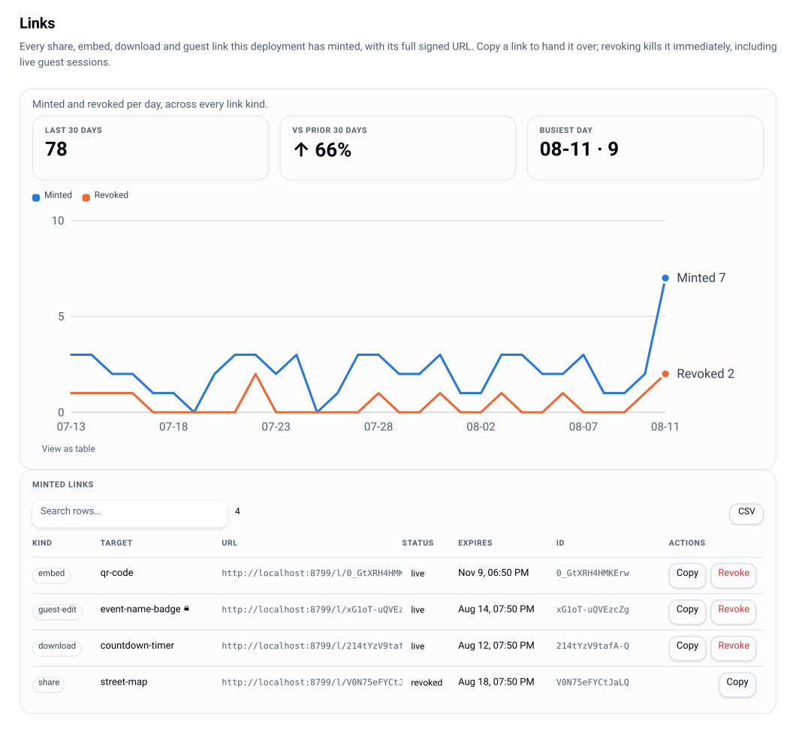

# Rendering and sharing

The control plane is Lolly's fourth shell: it can render a tool server-side to bytes, and it
can wrap that render in a signed, expiring, revocable URL. Everything here enforces policy
*before* rendering.



## Server renders

```
GET /render/<toolId>.<format>?<tool inputs>
```

Formats: `svg` and `png` (rasterised with resvg) always; `jpg` and `pdf` too when a
Chromium render worker is configured ([deployment](deployment.md)). The flow: load the tool through the real
engine → resolve overlays for the caller's groups → refuse or bake locked inputs → render →
optionally watermark → optionally embed provenance / sign → cache.

- **Authorization:** a signed-in caller needs `export.server` (admin default, grantable). A
  guest admitted to *that tool* may render it. Under `gated` mode, no principal at all is a
  `401`.
- **Policy first:** a caller-supplied value for a `locked` input is a `422 INPUT_LOCKED`; the
  locked value is baked in regardless of the query. `hidden` inputs are absent from the
  schema the shell ever saw.
- **Caching:** an in-process LRU keyed by the render cache-key contract, plus an `ETag`
  (`private, max-age=60`). The key folds in the pack version, the overlay state, provider
  fragment hashes and a fingerprint of the instance's own assets, so a policy edit, a catalog
  refresh or a [new asset version](catalog.md#versions) invalidates exactly the affected
  renders and nothing else.
- **Hooked tools:** a tool shipping `hooks.js` does not run in the in-process jsdom fast path
  unless `render.allowHooksInFastPath` is on. With a Chromium worker configured it dispatches
  there; without one it is refused with `501 HOOKED_TOOL_NEEDS_CHROMIUM`. Policy stays in the
  control plane either way - the worker returns SVG, and watermarking, provenance and
  rasterisation happen here.
- The engine, jsdom and resvg are imported lazily, so a deploy that never renders never
  loads them.

## Signed links

```
POST /api/v1/links      { kind, target, ttlHours?, password?, projectId? }
GET  /l/:id?s=<sig>
POST /api/v1/links/:id/revoke
GET  /api/v1/links[?all=1]
```

| Kind | What it does | Action required |
|---|---|---|
| `share` | resolves to the rendered bytes | `link.create` |
| `embed` | same, for embedding | `link.create` |
| `download` | same, with `Content-Disposition: attachment` | `link.create` |
| `guest-edit` | admits a guest session scoped to the tool/session | `link.create-guest` |

`target` needs a `toolId`, a `sessionId`, or an `assetId`. The signature covers the link id, kind, expiry
and a digest of the resolved target - so neither the target nor the expiry can be edited in
the URL bar, and the minted parameters are what gets rendered (the caller's query on `/l/:id`
is ignored, apart from the password gate). Optional passwords are scrypt-hashed.

Failure modes are distinct and honest: `403 BAD_SIGNATURE`, `410 LINK_EXPIRED`,
`410 LINK_REVOKED`, `401 PASSWORD_REQUIRED`.

### Linking a catalog asset

`share`, `embed` and `download` also take a catalog asset as their target - an instance
asset (`inst/…`), a federated one (`ext/<provider>/<remoteId>`) or a pack asset id - with an
optional `format` naming which of the asset's formats to serve (the first, otherwise):

```
POST /api/v1/links   { "kind": "download", "target": { "assetId": "inst/hero", "format": "png" } }
```

Two checks, at two different times, and both matter:

- **Exposure, at mint.** The minter must be able to see the asset - instance-asset groups,
  provider group visibility and the provider's exposure slice, exactly as the catalog routes
  apply them. You cannot mint a link to bytes you could not fetch yourself (`403`).
- **Lifecycle, on every visit.** The link resolver asks the same gate the feed and the blob
  routes ask, so an expired, not-yet-published or revoked asset stops serving on a link that
  is still live (`410 ASSET_EXPIRED`). A hold is not a refusal: it only ever preserves
  availability, so a held asset keeps serving.

`download` sets `Content-Disposition: attachment`; `share` and `embed` serve inline. Either
way the bytes carry the same private, no-CDN cache headers as `/catalog/*` plus a
content-security policy that sandboxes them and allows no script, so a shared SVG cannot
execute as the person who opens it. An old
federated id keeps resolving after [an exit](offboarding.md) through its alias. TTL, passwords,
revocation, audit and `link.visit` telemetry are unchanged - an asset link is an ordinary link
that happens to point at an asset, and the console's Links view lists it as one.

### Linking a collection

`share` and `download` also take a [collection](catalog.md#collections) as their target - the
same signed-target mechanism one level up:

```
POST /api/v1/links   { "kind": "share", "target": { "collectionId": "launch-kit" } }
```

- **`share`** resolves to a minimal listing page the instance serves itself: brand chrome from
  the same unauthenticated `/api/brand` sources the sign-in screen uses, the collection's
  assets with previews, a download per asset, and one **Download all** button.
- **`download`** resolves straight to the zip.
- **`embed`** is refused at mint (`400`). A collection is a list, not a byte stream.

The two checks are the same two, one level up: **exposure at mint** and **lifecycle on every
visit, per member**. Minting requires the minter to see the collection *and* every asset it
names; a mint that fails is a `403 MEMBER_NOT_VISIBLE` reporting how many members were
unseen, never which. An expired or revoked
asset leaves the page and the archive together, on a link that is otherwise live; the page
says how many were left out, never which.

The page shows **that collection and nothing else**: no search, no browsing past the set, no
self-registration, no route into the rest of the catalog. Asking the link for an asset the
collection does not name is a `404 NOT_IN_COLLECTION` even though the signature is valid.

The archive is built in-process from Node's own `zlib`, streamed member by member, with entries
named for the asset and de-duplicated. A set too large to zip is refused up front rather than
truncated silently.

**Expiry is enforced from the signature alone**, so a link outlives a lost database row only
until its own expiry. **Revocation is immediate** and kills live guest sessions with it. A
member can always revoke their own link; revoking someone else's needs `link.revoke`.

Guest links are additionally capped by `policy.guestLinks.maxTtlHours` and can be disabled
outright (`403 GUEST_LINKS_DISABLED`). See [identity](identity.md#guest-sessions).

The console's **Links** view lists every link this deploy has minted with its full signed
URL, a one-click copy, its status and its expiry.

## Preview watermarking

`enforce.watermark` on a tool overlay injects a diagonal, tiling **PREVIEW** brick pattern
into the SVG root before any rasterisation, so both `svg` and `png` carry it. Alternating
brick rows use `#0002` and `#fff2` so it reads on light and dark artwork alike.

`always` and `never` are fully wired. `until-approved` is the intended pairing with an
approval chain, but the per-render linkage to approval state is not built yet - see
[approvals](approvals.md) and [status](status.md).

## Provenance

Every server render that consumed catalog assets carries a machine-readable ingredients
list, C2PA-shaped, embedded with zero dependencies:

- SVG: a `<metadata>` JSON island.
- PNG: an `iTXt` chunk (keyword `lolly:provenance`) spliced after `IHDR`.
- HTTP: an `x-lolly-provenance` response header.

Both survive ordinary copying and are readable with `exiftool`/`pngcheck`-class tooling. Each
ingredient's `c2pa` field is the upstream manifest **if the source supplied one**, and
explicitly `null` when it did not (Brandfolder ships none) - so "«filename» from «provider»
was used" still travels with the export, honestly labelled.

With a signing identity configured, exports carry a real, signed C2PA Content Credential
instead of the unsigned island. That is one command to set up: [c2pa](c2pa.md).

## Team projects and sessions

A **project** is a folder of saved tool sessions. A **session** is one tool with its inputs,
saved so that colleagues can open the same work. Both live in the instance's store, so a
session saved on a laptop opens on a phone after sign-in.

### Who sees a project

Each project is either **private** (its owner and the people added to it) or shared with
one or more **groups**. A member sees a project they own, one they were added to, or one
shared with any group they belong to. Admins and owners see every project. Group membership
is the member's effective set: groups from the identity provider plus local groups added in
the console.

When Lolly offers a visibility choice, it reads the list from `sharing.groups` in
`GET /api/v1/org-config`. That list holds the member's own groups minus the groups that make
someone an admin or owner, sorted. Those are the names under `admin` and `owner` in
`idp.roleGroups`, or the literal `admin` and `owner` when that role has no mapping. Admins and
owners already see every project, so sharing with their groups adds nobody. Other role groups
stay in the list: approvers, authors, members and viewers see a team project only through its
groups, so a project shared with the author group reaches every author. An empty list means
the member can only make private projects. `can['project.create']` in the same document says whether to offer
**New project** at all. Both are hints for the interface: the routes below still decide.

Archiving a project hides it from `GET /api/v1/projects`, so it drops out of Lolly's team
list and save picker. The console's Projects view asks with `?archived=1`, lists archived
projects with a **Restore** button and live ones with **Archive**. Both send
`PATCH /api/v1/projects/:id` with `{"archived": false}` or `{"archived": true}`, which needs
a manager of the project (below). Handing a project to a new owner (`ownerId`) needs the
current owner or `project.manage`.

### People and roles

Everyone who can see a project has one role on it. The highest of these applies:

| Role | Who has it | What they may do |
|---|---|---|
| owner | the person who created the project, or the one it was handed to | everything below, and hand the project on |
| manager | added as manager; or anyone holding `project.manage` (admins and owners by default) on a project they can see | rename, change visibility, archive, delete anyone's session, add, change and remove people, invite |
| editor | added as editor; a member of one of the project's groups; any admin or owner | create sessions, save changes, delete their own sessions |
| viewer | added as viewer | open the project and its sessions, read revisions |

Group sharing works as before: a member of a project's group acts as an editor. Adding
someone gives them a role even on a private project. The instance role still applies on
top: an account with the instance `viewer` role cannot save, whatever its project role, and
a deny grant on `session.edit` or `project.manage` holds here as anywhere else. A viewer who
tries to save gets `403 READ_ONLY`; someone who cannot see the project gets `403 FORBIDDEN`.

Each row of `GET /api/v1/projects` and the document returned by
`GET /api/v1/sessions/:id` carry `myRole`, the caller's effective project role, so Lolly
can show the right controls. Workspace capabilities still apply on top of that role.
`GET /api/v1/projects/:id/members` lists the owner and everyone added, for anyone who can
see the project. Managers also see each person's email and the open invitations that carry
the project. For everyone else a person with no first or last name is shown by the part of
their address before the "@", never the whole address; the same applies to `updatedByName`
in the project and session lists. Managers change a role with `PATCH /api/v1/projects/:id/members/:userId` and
remove someone with `DELETE` on the same path. Anyone may remove themselves, which is how to
leave a project; the caller's own row in the members list carries `isMe: true` for that. The
owner has no member role and cannot be removed; hand the project on first.

Each row says where its access comes from: `via: 'owner'` or `via: 'member'`. Managers also
get `effective`, a separate list of the people who can open the project without a row on
it: members of one of its visibility groups (`via: 'group'`, with the group's name) and
workspace admins and owners (`via: 'admin'`). They are kept apart from `members` so a
client offers no role select or Remove on them: that access comes from a group or a
workspace role, and changes in the project's visibility and share settings or in the
directory. They carry no email, and a manager who is not an admin or
owner sees group rows only for groups they are in and learns only that admins can open the
project (`adminAccess: 'note'`), never who they are. People who reach the project through
a user-made group or the instance-wide audience are not in this list yet; the share
settings show those grants. The full rules are in
[permissions](permissions.md#who-can-see-who-has-access).

Handing a project on (`ownerId`) keeps the previous owner on it as a manager, audited as
`project.member.add` with `via: 'transfer'`, so they can still work there, leave, or be
removed. A previous owner whose account is disabled is not kept: offboarding (disable,
then transfer) leaves no row that re-enabling the account would bring back.

Live editing follows the same roles: a viewer joins a room as an observer, and only an
editor or higher holds a writer seat or invites others into the room. A guest-edit link to
a session needs editor on its project, at the mint and again on every gesture and keepalive
of each guest it let in: removing the person who made the link from the project, demoting
them to viewer or making the project private ends those guests' seats.

### Inviting people

In Lolly, **People with access** in the Share dialog and the Team projects view lists the
people on a project, and **Invite by email** adds more. Under the hood that is
`POST /api/v1/projects/:id/invite` with `{"emails": [...], "role": "viewer" | "editor" |
"manager", "passwordSetup": false}`, which needs a manager of the project. Each address
gets a result:

- `added`: the address belongs to an account, which becomes a member now. The person finds
  "*name* shared *project* with you" in their inbox, with a link to the project. Only an
  account that has shown it holds the address counts: one whose IdP verified the address at
  sign-in, one from a source the operator vouches for (the reverse proxy, an IdP set to
  `emailVerification: "trusted"`), the account that accepted the address's invitation, or
  one provisioned with no sign-in yet. An account whose sign-in only claimed the address is
  treated as if the address had no account.
- `invited`: the address has no account yet. An invitation carrying the project is created,
  or the open invitation for that address gains the project. The result carries the
  `invitationId`, the address's own [invite link](identity.md#invite-links) for this
  project (`link`) and when the invitation ends (`expiresAt`). At their first sign-in the
  person joins every project the invitation names, each only while the person who added it
  is still an enabled account that manages that project and may still invite people, and
  the role is still one the policy gives. An entry that fails is skipped and audited
  (`invite.project.skip`), so removing or offboarding a manager also stops the invitations
  they had pending.
- `already`: nothing to do. The person already has this role or a higher one, or owns the
  project. A role is raised by inviting again with a higher one, and only lowered on purpose
  through the members route.
- `refused`, with a `reason`:
  - `invalid-email`;
  - `account-disabled` (only to a caller who holds `user.invite`);
  - `invites-not-allowed` (the invite policy does not let you invite new people);
  - `domain-not-allowed`;
  - `invitations-off` (`idp.admission.invitations` is `false`, so sign-in would never read
    an invitation);
  - `invitation-accepted` (the address's invitation was already used; only to a caller who
    holds `user.invite`, everyone else reads `unavailable`);
  - `invitation-changed` (someone else changed the invitation at the same moment; try
    again).

Which addresses have an account is directory knowledge, which members do not otherwise
get. So a caller without `user.invite` is never told that an account is disabled: that
address is handled as if it had no account. Such a caller may also send at most 100
addresses an hour (`429 RATE_LIMITED`). Sharing still shows them who already has an
account, because that person appears on the project; the hourly limit is what keeps this
from running over a list. The limit is counted per server process.

The inbox message goes out once, when the person is first added. Raising their role sends
nothing, and removing and re-adding them never puts a message they dismissed back in front
of them. Each person may send at most 200 of these messages a day; past that the person is
still added, and the audit row records the message as held.

The response also carries `link`, the address of the project in Lolly
(`<baseUrl>/#/team/project/<projectId>`, or `<appUrl>/...` when `instance.appUrl` is set, the
same address the inbox message opens), and `message`: the workspace name, the inviter's
name, the sign-ins on offer and `instance.inviteNote`. Nothing is emailed from Lolly Work.
Instead, each invited address gets **Copy invite message** in the People panel: a message
naming the inviter, the project and the role, the address's invite link on its own line,
which sign-ins to use ("Sign in as … with Google or GitHub."), "Open the link to set your
password." when the link may set one, the end date and the invite note. Send it yourself,
by chat or email. The invite link shows who invited the person and to what, and opens the
project once they have signed in with the invited address; someone who is already a member
can use the plain project `link`.

Managers see the project's pending invitations in the People panel, from
`GET /api/v1/projects/:id/members`: each with its end date, whether it was opened, who
invited the person, and **Copy link**, **Copy message**, **New link** and **Revoke**.
**New link** (`POST /api/v1/projects/:id/invitations/:invitationId/link`) ends every link
copied before for that invitation, the console's included. An invitation that expired in
the last 30 days stays listed as Expired with **Invite again**
(`POST /api/v1/projects/:id/invitations/:invitationId/reinvite`), which needs a manager who
may invite new people.

An admin or owner can also tick **Can set a password** for people who will sign in with
email and password. Their invite link then sets the password as well, so they need one link,
not two; whoever holds such a link can set the password, so send it privately. The tick
starts ticked when every address is at a domain in `policy.invites.passwordDomains`. See
[setting a password from the link](identity.md#setting-a-password-from-the-link).

A manager withdraws an invitation from the project with
`DELETE /api/v1/projects/:id/invitations/:invitationId`. When a project invite created the
invitation (`createdVia: "project"`) and no project is left on it, the invitation is revoked
too, so the address can no longer sign in through it. An invitation made in the console only
loses the project: whether it still admits the person is for an admin to decide in People.
An invitation accepted in the meantime is never revoked by this route.

Someone who is already on a project is never also listed as invited to it. When a person
becomes a member or the owner, by an invite, by accepting an invitation for another of
their addresses, or by a transfer, the project comes off any pending invitation for an
address they hold, and a project-made invitation left with no projects and no groups is
revoked. Both are audited (`invite.project.remove`, `invite.revoke`, with `via:
"membership"`). Two invitations stay open with the project gone instead: one made in the
console, for the reason above, and one for an account that has not signed in yet, which
may be how that person gets in the first time.

A person can also come to hold an invited address without accepting anything, for example
by adding a sign-in for that address from their profile. The members list leaves such an
invitation out only while accepting it would change nothing. When it names a higher role
than the person has on the project, it stays listed, because their next sign-in with that
address raises them to that role. A manager who does not want that withdraws the invitation.

In the console, **Invite people** in People works for the whole instance. An address that
already belongs to an account joins the ticked groups at once (`status: "applied"`) instead
of receiving an invitation, under the same rule for which account holds the address as
above. That never applies to your own account or a disabled one, and only an owner can
re-group an owner.

### Invite policy

`policy.invites` in the [instance configuration](configuration.md#policy) decides who may
invite **new** people and on what terms:

- `allow`: `owners` (instance owners only), `admins` (anyone holding `user.invite`, which
  admins and owners hold by default; the default), or `members` (any member, unless a grant
  denies them `user.invite`). Inviting through a project also needs manager on that project,
  whatever the tier.
- `domains`: when the list is not empty, a new address must be at one of these domains.
- `maxTtlHours`: how long an invitation made from a project stays open (default 720, 30
  days). Adding a project to an existing invitation keeps its expiry.
- `projectRoles`: which roles may be given, by invitation or role change (default all three).
- `passwordDomains`: domains whose addresses usually sign in with a password. When every
  address on an invite is at one of them, **Can set a password** starts ticked. It only
  suggests; the tick stays an admin's choice.

The tier and the domain list apply to invitations, which let a new person in, from a
project or from the console and `lw invite add` alike. Sharing a project with someone who
already has an account, or giving their account groups in the console, needs manager on the
project (or the console's own checks) and an allowed role, and nothing else. `maxTtlHours`
is for invitations made from a project; the console sets its own expiry. Lolly reads `can['user.invite']` and `invites` (`domains`,
`maxTtlHours`, `projectRoles`) from `GET /api/v1/org-config` to offer only what the server
accepts; older servers send neither, and Lolly then hides inviting. The same `invites` block
also carries `passwordSetup` (the caller may tick **Can set a password**) and
`passwordDomains`. The policy is part of the instance configuration, so changing it means
editing the configuration and redeploying.

### Asking for access

Someone who opens a project or session link they cannot open sees "You do not have access
to this team project." and can **Ask for access**: they choose the access they need (Can
view or Can edit) and may add a note of up to 280 characters. A viewer can **Ask to edit**
the same way, from Share > Team and from the People panel. Both are a request of kind
`project`, filed with `POST /api/v1/projects/:id/access-requests` or, from a session link,
`POST /api/v1/sessions/:id/access-requests` (see [the API](api.md#invite-links-and-access-requests)).
The same request for a person who is not on the instance at all is
[asking to join](identity.md#asking-to-join).

Filing never tells the requester anything about the project. The answer is the same
`202` whether the project exists, is archived, the person already has that access, a
request is already open, or requests are switched off (`policy.requests.project`). The
requester never learns who manages a project until someone approves.

**Who answers.** The project's owner and its managers, when at least one of them is an
enabled account. Otherwise, everyone who manages the project through `project.manage`
(admins and owners). They get an inbox notice, "Sam asks to edit Brand refresh", and see
the request under **Asking for access** in the project's People panel. The approver is
checked again on every list and answer, against the project stored on the request.

- **Approve** with a role, by default the one asked for. The role must be one
  `policy.invites.projectRoles` allows and one the approver could give directly. The person
  is added to the project and gets a notice, "Andy gave you edit access to Brand refresh",
  with **Open**. Approving fails when the project was archived (`PROJECT_ARCHIVED`) or the
  requester's account was disabled (`REQUESTER_UNAVAILABLE`); the request then closes as
  expired.
- **Decline.** The requester gets "Your request for Brand refresh was not approved".
- **Withdraw.** The requester can withdraw an open request.
- **Already handled.** When two approvers answer at once, one wins. The other sees who
  answered and how ("Priya already approved this"), and nothing changes.
- **Access another way.** When the person is added to the project with that role or a
  higher one, by an invite, a share or an accepted invitation, their open requests for it
  close as `superseded`. Nobody gets a second notice; the share covers it.
- **Expiry.** A request expires after `policy.requests.ttlDays` (14 days), and its notice
  with it.
- **Limits.** One open request per person and project, and 20 requests a day per
  requester (`429 RATE_LIMITED` past that).

Every step is audited (`access.request`, `access.approve`, `access.decline`,
`access.withdraw`, `access.supersede`). The note is recorded only as its length.

### Notices

The people steps above reach people through their inbox. The server writes every one of
these notices in one place (`server/src/notify/people.ts`), in English, naming people by
name and never by email to anyone who could not already see the address:

| `data.kind` | Goes to | Title |
|---|---|---|
| `access-request` | the people who may answer it | "Sam asks to edit Brand refresh", "… asks to view …", "Sam asks to join lolly.ing", or "Sam asks to use their own account for an invitation", with the address, the sign-in and the note in the body, and **Review** |
| `access-answer` | the requester | "Andy gave you edit access to Brand refresh" with **Open**, or "Your request for Brand refresh was not approved" |
| `invite-accepted` | each person who invited them (at most 5) | "Sam accepted your invitation", with **Open** (the project) or **Open People** (the console) |
| `invite-skipped` | the invitee | "Your invitation to Brand refresh no longer works", when the person who added the project can no longer add people to it, or the project was archived |
| `welcome` | the invitee, on accepting | "Welcome to lolly.ing", with the inviter and, for a project, its name, the role and **Open** |
| `comment-mention` | a person mentioned in a comment | "Ana mentioned you in Spring poster", with the start of the newest message and **Open thread** |
| `comment-reply` | the people in a comment thread when someone replies | "Ana replied in Spring poster", or "New replies in Spring poster: 3", with **Open thread** |

A request notice has `kind: "request"` and severity `action`; the others have
`kind: "notice"`. Each carries `data.at`, the time it happened, and the ids a client needs
(`requestId`, `projectId`, `invitationId` and so on). A request notice disappears when the
request is answered, withdrawn, superseded or expires. The others stay until dismissed, and
an answer or acceptance notice for 30 days at most.

Comment notices (`kind: "comment"`, id `cn_…`) work differently. There is one per person
per thread, updated as replies arrive. It stores no text and no names: the inbox writes
the title, the excerpt and the names each time it is read, so an edited or deleted
message never lingers there. It is shown only while the person can still open the
document and read its comments. Dismissing it removes it, and the next reply brings it
back. Reading the thread in Lolly removes it too. The [API reference](api.md#approvals-and-inbox)
has the details.

The inbox also stops showing a share or a collaboration invite once the person can no
longer see its project (an invite also once its session is deleted), and a project access
request once they no longer manage that project.

`GET /api/v1/inbox` answers with an `ETag` and an `unread` count, and `304` when nothing
changed, so Lolly checks it when the tab comes back into view (at most once a minute) and
every 60 seconds while it is visible. The banner shows one message at a time and the next
after a dismiss; **View all** opens the inbox, where project requests have **Approve** (with
a role) and **Decline**. Requests to join and to use another account are answered in the
console.

Notices are not emailed yet. `notify.people.email` is the switch for that, off by default,
and this release sends no people email even with it on (see
[configuration](configuration.md#emailing-people-notices)). Until then, copy invite
messages and links and send them yourself.

### Saving from Lolly

Signed in to an instance, the Share dialog offers a **Team** section:

- **Save to a team project** picks an existing project or creates one with the chosen
  visibility, then saves the current tool and inputs as a new session
  (`POST /api/v1/projects/:id/sessions`).
- **Save changes** writes an opened team session back (`PUT /api/v1/sessions/:id`) with
  the revision it was opened at.
- **Copy team link** copies the session's link (below).

A session body may be up to 4 MiB, enough for a large Design document; a larger one is
refused with `413`. Images uploaded on one device are stored on that device. Where shared
files are on (below), saving to a team project copies the images a session uses into the
project's files, so the session opens elsewhere with them. Where they are off, the session
opens elsewhere without those images, and Lolly warns about this when you save.

Saving needs editor on the project and `session.edit`; creating a session needs editor and
`session.create`. Deleting a session needs `session.delete`, editor on the project and one
of: being the person who created the session, or being a manager of the project (its owner,
a manager member or a holder of `project.manage`). Admins and owners hold `project.manage`
by default, so a deny grant on it also stops them deleting a colleague's session. Being able
to see and edit a team project is not enough on its own, so a colleague's session stays put.
Deletion leaves a tombstone, so a stale copy cannot bring the session back.

### Shared files

A project can hold files: the images and other uploads its sessions use, kept by the
instance so every member gets the same bytes. A session refers to a file by the asset id
`user/team/<fileId>`.

Shared files are on when `policy.projectFiles.enabled` is `true` (the default) and the
instance keeps its data in Postgres. On the memory store they are always off, because an
upload would vanish with the process. `sharing.projectFiles` in `GET /api/v1/org-config` says
which, and while files are off every file route answers `404`.

| Who | May |
|---|---|
| anyone who can see the project (viewer and up) | list the project's files and download them |
| editor and up, with `session.create` | upload a file; the project must not be archived. Service tokens cannot |
| editor and up, with `session.edit` | rename a finished file; the bytes and id stay the same, so sessions that use the file still open. The project must not be archived. Service tokens cannot |
| the person who uploaded the file | delete it, or cancel their own unfinished upload |
| manager and up (owner, manager member, `project.manage`) | delete any file in the project |

An upload is reserved first, then sent in parts of 1 MiB, then finalized. Each part is
checked against the digest declared at the start, and the whole file is checked before it is
listed. Only finished files are listed, newest first, and only the uploader can send parts or
finish an upload. An unfinished upload expires 15 minutes after it starts or after its last
accepted part, and at the latest 24 hours after it starts (`policy.projectFiles.uploadTtlHours`),
so an upload a closed tab left behind stops holding room within minutes. After that it cannot
be finished and counts toward no limit. Once it is an hour past its expiry it is removed with
its parts, when someone next starts an upload or when retention runs.

The limits come from `policy.projectFiles` (see [configuration](configuration.md#policy)):

- one file: 25 MiB by default (`maxFileBytes`), never more than 256 MiB;
- one project: 128 MiB of files (`projectBudgetBytes`);
- the whole instance: 256 MiB of files (`instanceBudgetBytes`);
- one person: 16 unfinished uploads at a time, declaring twice the largest file in all;
- one person's downloads: twice the instance budget a day.

Finished files and unfinished uploads that have not expired both count, each at its size plus
4 KiB for its database rows, so many tiny files fill a budget too. The defaults suit a
small hosted Postgres, which holds the file bytes as well. The file list reports
`projectUsedBytes` and `instanceRemainingBytes` so Lolly can say how much room is left.

Deleting a file that a live session in the project still uses is refused with
`409 FILE_IN_USE`, naming those sessions; that session would otherwise open without it. A
manager can delete it anyway with `?force=1`. Every finished upload is audited as
`project.file-upload`, every rename as `project.file-rename` and every delete or cancel as
`project.file-delete`. A person's
finished files block erasing their account, like their sessions do; their unfinished
uploads are removed when the account is erased. The
[API reference](api.md#project-files) lists the routes.

### Who changed what

Project rows in `GET /api/v1/projects` carry `updatedAt` and `updatedByName`: the newest of
the last session save and the last rename, visibility or archive change, and the name of the
person who made it (`null` when nobody has changed the project since it was created). Session
rows in `GET /api/v1/projects/:id/sessions` carry `updatedByName` beside `updatedBy`. Lolly
shows these in its lists, so a team working one after another can see who saved last.

### Team links

A team project opens at `<app>/#/team/project/<projectId>`, which shows Lolly's Team projects
view on that project. A team session opens at `<app>/#/team/<sessionId>`. Lolly loads the session, opens its tool
with the saved inputs and remembers the revision for the next save. The link carries only
the session id, and opening one needs the same visibility as reading the session through the
API. A signed-out reader goes through the sign-in gate first and returns to the session
afterwards. Collaboration invites in the inbox use this link too.

A link to a comment thread adds `?thread=<threadId>`:
`<app>/#/team/<sessionId>?thread=<threadId>`. Lolly opens the session, connects and shows
that thread. The link grants nothing: someone who cannot open the session sees the usual
refusal and can ask for access, and the thread opens once access is approved.

### When two people save the same session

Session writes are compare-and-set on `rev`. When someone else saved since you opened the
session, your save answers `409 CONFLICT` with the newer version in `current`, and nothing
is overwritten. Lolly then offers a choice: open their version, or save yours as a new
session so both survive. Every refused save is recorded as `session.conflict` in the audit
log (ids and revisions only, never input values). The [API reference](api.md#projects-and-sessions)
lists the routes.

## Related

- Restricting formats and inputs: [governance](governance.md)
- What renders get recorded as: [telemetry](telemetry.md), [audit](audit.md)
- Worker deployment: [deployment](deployment.md)

## Shared subfolders

Subfolders belong to their project and inherit its membership. Viewers can browse
folders and their contents; editors can create folders, rename them and move
sessions or finished files between them. A move changes only the folder listing,
so open documents, their links and the assets they use keep working. Personal
folders remain on the person's device until they choose to share them.
