# Status and roadmap

The honest state of this deploy. Written to be safe to hand to an auditor or a CIO: the
gaps are named, not smoothed over. Verified against the repository on **2026-08-25**.

## Health

| | Control plane (this repo) | Lolly OSS |
|---|---|---|
| Tests | 587 (584 pass, 3 conditional skips, ~8 s) | 5,220 (5,189 pass, 31 conditional skips, ~51 s) |
| CI | 4 blocking gates: test (with a real Postgres service), typecheck, audit (npm audit + SBOM freshness), package (image build) | 7 blocking gates incl. SBOM drift + license checks |
| Runtime deps | 7 (2 vendored); `npm audit`: 0 findings | 1 npm (+ Rust for desktop shells) |
| Compliance artefacts | `SECURITY.md`, CycloneDX `sbom.cdx.json` (CI-checked for drift) | SBOM (CI-gated), SECURITY.md with threat model, third-party notices |

## What is built and tested

- Deploy config + fail-closed secrets; OIDC login (discovery, PKCE, JWKS-verified), dev
  provider, member and guest sessions with domain-separated tokens.
- RBAC evaluator (roles + deny-wins grants) with the owner-only escalation guard; the grants
  editor in console, CLI and API.
- Tool overlays (editable/choice/locked/hidden, hidden = absent), the enforce block, feature-
  flag governance, profile locking - plus `org-config` and preview-as-group, computed through
  the same assembler the live client polls.
- Policy-as-code: canonical export, dry-run diff, apply, prune, boot seeding.
- Render plane v1: real engine, jsdom fast path, svg + png (resvg), policy enforced pre-render,
  LRU + ETag, PREVIEW watermark, C2PA-shaped provenance embedded in SVG/PNG, **real C2PA
  signing** when an identity is configured.
- Links: mint/verify/expire/revoke, passwords, guest admission with TTL caps.
- Approvals engine (any/quorum/all, nomination, separation of duties) with per-user inbox.
- Catalog: pack serving with per-caller filtering, lifecycle (schedule/expire/revoke), thirteen
  provider kinds with sealed credentials, exposure governance and live search fan-out, plus the
  exit (materialize, drift, cutover) and publish-out to Optimizely CMP.
- Catalog submit: members with `catalog.submit` add assets from a browser or the CLI, with a
  size cap, per-group quotas, checksum dedupe, an operator-pluggable pre-store scan hook, C2PA
  detection, and optional review through an approval chain.
- Org-defined asset metadata: an org names its own fields (text/select/date/url, required or
  not) in the governance document and fills them in on pack, federated and instance-owned
  assets alike through `catalog.edit`; the values ride the feed and the search haystack.
- Collections: named, ordered, group-visible sets of catalog assets, curated behind
  `catalog.collection.manage`, listed additively on the per-caller feed, and shareable as a
  signed link that serves a brand-chromed listing page and a zip-all - that set only.
- Asset versions: new bytes for an existing instance asset become version N+1 under the same id
  and URL, prior versions stay readable at a gated `?v=N`, rollback moves the head, a hold
  refuses version deletion, retention is `policy.catalog.versionKeep` (keep-all by default), and
  a head move busts the render cache. Supersession (`replacedBy`) retires an id in favour of
  another and rides the feed additively.
- Telemetry ingest (closed allowlist, attribution at the door), rollups, activity feed, fleet
  registry, hash-chained audit log with an anchorable head.
- Postgres store + migrations runner behind one conformance-tested seam.
- Admin console (`/admin`) and `lw` CLI over the same API - including this documentation set
  at `/admin#/docs`.
- Packaging: a working container build (`deploy/compose/Dockerfile`), Compose, and a Helm
  chart with NetworkPolicy/ServiceMonitor/non-root defaults, a migrate Job, pack and shell
  volumes, and an optional render-worker tier.

## Open gaps, in the order they will bite

### 1. Session revocation - largely closed
Sessions are stateless signed tokens with a `policy.sessionTtlHours` lifetime, but disabling
a person (console or SCIM `active=false`) is now **instant revocation**: it bumps the user's
**session epoch**, a counter the token embeds at mint, so every live session of theirs is
refused from that request on. `bumpSessionEpoch` is the same lever without a disable. What
remains is narrow and mostly cosmetic: revocation is **per user, not per individual session**,
and the *role a shell's token claims* is stale until the next mint (authorization is not -
`requireAction` resolves the live record every request). Mitigation for the residual: lower
`sessionTtlHours`. See [identity](identity.md).

### 2. Audit-head anchoring is manual
The mechanism is built (`/api/v1/audit/head`, `lw audit head`, optional boot/interval
logging). Nothing schedules it, and Postgres carries no append-only constraint - so head
publishing *is* the truncation defence and needs to become routine. See [audit](audit.md).

### 3. Container image: shipped and signed; tag lag + package visibility
The first tagged release (**v0.2.0**, 2026-08-14) built and pushed both images (server,
render-worker) to GHCR on a `v*` tag, multi-arch, with SBOM + provenance attestations and a
keyless cosign signature over each manifest digest (verify recipe in
[deployment](deployment.md#verifying-the-images)). Two things remain before a third party can
`helm install` unattended: (a) `main` has since moved past v0.2.0 with no version bump, so the
tag needs refreshing before launch, and (b) the GHCR packages are currently **private** (an
anonymous pull returns 401) - either make the `lolly-tools` packages public or ship an
`imagePullSecrets` bootstrap snippet. Until then `image.repository`/`tag` must be set deliberately.

### 4. Shell delivery on Kubernetes
Serving the web shell needs a built dist on a volume you populate; brand-pack delivery is
likewise bring-your-own (`pack.type` defaults to `none`). The stale-dist boot guard means a
wrong path now fails loudly instead of quietly un-governing employees, which is the
improvement - not a substitute for a delivery pipeline.

### 5. Engine pin drift
The vendored engine is pinned and pin-verified (`@lolly/engine@1.146.0`), but it now lags OSS
HEAD (`1.152.0` - six additive minors) and re-pinning is manual. The gap is still safe (minors
are additive-only under the HostV1 contract), but an automated re-pin cadence, gated on the
bridge-contract version check, is wanted before it turns into a mismatch.

### 6. Postgres leg depends on CI
The Postgres driver only runs under `LW_TEST_DATABASE_URL`. CI now provides one, so this is
covered on `main` - but a local `npm test` still exercises only the memory driver.

### 7. `until-approved` watermarking
`always` and `never` are wired; the per-render linkage between approval state and watermarking
is deliberately not built yet. Bind a chain *and* set `always` if you need the guarantee today.

### 8. Vercel is a pilot vehicle
The hosted demo renders for real - `GET /render/<toolId>.<format>` serves live SVG/PNG bytes
off the jsdom fast path (verified against www.lolly.work). What makes it a pilot, not
production: it runs **memory-only** (no `DATABASE_URL`, so seeded/created state resets), there
is **no Chromium worker tier** (hooked / HTML-heavy tools are refused on the fast path), and
pack delivery is demo-scoped. Fine for a trial, not for production.

### 9. OSS license clearance (open-source side, external)
Two distinct issues, often conflated. **(a) Manifest drift, mechanical:** the desktop/mobile
`Cargo.lock`s have outrun the committed license map, so `check:cargo-licenses` and the SBOM
freshness gate both fail - ~93 crates are present in the lock but absent from
`cargo-licenses.json`. (The "580 crates report unknown" figure was a miscount: all 580 mapped
crates carry a valid SPDX expression; the fault is coverage drift, not unknown licenses.) Fix
is `npm run build:cargo-licenses && npm run build:sbom` on a Rust toolchain, then commit.
**(b) Copyleft review, needs counsel:** the two LGPL-3.0 web-PWA deps (`heic-to`,
`@breezystack/lamejs`) are dynamically `import()`ed with source offers already in the notices,
so the substantive obligation is largely met but the formal relink/substitution analysis is
still open; and a GPL-3.0-only build-time crate (`auto_generate_cdp`, via headless_chrome's
CDP codegen) needs verifying as build-only-and-not-distributed. The hosted web product is
close to clear; wide distribution of downloadable desktop/mobile binaries is not, and remains
the likeliest external-review blocker.

### 10. Bus factor
One person commits to both repos. The plans directory and honest inline documentation are the
mitigation; they are not a substitute for a second maintainer.

## Roadmap shape

The plan sequences phases so each is independently useful:

| Phase | Content | State |
|---|---|---|
| 0 | scaffold, schema, CI, workers, compose, Vercel trial | done, Vercel trial-grade |
| 1 (MVP) | SSO + catalog + render/links + fleet + audit core | done |
| 2 | roles/grants, overlays, profile governance, org-config, message bridge | done; org-scoped MCP endpoint outstanding |
| 3 | approvals, watermarking, lifecycle, C2PA assertions | largely done (see gap 7) |
| 4 | shared workspaces, collab presence, telemetry dashboards | projects/sessions and dashboards done; server collab substrate **done single-node** (ws gateway + rooms + persistence + guest join, `server/src/collab/`) - client presence UI is OSS-side and open |
| 5 | SAML/SCIM, SIEM streaming, live co-editing, air-gap hardening | **SCIM done** (`/scim/v2`: Users create/patch/`active=false`, Group membership, per-IdP bearer tokens - plans/31 §8); SAML deliberately deferred to Keycloak's SAML→OIDC bridge; live co-editing server side done but **rollout stays adoption-gated** (the conflict counter on the console Overview is the gate's instrument); SIEM streaming not started |

The community gate is worth restating, because it is the test of the brand-agnostic claim:
**someone who is not us stands a deploy up from the Helm chart.**

## Next three things worth doing

1. **Push a release tag** so the wired publish-and-sign workflow produces the first signed
   images, then pin them in the chart - the last packaging step between "builds" and
   "installable".
2. **Make audit-head anchoring routine** (a scheduled commit or sink) so the truncation
   defence is real and not merely available.
3. **Automate the engine re-pin** cadence, with the bridge-contract version check as the gate.
