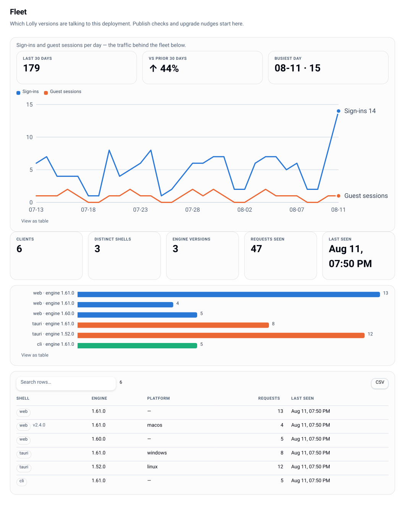

# Status and roadmap

Implementation status and the work still needed for customer acceptance. The guided setup
milestone and deployment checks below were verified on **2026-10-02**. Configuration checks,
local integration fixtures and live customer acceptance are recorded separately.

## Guided setup update, 2026-10-02

The new [Customer setup](customer-setup.md) journey provides six guided steps, validated
non-secret deployment files, a backed-up source-config apply command, applied-settings
checks after restart, exact customer group mappings, bounded installed OIDC discovery,
observed owner sign-in, SCIM subject correlation and a checked downloadable sample.
SCIM role changes affect existing sessions; disable revokes access. Tokens, policy, source
administration and chain editing remain on their existing governed screens.

Verified with signed-JWT OIDC/SCIM HTTP fixtures, current permission denial, output digest
and evidence checks, memory/Postgres conformance and Chromium desktop/phone light/dark.
Live customer tenants and released client/worker artifacts still need their selected
integration tests. WebDAV / Nextcloud now has typed source setup, a bounded paged listing
and original checksum, credential retry and sync-before-enable. Google Drive now has typed
folder/group configuration, registered browser consent, sealed refresh-token capture,
recoverable saved-source previews and activation guarded against changed settings or
credentials. Shared drive flags and skipped native-document diagnostics are included.
The guide and app explain exact redirect registration, consent audience and testing-token
expiry. Other provider forms/browser consent, application service-token scopes/expiry,
coordinated editable defaults and exact release contracts remain deferred. Live Google
Workspace/customer acceptance remains outstanding.

Setup milestone local verification: 1,142 tests, 1,123 passed, zero failures and 19 conditional
skips; isolated Postgres conformance/rollback passed separately. Twenty new Google setup
checks cover consent/session revocation, stale settings, bounded reads and console recovery.
Chromium rehearsed Google consent fixtures across an app restart, original-file checks,
group access, disable/resume and desktop/phone light/dark. WebDAV's HTTP/browser rehearsal
also passed after sharing the typed fields. Typecheck, documentation/comments, engine pin,
SBOM freshness and both production dependency audits passed.

The latest verified implementation [passed CI](https://github.com/lolly-tools/lolly-work/actions/runs/36947720080)
with Postgres enabled: 1,159 tests, 1,153 passed, zero failures and six conditional skips.
Both deployment container images built successfully. The public demo's health endpoint,
guided provider module and a real SVG render also passed live checks.

Deployment verification also exposed missing engine subpaths, a source-relative runtime
import and jsdom dependencies incompatible with the hosted `require(ESM)` restriction.
The build now packages the pinned engine's full public export map, uses its public version
helper, runs on Node 24 and converts the affected dependency entries in the output package.
CI exercises jsdom parsing/selectors/styles, boots the packaged function, checks console/setup
routes and renders a real SVG with `require(ESM)` disabled before permitting deployment.

## Verification and packaging

| Area | Verified state |
|---|---|
| Setup milestone local tests | 1,142 tests; 1,123 passed, zero failures, 19 conditional skips. Postgres checks also passed in an isolated local database. |
| CI tests | 1,159 tests; 1,153 passed, zero failures, six conditional skips with Postgres enabled. |
| Deployment gates | Full tests and packaged function rendering, typecheck, root/worker production dependency audits, SBOM freshness, server and render-worker image builds. |
| Engine consumption | Pinned, unmodified engine `1.239.0` and core `1.0.0`, verified before tests. Pack inspection checks manifests, required files and available server formats. |
| Documentation images | SVG captures of the real local console, with embedded fonts, paired light/dark variants and signed screen-capture credentials. Examples contain evaluation data. |
| Release qualification | Passing app CI does not select or certify a matched employee-client, worker and deployment-image release for a customer. |

## Remaining customer acceptance work

| Work | Current boundary and reopening condition |
|---|---|
| Customer identity and source | Verify the selected tenant's registered callbacks, real owner groups, SCIM subject correlation, known original checksum, denied groups, revocation and source disable. Follow [Customer setup](customer-setup.md) and the selected [provider guide](providers/README.md). |
| Other guided provider forms | WebDAV / Nextcloud and Google Drive are implemented. Other kinds retain advanced configuration and documented CLI consent where available; add the selected customer's next provider when its contract is known. |
| Service-token scopes and expiry | Role assignment, last use and revocation are implemented. Narrow scopes and expiry require credential and authorization changes. See [Identity](identity.md). |
| Editable defaults | Manifest defaults and governed locked values are available. Editable overlay defaults still need one agreed precedence across clients, collaboration, automation and server renders. |
| Matched releases and delivery | Qualify the actual employee clients, worker formats, deployment images and mounted shell/pack. Current setup and pack inspection do not certify those artifacts. |
| Approval-bound ordinary exports | Reviewer permission, chain editing and separation of duties are implemented. Binding an ordinary export to reviewed final bytes and `until-approved` watermarking remains separate work. |
| Publication and availability | Trusted central pack publication, HA and unattended delivery recovery need their selected deployment contracts and acceptance checks when required. |

## What is built and tested

- Recoverable single renders (`/api/v1/renders`, `lw renders`): principal-owned
  requests, atomic idempotency, expiring claims, heartbeat/fenced completion,
  bounded retries, cancellation and digest-verified retained output. Standalone
  startup recovers queued/expired work; persistence needs Postgres and durable
  BlobStore. Durable render batches (`/api/v1/render-batches`, `lw render-batches`)
  commit parents and children together, recover individual rows, retain a JSON
  manifest and retry unsuccessful rows while reusing successes. New outputs
  retain partial execution evidence for loaded sources, context and observed
  asset bytes, committed with the output under the same lease. Full dependency
  locking and campaign reconciliation remain next slices. See [Recoverable renders](renders.md).

- Deploy config + fail-closed secrets; OIDC login (discovery, PKCE, JWKS-verified), dev
  provider, member and guest sessions with domain-separated tokens.
- RBAC evaluator (roles + deny-wins grants) with the owner-only escalation guard; the grants
  editor in console, CLI and API.
- Tool overlays (editable/choice/locked/hidden, hidden = absent), the enforce block, feature-
  flag governance, profile locking - plus `org-config` and preview-as-group, computed through
  the same assembler the live client polls.
- Policy-as-code: canonical export, dry-run diff, apply, prune, boot seeding.
- Render plane v1: real engine, jsdom fast path, svg + png (resvg), policy enforced pre-render,
  LRU + ETag, PREVIEW watermark, C2PA-shaped provenance embedded in SVG/PNG, **real C2PA
  signing** when an identity is configured.
- Links: mint/verify/expire/revoke, passwords, guest admission with TTL caps.
- Approvals engine (any/quorum/all, nomination, separation of duties) with per-user inbox.
- Catalog: pack serving with per-caller filtering, lifecycle (schedule/expire/revoke), thirteen
  provider kinds with sealed credentials, exposure governance and live search fan-out, plus the
  exit (materialize, drift, cutover) and publish-out to Optimizely CMP.
- Catalog submit: members with `catalog.submit` add assets from a browser or the CLI, with a
  size cap, per-group quotas, checksum dedupe, an operator-pluggable pre-store scan hook, C2PA
  detection, and optional review through an approval chain.
- Outbound delivery: fixed, group/RBAC-scoped organization targets with S3-compatible, WebDAV
  and signed-HTTPS adapters, shell presentation beside (never over) personal targets, C2PA and
  byte gates, optional approval-chain binding over immutable staged bytes, immutable durable
  receipts, idempotency, retry and audit. Completed automation renders publish by reference to
  the same retained bytes, scoped to the job principal and protected from deletion while in
  use. No target is configured by default, and personal device targets remain outside the
  control plane.
- Org-defined asset metadata: an org names its own fields (text/select/date/url, required or
  not) in the governance document and fills them in on pack, federated and instance-owned
  assets alike through `catalog.edit`; the values ride the feed and the search haystack.
- Collections: named, ordered, group-visible sets of catalog assets, curated behind
  `catalog.collection.manage`, listed additively on the per-caller feed, and shareable as a
  signed link that serves a brand-chromed listing page and a zip-all - that set only.
- Asset versions: new bytes for an existing instance asset become version N+1 under the same id
  and URL, prior versions stay readable at a gated `?v=N`, rollback moves the head, a hold
  refuses version deletion, retention is `policy.catalog.versionKeep` (keep-all by default), and
  a head move busts the render cache. Supersession (`replacedBy`) retires an id in favour of
  another and rides the feed additively.
- Telemetry ingest (closed allowlist, attribution at the door), rollups, activity feed, fleet
  registry, hash-chained audit log with an anchorable head.
- Postgres store + migrations runner behind one conformance-tested seam.
- Admin console (`/admin`) and `lw` CLI over the same API - including this documentation set
  at `/admin#/docs`.
- Packaging: a working container build (`deploy/compose/Dockerfile`), Compose, and a Helm
  chart with NetworkPolicy/ServiceMonitor/non-root defaults, a migrate Job, pack and shell
  volumes, and an optional render-worker tier.

## Open gaps, in the order they will bite

### 1. Session revocation - largely closed
Sessions are stateless signed tokens with a `policy.sessionTtlHours` lifetime, but disabling
a person (console or SCIM `active=false`) is now **instant revocation**: it bumps the user's
**session epoch**, a counter the token embeds at mint, so every live session of theirs is
refused from that request on. `bumpSessionEpoch` is the same lever without a disable. What
remains is narrow and mostly cosmetic: revocation is **per user, not per individual session**,
and the *role a shell's token claims* is stale until the next mint (authorization is not -
`requireAction` resolves the live record every request). Mitigation for the residual: lower
`sessionTtlHours`. See [identity](identity.md).

### 2. Audit-head anchoring stops at the log line
Head **logging is on by default** (boot + hourly, `audit.headLog`). Migration `0034`
adds keyed audit MAC storage and a PostgreSQL append guard, with a controlled retention
delete path. A database superuser can still bypass the trigger or truncate the tail.
Operators must collect heads in an independently retained external sink and verify
receipt; local stdout alone is not an external anchor. See [audit](audit.md).

### 3. Deployment image qualification
The release workflow builds server and render-worker images on a `v*` tag with signatures,
SBOM and provenance attestations; see [image verification](deployment.md#verifying-the-images).
The package version remains `0.2.0`, while `main` includes the new setup work. Current CI
builds both images but does not publish a new customer release. Select and verify the intended
image digests, client and worker versions before installation. Confirm registry access in the
target environment and configure `imagePullSecrets` if required; historical package visibility
is not a current pull test.

### 4. Shell delivery on Kubernetes
Serving the web shell needs a built dist on a volume you populate; brand-pack delivery is
likewise bring-your-own (`pack.type` defaults to `none`). The stale-dist boot guard means a
wrong path now fails loudly instead of quietly un-governing employees, which is the
improvement - not a substitute for a delivery pipeline.

### 5. Engine pin drift (a recurring risk, currently closed)
The vendored engine is pinned and pin-verified (`engine-pin.json`, `@lolly/engine@1.239.0`
on 2026-10-02). The pin is re-verified as `pretest`; `engine-drift.yml` reports upstream drift
weekly and `repin-engine` applies a reviewed snapshot. `inspect:pack` and Customer setup now
load manifests through the installed engine and report incompatible requirements, missing
files and unsupported server formats. A matched release still needs its client and worker
contracts checked; a green pin check alone does not establish them.

### 6. Postgres leg depends on CI
The Postgres driver only runs under `LW_TEST_DATABASE_URL`. CI now provides one, so this is
covered on `main` - but a local `pnpm test` still exercises only the memory driver.

### 7. `until-approved` watermarking
`always` is wired; `never` is stored but never consulted (equivalent to unset); the
per-render linkage between approval state and watermarking is deliberately not built yet.
Set `always` if you need the guarantee today.

### 8. Vercel is a pilot vehicle
The hosted demo renders for real - `GET /render/<toolId>.<format>` serves live SVG/PNG bytes
off the jsdom fast path (verified against www.lolly.work). What makes it a pilot, not
production: it runs **memory-only** (no `DATABASE_URL`, so seeded/created state resets), there
is **no Chromium worker tier** (only curated demo hooks opt into in-process rendering), and
pack delivery is demo-scoped. Fine for a trial, not for production.

### 9. Employee client distribution
The Work repository's audits, SBOM and notices cover its own deployment. They do not clear
the exact employee desktop/mobile binaries, their third-party notices or the client's
distribution terms. Review those artifacts in the Lolly release being delivered. Earlier
upstream license-map counts are not evidence about the current customer release.

### 10. Bus factor
One person commits to both repos. The plans directory and honest inline documentation are the
mitigation; they are not a substitute for a second maintainer.

### 11. Approval permission and policy limits
Approval actions, reviewer selection, nomination and notifications now evaluate `approval.act`
alongside step-group eligibility and separation of duties. Custom reviewer groups may need an
explicit allow grant. The overlay `enforce` keys `c2pa` and `escalation` remain declared but
unsupported by write paths; `until-approved` does not yet bind an ordinary export to an
approval. The console identifies unsupported settings. See [governance](governance.md) and
[approvals](approvals.md).

## Roadmap shape

The plan sequences phases so each is independently useful:

| Phase | Content | State |
|---|---|---|
| 0 | scaffold, schema, CI, workers, compose, Vercel trial | done, Vercel trial-grade |
| 1 (MVP) | SSO + catalog + render/links + fleet + audit core | done |
| 2 | roles/grants, overlays, profile governance, org-config, message bridge | done; org-scoped MCP endpoint outstanding |
| 3 | approvals, watermarking, lifecycle, C2PA assertions | largely done (see gap 7) |
| 4 | shared workspaces, collab presence, telemetry dashboards | projects/sessions and dashboards done; server collab substrate **done single-node** (ws gateway + rooms + persistence + guest join, `server/src/collab/`); employee-client release and rollout acceptance remain separate |
| 5 | SAML/SCIM, SIEM streaming, live co-editing, air-gap hardening | **SCIM done** (`/scim/v2`: Users create/patch/`active=false`, Group membership, per-IdP bearer tokens - plans/31 section 8); SAML deliberately deferred to Keycloak's SAML→OIDC bridge; live co-editing server side done but **rollout stays adoption-gated** (the conflict counter on the console Overview is the gate's instrument); SIEM forwarding **done** (plans/35: batched, cursor-tracked, `lw_siem_lag` gauge - see [operations](operations.md#siem-forwarding)) |

The community gate is worth restating, because it is the test of the brand-agnostic claim:
**someone who is not us stands a deploy up from the Helm chart.**

## Next work towards a customer launch

1. Select the customer's identity/source and qualify the real integration using the setup and provider guides.
2. Qualify and publish matched deployment, worker and employee-client artifacts, then rehearse installation with their digests and registry access.
3. Narrow service-token authority and expiry, then agree editable-default precedence across the selected clients and render paths.

Audit anchoring, HA, central publication and recovery stay conditional on the deployment's requirements. The table above records the application's deliberate deferrals; the setup screen shows which configured integrations have actually been observed.
