# Telemetry and dashboards

The posture is deliberate and defensible to a works council: **labels, never content; and
no name on an event unless the person agreed to it.** Both invariants are enforced at the
door, at ingest - not in the query layer, where a mistake would already have stored the data.

## The two invariants

1. **No input values, ever.** Each event type has a closed allowlist of attribute keys;
   anything else is dropped before storage. Surviving values are coerced to strings and
   length-capped at 200 characters, so an attribute is a label and cannot smuggle content.
2. **Attribution policy applies at ingest.** Below `standard`, or at `standard` when
   `telemetryAttribution: 'opt-in'` and the user has not consented, the user id is stripped - 
   unconsented events are aggregate from the first byte.

## Levels

| `policy.telemetry` | Behaviour |
|---|---|
| `off` | nothing is stored; ingest drops everything |
| `aggregate` | events without any user id |
| `standard` | events may carry a user id, subject to the attribution rule |

| `policy.telemetryAttribution` | Behaviour at `standard` |
|---|---|
| `opt-in` (default) | a user id is stored only after that user consents |
| `default` | events are attributed |

Consent is per user: `POST /api/v1/telemetry/consent`. The shell surfaces it; the control
plane simply honours it.

## What is recorded

| Event | Attributes |
|---|---|
| `app.boot` | `shell`, `shellVersion`, `engine`, `platform` |
| `tool.open` | `toolId` |
| `session.save` | `toolId`, `projectId` |
| `render.export` | `toolId`, `format`, `destination`, `approved` |
| `link.create`, `link.visit` | `linkKind` |
| `catalog.asset-use` | `assetId` |
| `approval.requested` / `approved` / `rejected` | `chainId`, `step` |
| `profile.update` | `fields` (names only) |
| `collab.join` | `toolId` |
| `session.tool` | `toolId`, `seconds` |
| `session.shell` | `shell`, `seconds` |

An unknown event id is dropped, not stored-and-ignored. CLI sessions are intentionally not
captured (they are short or instantaneous by design).

`seconds` is a numeric label used for seat-utility rollups. There is no free-text attribute
anywhere in the vocabulary, which is what makes the no-values invariant hold structurally
rather than by review.

Ingest: `POST /api/v1/telemetry`. Rate-limited per IP
(`rateLimit.telemetry`, default capacity 120, refill 4/s).

## Dashboards

| Surface | Route | Action |
|---|---|---|
| Overview stats | `GET /api/v1/stats/overview` | signed-in |
| Rollup summary | `GET /api/v1/telemetry/summary` | `telemetry.view` |
| Activity feed | `GET /api/v1/activity` | signed-in, filtered to what the caller may see |
| Fleet | `GET /api/v1/fleet` | `fleet.view` |

The console's **Overview** leads with a role-aware "what needs me" panel, then popularity and
export figures over the last 14 days, with a data table under every chart.

The **Activity** feed is a merged timeline over two existing records: the audit log (the
authoritative "who did what") and *attributed* usage telemetry (only events carrying a user
id, so the feed can name the actor). Nothing new is collected to build it. It offers facets
for category and actor.

**Fleet** answers "which Lolly versions are talking to this deploy" from the
`X-Lolly-Client` header - shell, shell version, engine version, platform, request counts and
last-seen. That is where publish checks and upgrade nudges start; message targeting can then
select an audience by groups × shell × engine-version range (see [api](api.md)).

## Disclosure

What the deploy discloses to members is a policy choice, and the console states its own
posture in the UI rather than hiding it - an internal deploy shows utilisation in full.
Per-item download and transform attribution needs the shells to emit those events; today
transforms and crops count as tool activity, and the console says so on the page instead of
implying data it does not have.

## Prometheus

`GET /metrics` exposes gauges for the audit-chain integrity flag, process uptime and RSS,
live rate-limit buckets, and per-provider enabled/asset-count/last-error. It is
**loopback-only** unless `LW_METRICS_TOKEN` is set, and it is registered before auth so it
cannot be shadowed. See [operations](operations.md).

## Related

- The authoritative record of governed actions: [audit](audit.md)
- Configuration keys: [configuration](configuration.md)
